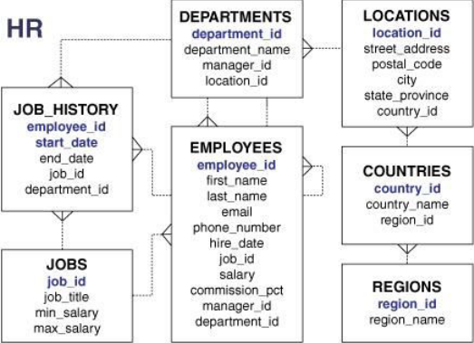
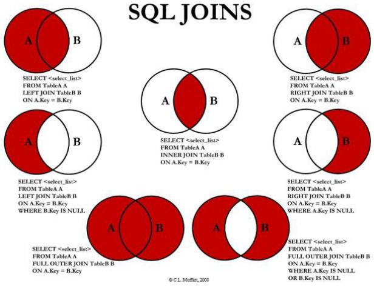

# Többtáblás lekérdezések 
 - Cél: a táblák összekapcsolása bizonyos attribútumok megegyezése alapján. 
 - Példa: 
	 - Szeretnénk látni, melyik dolgozó melyik részlegben dolgozik. Probléma: a dolgozó neve az employees, a részleg neve a departments táblában található! 

## Táblák összekapcsolása 

### Összekapcsolás a FROM és WHERE részben 

```sql
SELECT first_name, last_name, department_name 
FROM employees, departments 
WHERE employees.department_id = 
departments.department_id;
```

#### Gyakorlás 
 1. Akkor most nézzük a dolgozó nevét, munkakörének azonosítóját és a címének azonosítóját! 
	```sql
	SELECT first_name, last_name, 
	job_id, location_id 
	FROM employees, departments 
	WHERE employees.department_id 
	= departments.department_id; 
	```
	vagy
	```sql
	SELECT first_name, last_name, 
	job_id, location_id 
	FROM employees e, departments d 
	WHERE e. department_id = d. department_id ; 
	```
	- A lekérdezésben szereplő tábláknak is adhatunk másodlagos elnevezést (célszerűen a hosszú nevű tábláknak valamilyen rövid nevet). 

2. Listázzuk a részlegek nevét, a címük azonosítóját és városának nevét! 
	```sql
	 SELECT department_name, d.location_id , city 
	 FROM departments d, locations l 
	 WHERE d.location_id=l.location_id; 
	```
	 - Ha egy lekérdezett oszlopnév több táblában is előfordul, jeleznünk kell, hogy melyik táblában lévőt szeretnénk. 

## Táblák összekapcsolása (önmagával)
### Gyakorlás 
1.  A dolgozók teljes neve mellé kerüljön oda a főnökük teljes neve (firstname + lastname) 
	 - Az employees táblát önmagával kapcsoljuk össze, a lekérdezésben azonban két külön táblaként viselkedik. Ezeket másodlagos elnevezéssel különböztethetjük meg: 
	```sql
	SELECT e1.first_name || ' ' 
		|| e1.last_name as Főnök, 
		e2.first_name || ' ' || 
		e2.last_name as Beosztott 
		FROM employees e1, employees e2 
		WHERE e1.employee_id = e2.manager_id; 
	```
2. Most a főnök és a beosztott nevén kívül jelenítsük meg kettejük fizetésének a különbségét is! ◦ Tipp: a főnök mindig többet keres, mint a beosztottja. 
```sql
	SELECT e1.first_name || ' ' || e1.last_name as Főnök,       	e2.first_name || ' ' || e2.last_name as Beosztott, 
	e1.salary e2.salary as Különbség FROM 
	employees e1, employees e2 
	WHERE e1.employee_id = e2.manager_id; 
```
## Összekapcsolás típusok 
 - INNER JOIN 
	 - Ugyanaz, mint eddig a WHERE feltétellel: csak azokat a rekordokat listázzuk, amelyeknek van megfelelője a másik táblában. 
- LEFT \[OUTER\] JOIN 
	- A bal oldalán szereplő táblából minden rekord (amelyiknek nincs megfelelője, ott NULL szerepel a másik tábla mezői helyén) 
- RIGHT \[OUTER\] JOIN 
	- A jobb oldalán szereplő táblából minden rekord 
- FULL \[OUTER\] JOIN 
	- Mindkét táblából minden rekord 
- NATURAL JOIN 
	- azaz natural inner join 
	- "automatikus" inner join: az összekapcsolást az egyező nevű oszlopok szerint végzi el, tehát NEM kell megadni az összekapcsoláshoz használt oszlopokat
	- NEM használható tehát pl. ezekre: employees employees, employees departments (manager_id!) employees job_history ( job_id! )
	- létezik natural left join, natural right join és natural full join is, de azokkal nem foglalkozunk 


## INNER JOIN 
 - Nézzünk egy korábbi példát, most JOIN segítségével. Tehát dolgozó vezetékneve, munkakör azonosítója, részleg azonosítója és neve. 
	```sql
	SELECT last_name, job_id, department_id, department_name 
	FROM employees 
	INNER JOIN departments USING(department_id); 
	```
 - A két department_id oszlop "összeolvadt", ilyenkor nem szabad kiírni a táblanevet elé! 
- Ha az összekapcsolandó attribútumok nevei nem egyeznek meg, akkor is használható, de ilyenkor (a WHERE-hez hasonlóan) meg kell különböztetni a táblák egyező nevű oszlopait: 
	```sql
 	SELECT e1.last_name as Főnök, e2.last_name as Beosztott 
 	FROM employees e1 
 	INNER JOIN employees e2 
 	ON e1.employee_id = e2.manager_id ; 
	```

## LEFT JOIN 
 - Jelenítsük meg a dolgozók azonosítóját, vezetéknevét, részlegének azonosítóját és a nevét. Azokat a dolgozókat is listázzuk, akik egy részlegbe sem tartoznak! 
	```sql
 	SELECT employee_id, last_name, e.department_id, 			department_name
 	FROM employees e 
 	LEFT JOIN departments d 
 	ON e.department_id = d.department_id; 
	```

## A \\ B 
 - Jelenítsük meg csak azon dolgozók azonosítóját és nevét, akik egyik részlegnek sem a vezetői! ◦ Tipp: előző lekérdezés eredményét figyeljük meg! Mi jellemzi a kérdéses dolgozókat? d.department_name NULL értékű (vagy d. manager_id NULL értékű)! 

```sql
 SELECT e.employee_id, last_name, d.manager_id 
 FROM employees e 
 LEFT JOIN departments d 
 ON e.employee_id = d.manager_id 
 WHERE d.manager_id IS NULL; 
```

```sql
SELECT employee_id, last_name 
FROM employees e 
LEFT JOIN departments d ON e.employee_id = d.manager_id 
WHERE d.manager_id IS NULL; 
```

## RIGHT JOIN 
 - Jelenítsük meg a dolgozók vezetéknevét, részlegének azonosítóját és nevét; listázzuk azokat a részlegeket is, ahol egy ember sem dolgozik! 
```sql
SELECT last_name, e.department_id, department_name 
FROM employees e 
RIGHT JOIN departments d 
ON e.department_id = d.department_id; 
```
## FULL JOIN
- Jelenítsük meg a dolgozók vezetéknevét, részlegének azonosítóját és részlegének nevét! Amennyiben egy dolgozó egyik részleghez sem tartozik vagy az adott részlegben egy dolgozó sem dolgozik,  akkor is jelenjen meg a rekord!
```sql
SELECT last_name, e.department_id, department_name
FROM employees e 
FULL JOIN departments d 
ON e.department_id = d.department_id;
```
## NATURAL JOIN 
 - Listázzuk a dolgozók adatait munkaköri adataikkal együtt. 
```sql
SELECT * FROM employees NATURAL JOIN jobs; 
```

# Hierarchikus lekérdezés 
 - Hierarchikus szerkezetű adatokat is le tudunk kérdezni egy SELECT utasítás segítségével.
 - A hierarchia gyökerét (gyökereit) a START WITH feltétellel kell megadni. 
 - A szülő és gyermek sorok közti kapcsolatot a CONNECT BY clause-zal. Ebben (is) használjuk a PRIOR kulcsszót, amelyik a szülő rekordra utal. 
```sql
 SELECT last_name Beosztott, 
 PRIOR last_name Főnöke 
 FROM employees 
 START WITH employee_id = 100 
 CONNECT BY manager_id = PRIOR employee_id ; 
```
 - Mivel a főnök a szülőrekord, ezért a főnök nevét és azonosítóját jelöljük meg PRIOR-ral! 

- Kiértékelés sorrendje a következő: 
	1. A START WITH alapján kiválasztja a gyökér sorokat. 
	2. A CONNECT BY alapján a gyökerek gyerekeit választja ki. 
	3. A további leszármazottakat választja ki mélységi keresési stratégiával. 
	4. A WHERE alapján kiszűri a sorokat, de az eldobott sorok leszármazottait nem dobja el. Vagyis a feltételt minden egyes sorra külön-külön értékeli ki. 
	5. A sorokat a preorder bejárás szerinti sorrendben adja vissza. 
- Használhatjuk a LEVEL pszeudo oszlopot, amelyik a gyökér sorokra egyet ad vissza, a többiekre pedig a megfelelő mélységet. 
```sql
SELECT last_name, employee_id, manager_id,
LEVEL FROM employees START WITH employee_id = 100 
CONNECT BY PRIOR employee_id = manager_id; 
```
- Hierarchikus lekérdezésekben az azonos szülőrekordhoz tartozó gyermekrekordokat az ORDER SIBLINGS BY kifejezéssel rendezhetjük. 
```sql
SELECT last_name, manager_id, LEVEL FROM employees 
START WITH employee_id = 100 
CONNECT BY PRIOR employee_id = manager_id 
ORDER SIBLINGS BY last_name; 
```
