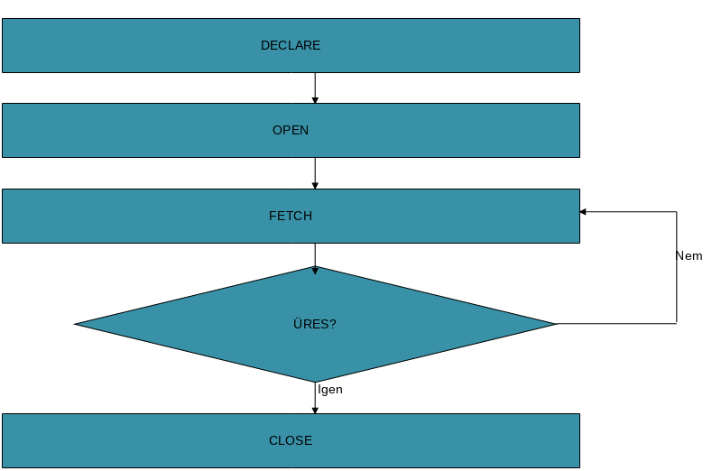

# PL/SQL
- procedurális programnyelv, fügvények és eljárások irására van
- blokk részei:
	- deklarációs rész (opcionális)
	- végrehajtható rész
	- kivételkezelő rész (opcionális)
```sql
[DECLARE  
változók deklarálása]
BEGIN  
utasítások  
[EXCEPTION  
kivételkezelés ]  
END;
/
```
- Output beállítások: egy munkamenetben csak egyszer kell kiadni a parancsot
	- SET serveroutput ON
	- SET verify OFF
- bekért string kiirása
```sql
ACCEPT nev PROMPT 'Kérem a neved:'
BEGIN
	dbms_output.put_line('Hello ' || '&nev');
END;
```
- ACCEPT parancs sql parancs nem PL
	- nélküle csak lokális lesz a változó
- Definiálás és lekérdezés: DEFINE  
- Törlés: UNDEFINE
## Változók
- begin-endben értékadás := kivül =
- & - inline promt és behelyetesités
```sql
ACCEPT x PROMPT  'Kérem a  számot:'
DECLARE
	szam NUMBER;
BEGIN
	szam := &x;
	dbms_output.put_line(szam ||  
	' négyzete: ' ||szam*szam);
END;
```
## Elágazás
```sql
IF feltétel THEN
	ezt csináljuk
ELSIF másikfeltétel THEN
	mást csinálunk
ELSE
	különben ezt csináljuk
END IF;
```
## Ciklusok
- while loop
```sql
WHILE feltétel 
LOOP
 ....
END LOOP;
```
- for loop
```sql
FOR i IN tól..ig
LOOP
....
END LOOP; 
```
```sql
DECLARE
	tol NUMBER :=1;
	ig  NUMBER :=10;
BEGIN
	LOOP
		dbms_output.put_line(tol);
		EXIT WHEN tol=ig;
		tol:=tol+1;
	END LOOP;
END;
```
## Lekérdezés PL/SQL blokkban
- Ha egy változóban eltároljuk a lekérdezés eredményét akkor
	- SELECT valami_mezo INTO változó WHERE......
```sql
ACCEPT rnev PROMPT 'Kérem a részleg nevét:'
DECLARE
	átlag NUMBER;
BEGIN
	SELECT AVG(salary) INTO átlag
	FROM employees 
	INNER JOIN departments 
	USING (department_id)
	WHERE LOWER(department_name)=
	LOWER('&rnev');
	dbms_output.put_line('A &rnev részleg átlaga '
	|| átlag);
END;
```
## Kurzorok
- Nem halmazként használjuk az adatokat, hanem olyan táblákként, amely táblákon rekordonként (soronként) végig lehet „lépkedni”.
- 
- **%FOUND** – Sikeres volt az előző FETCH művelet?
- **%NOTFOUND** – Sikertelen volt az előző FETCH művelet?
- **%ROWCOUNT **  – Feldolgozott sorok darabszáma
- **%ISOPEN** – Volt OPEN művelet?
#### Implicit kurzor definiálása
```sql
DECLARE
	egysor employees%ROWTYPE;
BEGIN
  FOR egysor IN (SELECT * FROM employees)
  LOOP
    dbms_output.put('Név: ' ||
	egysor.last_name);
    dbms_output.put_line(',  Fizetés: ' ||
	egysor.salary);
  END LOOP;
END;
```
#### Explicit kurzor definiálása
```sql
DECLARE
  CURSOR kurzor IS select * from employees;
  rekord employees%ROWTYPE;
BEGIN
  FOR rekord IN kurzor
  LOOP
    IF rekord.salary BETWEEN 10000 AND 15000
    THEN
 		dbms_output.put_line(rekord.last_name
		||',  ' || rekord.salary);         
    END IF;
  END LOOP;
END;
```
#### Használata
```sql
...
BEGIN
	OPEN kurzor;
 	LOOP
  		FETCH kurzor INTO rekord;
  		EXIT WHEN kurzor%NOTFOUND;
  		IF rekord.sal BETWEEN &also 
		AND &felso  
  		THEN
 			dbms_output.put_line(rekord.ename||
			', ' ||rekord.sal);         
    	END IF;
 	END LOOP;
 CLOSE kurzor;
END;
```
#### Kurzor használata módosításra
- FOR UPDATE: zárolja az érintett sorokat, a következő COMMIT vagy ROLLBACK utasításkor oldja fel
- NOWAIT: nem várakozik erőforrásokra
```sql
CURSOR kurzor IS SELECT * FROM employees2
FOR UPDATE [OF salary] [NOWAIT];
```
```sql
...
BEGIN
	OPEN kurzor;
		LOOP
 			FETCH kurzor INTO rekord;
 			EXIT WHEN kurzor%NOTFOUND;
  			fizetes := rekord.sal * 1.2;
  			UPDATE dolgozo set sal = fizetes  		WHERE CURRENT OF kurzor; 
		END LOOP;
	CLOSE kurzor;
END;
```
## Tárolt eljárások, függvények
- eljárás: nincs visszatérési érték, PROCEDURE
- függvény: van visszatérési érték, FUNCTION
#### PROCEDURE
- Futtatása PL/SQL blokkon belül: szokásos
- Futtatása PL/SQL blokkon kívülről:
	- EXECUTE eljárásnév;
- Törlés: DROP PROCEDURE eljárásnév;
\<OR REPLACE\> szerepe: ha már létezik, akkor lecseréli
```sql
CREATE OR REPLACE PROCEDURE eljárásnév (paraméterlista)
IS
	lokális változók
BEGIN
	utasítások
EXCEPTION …
END;
```
```sql
CREATE PROCEDURE osszead (a NUMBER, b NUMBER) IS
BEGIN
	dbms_output.put_line('Összegük: '||
	(a+b));
END;
```
- Teszt:
	- execute osszead(2,3)
	- begin osszead(2,3); end;
#### FUNCTION
```sql
CREATE OR REPLACE FUNCTION 
		függvénynév (paraméterlista)
RETURN típus
IS
	lokális változók
BEGIN
	utasítások
EXCEPTION …
END;
```
```sql
CREATE OR REPLACE FUNCTION maxfizu(dn NUMBER) RETURN NUMBER IS
	m NUMBER;
	BEGIN
		SELECT MAX(salary) INTO m 
		FROM employees WHERE
		department_id=dn;
		RETURN m;
	END;
```
- Teszt:
	- select department_name, maxfizu(department_id) from departments;
## Triggerek
- Adott esemény bekövetkezésére reagálunk (tárolt eljárást futtat)
- Milyen műveletekre:
	- INSERT, UPDATE, DELETE, CREATE, ALTER, DROP
- Mikor: BEFORE, AFTER 
- INSTEAD OF (csak nézetekre, csak soronként; ezzel oldható meg DML azokra a nézetekre, amikre amúgy nem lehetne)
- Az ALTER TRIGGER a nézethez hasonlóan nem használható a definíció megváltoztatására (csak enable, disable, compile)
-  :OLD és :NEW 
	- csak sor szintű triggerben érhetők el; 
	- ha nincs értelmük, akkor az értékük NULL (pl. beszúrásnál az OLD, törlésnél a NEW értékei)
- A WHEN feltételben is használhatók, de ott nem kell eléjük kettőspont.

```sql
CREATE OR REPLACE TRIGGER  {név}
	[BEFORE | AFTER | INSTEAD OF]
	{esemény} [OR {esemény} …]
	ON {tábla}
[FOR EACH ROW [WHEN {feltétel}]]
[DECLARE {változók}]
BEGIN
	{utasítások}
[EXCEPTION …]
END;
```
```sql
CREATE OR REPLACE TRIGGER Naplozo
BEFORE DELETE OR INSERT ON employees
FOR EACH ROW BEGIN
  IF INSERTING THEN
 		dbms_output.put_line('Uj: '||
		:NEW.last_name);
  ELSIF DELETING THEN
 		dbms_output.put_line('Töröl: '|| 
		:OLD.last_name);
	END IF;
END;
```
## Kivételkezelés
```sql
EXCEPTION
	WHEN kivételnév THEN
 	utasítások;
END;
```
#### Néhány, előre definiált rendszerkivétel
- NO_DATA_FOUND
	- SELECT INTO nem adott vissza sort
	- Vigyázat! Csoportfüggvények nem dobnak ilyet!
- TOO_MANY_ROWS
	- SELECT INTO egynél több sort adott vissza
- INVALID_NUMBER
	- számmá konvertálás hibája
- ZERO_DIVIDE
	- nullával osztás
- OTHERS
	- "Minden más"
```sql
...
BEGIN
SELECT ename INTO név
FROM emp WHERE empno=&azon;
dbms_output.put_line('Dolgozó neve: '|| név);
EXCEPTION
	WHEN NO_DATA_FOUND THEN
		dbms_output.put_line('Nincs 
		ilyen dolgozó!');
	WHEN OTHERS THEN
		dbms_output.put_line('Ismeretlen 
   hiba.');
END;
```
- saját kivétel
```sql
ACCEPT szam PROMPT "Szám: "
DECLARE 
	nulla EXCEPTION;
BEGIN
	IF &szam=0 THEN
		RAISE nulla;
	END IF;
 	...
	EXCEPTION
    	WHEN nulla THEN 
			dbms_output.put_line('Ez
			nulla!');
END;
```


