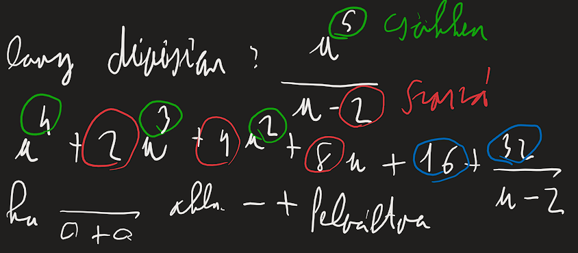
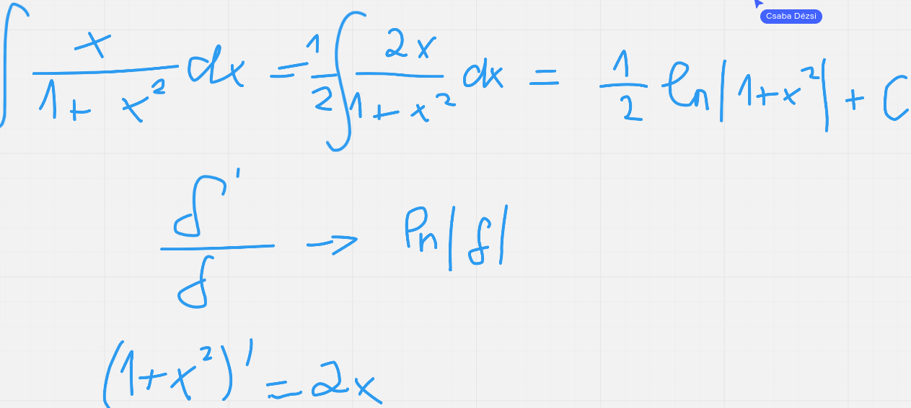

# Alap átalakitások
## Teljes négyzet
- átirni a $x^2+2ax+a^2=(x+a)^2$ 
- $x^2+2x+5=>2a=2=>a=1=>x^2+2x+5+1^2-1^2$ 
- $(x+1)^2+5-1^2$
## Szorzatra bontás
- $x^2+6x+8$ => $\left(x^2+2x\right)+\left(4x+8\right)$
- => $x\left(x+2\right)+4\left(x+2\right)$ => $x\left(x+2\right)+4\left(x+2\right)$ 
### Szabályok
- $\frac{a+-b}{c}=\frac{a}{c}+-\frac{b}{c}$    
- $\frac{a}{\frac{b}{c}}=\frac{a\times c}{b}$ => $\frac{x^{\frac{3}{4}}}{\frac{3}{4}}=\frac{x^{\frac{3}{4}}\times 4}{3}=\frac{4}{3}x^{\frac{3}{4}}$ 
-  $\frac{\frac{a}{b}}{\frac{c}{d}}=\frac{a*d}{b*c}$  
- $\frac{a}{b}\cdot \frac{c}{d}=\frac{a\:\cdot \:c}{b\:\cdot \:d}$  
- $\frac{x^a}{x^b}=\frac{1}{x^{b-a}}$ 
- $\frac{x^a}{x^b}=x^{a-b}$ 
- $\frac{ax+b}{(cx+d)^3}=\frac{\frac{a}{c}}{(cx+d)^2}- \frac{\frac{(a\times d)-b}{c}}{(cx+d)^3}$ 
	- $\frac{6x+3}{\left(3x+5\right)^3}=\frac{2}{\left(3x+5\right)^2}-\frac{7}{\left(3x+5\right)^3}$ 
- $\frac{a+b}{x}=\frac{a}{x}+\frac{b}{x}$ 
- 
- 
#### Trigonometrikus azonosságok
- $\sin{2\alpha} =\sin{2\alpha}\times\cos{\alpha}$
	- $\sin{x}\times\cos{x}=\frac{\sin{2x}}{2}$
- $\cos{2\alpha}=\cos^2{\alpha}\times\sin^2{\alpha}$ 
- $cos^2xsin^2x=\frac{1-cos4x}{8}$ 
- $cos^2x=1+sin^2$??
- $sin^2x=1-cos^2$??
- $sin^2x=\frac{1-\cos^2{2x}}{2}$ 
- $cos^2x=\frac{1+\cos^2{2x}}{2}$ => $\cos^3{3x}=\frac{1+\cos^2{6x}}{2}$ 