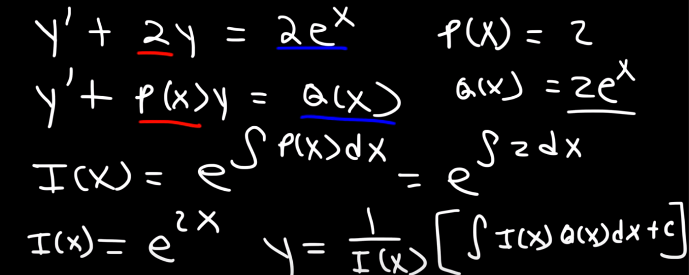

- Rend: hányadik derivált
- x: független változó, y': függö 
- lineáris: ismeretlen(y) legfeljebb első fokon
- homogén: nincs benne c(x) (tehát egyenlő 0)
- inhomogén: c(x) a vége (nem egyenlő 0)
- kezdeti feltétel: y(valami)
- két megoldás: homogén,partikuláris
- állandó együtthatós: y'+f(x)y=g(x) ahol f(x) konstans ami az együttható
## Megoldási módszerek
- Szétválasztás módszere
- partikuláris megoldás megadása(lineáris inhomogén)
- Két megoldás megadása képlettel(lineáris)
	- 
