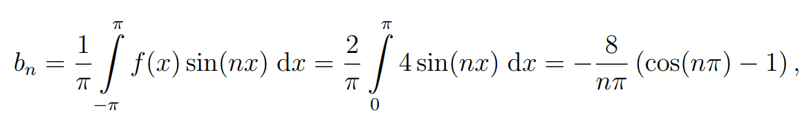
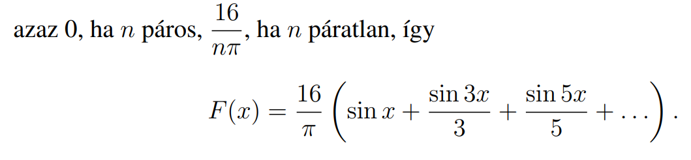
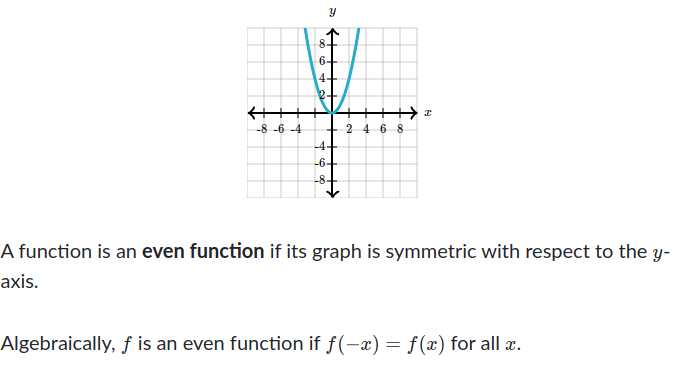
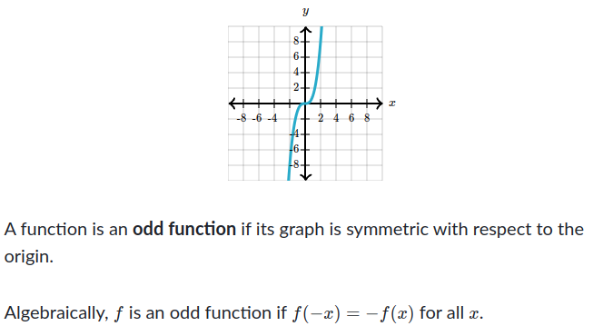
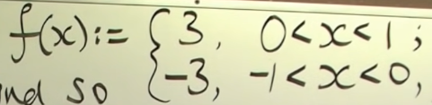
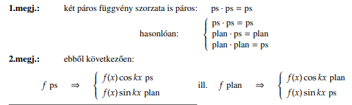
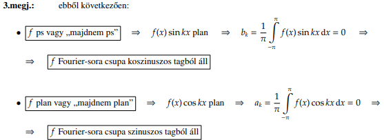
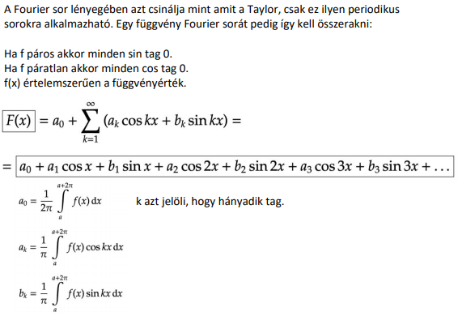
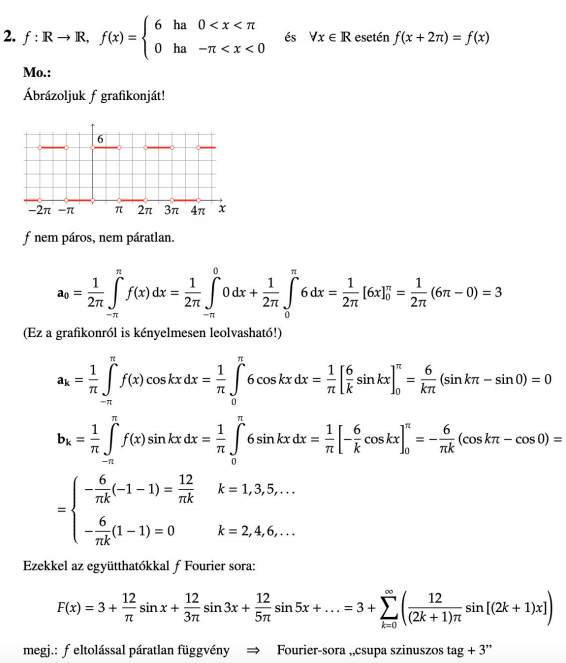

## Fourier sorok
- https://math.libretexts.org/Bookshelves/Differential_Equations/Introduction_to_Partial_Differential_Equations_(Herman)/03%3A_Trigonometric_Fourier_Series/3.02%3A_Fourier_Trigonometric_Series
- fügvény felirása sin és cos sorozatával
- Fourier van egy sin-os és cos-os együtthatója
	- $a_n=\frac{1}{\pi}\int_0^{2\pi} f(x)\cos nxdx,\quad n=0,1,2,\ldots$  
	- $b_n=\frac{1}{\pi}\int_0^{2\pi}f(x)\sin nxdx,\quad n=1,2,\ldots$ 
	- $a_0=\frac{1}{\pi}\int_0^{2\pi}f(x)dx$ 
- Két feladat tipus
	- Ha a fügvény van megadva: Ha a fügvény páros cos-t használunk vagyis $a_n$-t, ha páratlan sin-t vagyis $b_n$-t.
		- ha a $a_n,b_n,a_0$ nem hoz eredményt  akkor $a_2$-re is probálhatunk
	- Ha a fügvény tartományokban van megadva akkor ezeket intervallumon külön integráljuk és összeadjuk
		- Az külön integrálás elkerülhetö ha 2-vel szortunk igy felére csökken  a tartomány
			- 
		- integrálás tartománya a két fügvény kezdete és vége
		- $f(x)=\left\{\begin{array}{cc}1,&0<x<\pi , \\ -1, &\pi <x<2\pi ,\end{array}\right.$ 
		- $a_0=\frac{1}{\pi}\int_0^{2\pi}f(x)dx\nonumber \\ =\frac{1}{\pi}\int_0^{\pi}dx+\frac{1}{\pi}\int_\pi^{2\pi}(-1)dx\nonumber \\ =\frac{1}{\pi}(\pi )+\frac{1}{\pi}(-2\pi +\pi )=0$  
		- $a_n=\frac{1}{\pi}\int_0^{2\pi}f(x)\cos nxdx\nonumber \\ =\frac{1}{\pi}\left[\int_0^\pi \cos nxdx-\int_\pi^{2\pi}\cos nxdx\right] \nonumber \\ =\frac{1}{\pi}\left[\left(\frac{1}{n}\sin nx\right)_0^{\pi}-\left(\frac{1}{n}\sin nx\right)_\pi^{2\pi}\right]\nonumber \\ =0$ 
		- $b_n=\frac{1}{\pi}\int_0^{2\pi}f(x)\sin nxdx\nonumber \\ =\frac{1}{\pi}\left[\int_0^\pi \sin nxdx-\int_\pi^{2\pi}\sin nxdx\right]\nonumber \\ =\frac{1}{\pi}\left[\left(-\frac{1}{n}\cos nx\right)_0^\pi +\left(\frac{1}{n}\cos nx\right)_\pi^{2\pi}\right]\nonumber$
			- $=\frac{1}{\pi}\left[-\frac{1}{n}\cos n\pi +\frac{1}{n}+\frac{1}{n}-\frac{1}{n}\cos n\pi\right]\nonumber \\ =\frac{2}{n\pi}(1-\cos n\pi )$ 
		- 
- Sor meghatározása együtthatók kiszámolása után
	- n helyére páros és páratatlna számok helyetesitése => patern megtalálása
	- és beszorzás sin/cos-al
	- 
- Párossága f(x)-nek
	- y szimetria páros
	- x szimetria páratlan
	- Párossági teszt
		- 
	- Páratlansági teszt
		- 
- páratlan x páros=kiütik egymást => 0
- integrál trükk
	-  $\int _{-1}^1\:$ => $2\int _0^1\:$ feléle csökkentett a tartományt igy 2-vel kell szorozni
- Periódus: valami + 2
	- 2L=2
	- L=1 
- 
- $a_0$ nem kell kiszámolni ha kiütik egymást pl.    
- értékke más páros és páratlanba
- $a_0+a_n*\frac{sin(kx)}{k}$ vagy $b_0+b_n*\frac{cos(kx)}{k}$  
- meg megnézzük a megadott tartomány + és - változatát is
- 
- 
- 
- 
  

