# Függvény sorok
- 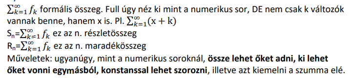
- konvergenciatartomány és összegfügvény
	- Konvergencia tarományt megkapjuk ha mértani a sorozat akkor $-1<q<1$ szabállyal
		- Ezt a két szabályt szét kell szedni és az egyet közös nevezöre kell hozni a 
	- Összegfügvény: vagy mértani összeg vagy szétválasztás ha semelyik akkor a derivált lesz mértani összeg
	- 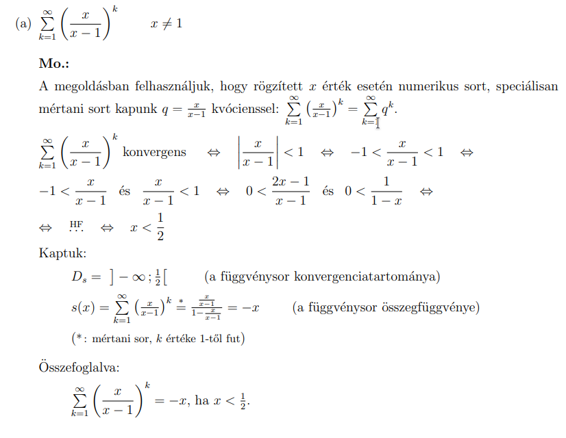
		- $\frac{\frac{x}{x-1}}{1-\frac{x}{x-1}}=\frac{x}{\left(x-1\right)\left(1-\frac{x}{x-1}\right)}=\frac{x}{\left(x-1\right)\left(-\frac{1}{x-1}\right)}$   
	- 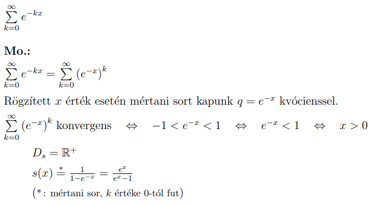
	- 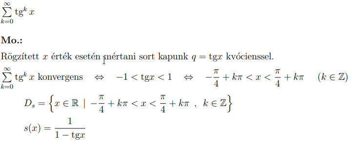
	- 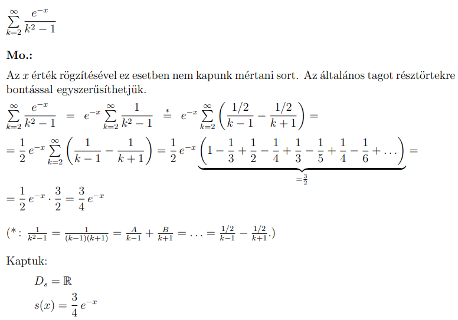
- igazolja hogy
	- 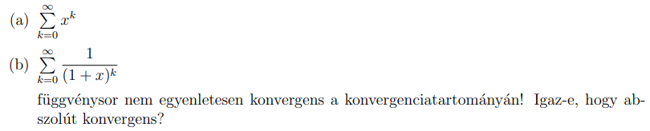
- összegfügvény
	- 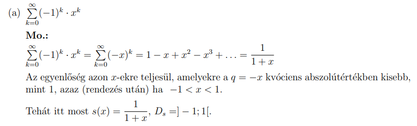
	- 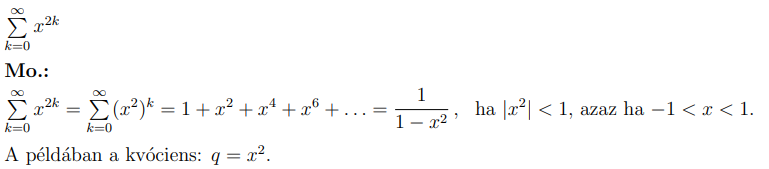
	- 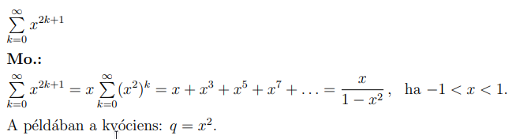
	- 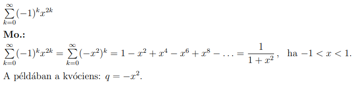
	- 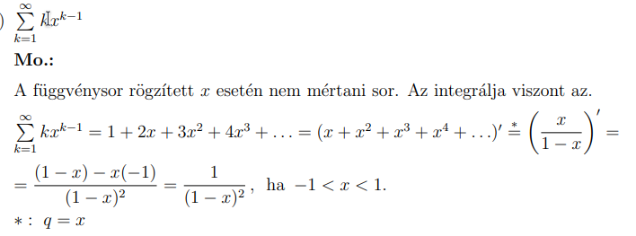
	- 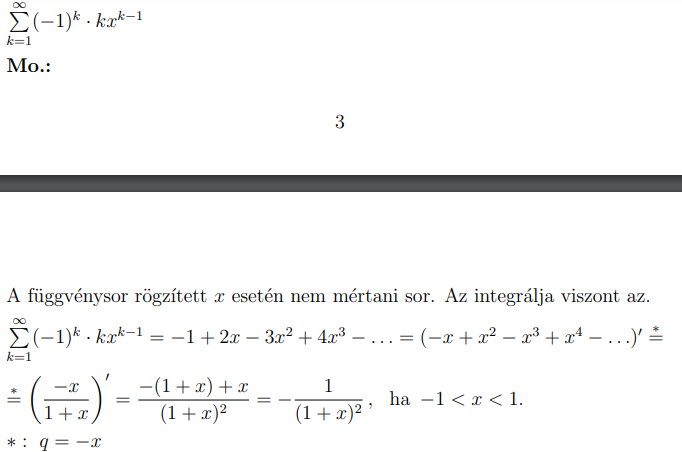
	- 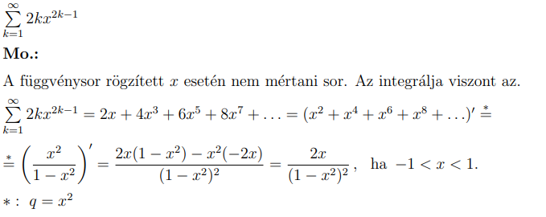
	- 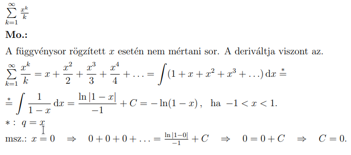
  