# Hatványsorok
## Szabályok
- 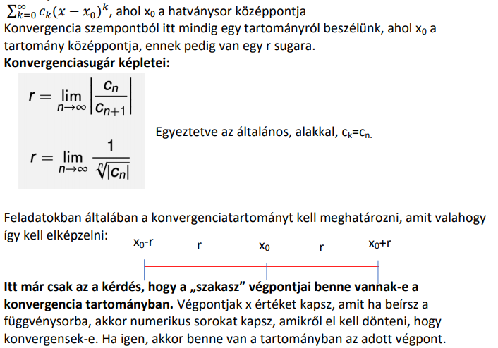
- 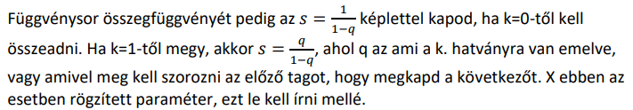
## Feladatok
- 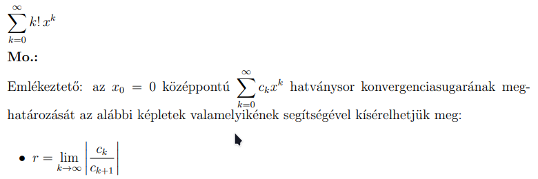
- 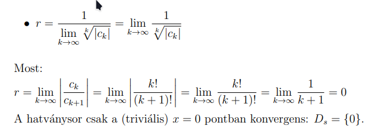
- 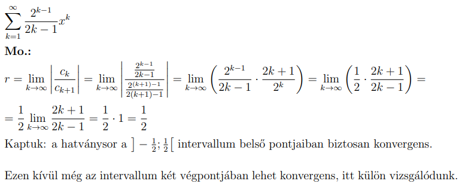
	- 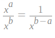  $\frac{\frac{a}{b}}{\frac{c}{d}}=\frac{a\cdot \:d}{b\cdot \:c}$ $\frac{\frac{2^{k-1}}{2k-1}}{\frac{2^{k+1-1}}{2\left(k+1\right)-1}}=\frac{2^{k-1}\left(2\left(k+1\right)-1\right)}{\left(2k-1\right)\cdot \:2^{k+1-1}}=\frac{2\left(k+1\right)-1}{\left(2k-1\right)\cdot \:2}=\frac{2k+1}{2\left(2k-1\right)}$ 
	- 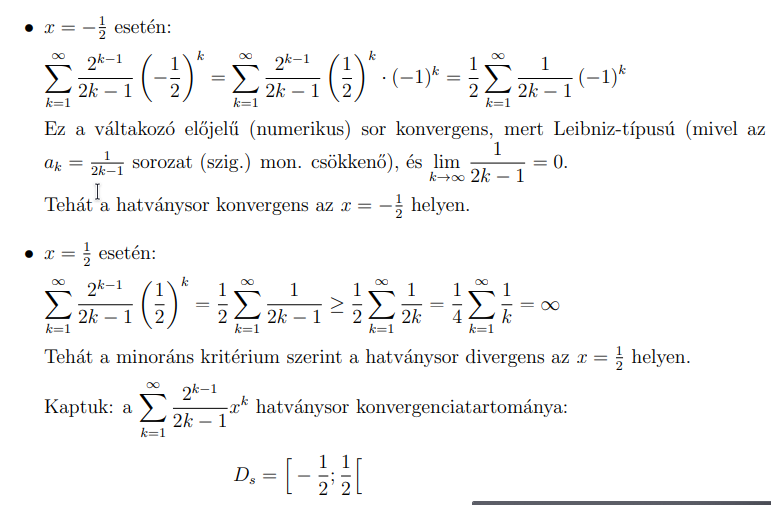
- 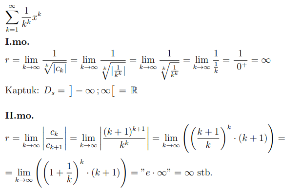
- 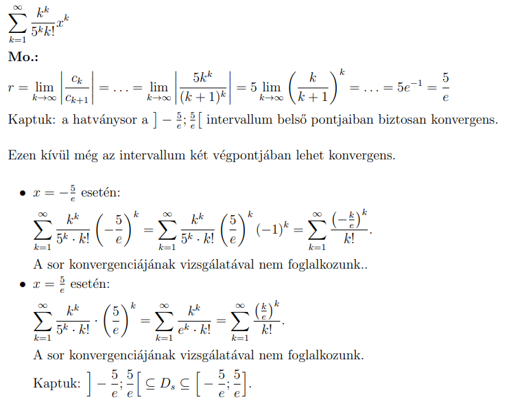
- 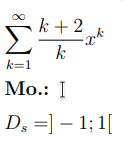
- 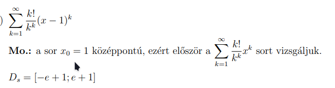