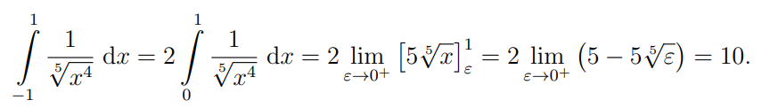
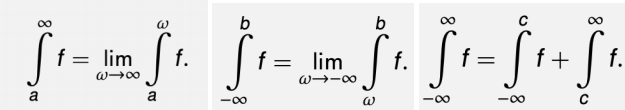
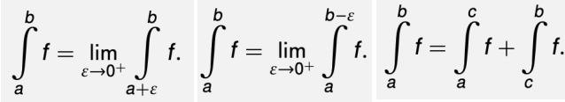
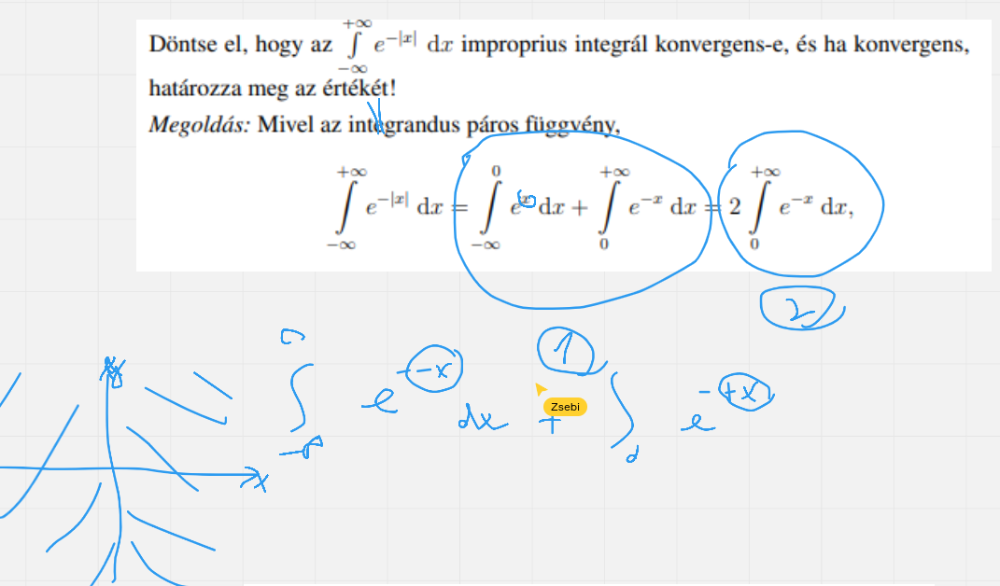
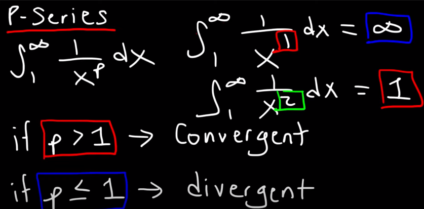

# Improprius integrálok
- Hasznos szabályok
	- $\log _c\left(a\right)-\log _c\left(b\right)=\log _c\left(\frac{a}{b}\right)$  
 - ha konstant akkor az eredmény -> konvergens
	 - ha nem akkor divergens
- ha azt integrál tartományának egyik fele minusz elöjelü akkor abból sok esetben 0-t lehet csinálni ha megszorozzuk 2-vel vagyis lefelezzük az intervallumot
	- 
#### Tipusok
- ha egy minusz/plusz végeteln van az integrálkás tartományában
	- akkor végtelent t-re cseréljük és t-n határértékét vesszük
	- $\int ^∞_1\frac{1}{x}dx=\lim_{t→+∞}\int ^t_1\frac{1}{x}dx=\lim_{t→+∞}\ln |x|∣^t_1=\lim_{t→+∞}(\ln |t|−\ln 1)=+∞$ 
- ha integrál tartomány mindkét oldala végtelen
	- fel kell bontani két integrálra és mindkettönél az egyik végtelent 0-ra cserélni és határértéküket venni
	- ha külön-külön konvergenserk csak akkor konvergens az eredeti
	- $\int ^{+∞}_{−∞}xe^xdx=\int ^0_{−∞}xe^xdx+\int ^{+∞}_0xe^xdx$ 
- ha van egy szakadás az intervallumban (Discontinuous Integrand)
	- a szakadást úgy lehet megállapitani hogy behelyetesitjük a tartomány két végét ha az eredmény 0 akkor ott szakadás található
	- ha szakadás van akkor a szám ball vagy jobb környezetétt kell vizsgálni 
		- ha kissebb számmal müködik: $\int ^4_0\frac{1}{\sqrt{4−x}}dx=\lim_{t→4^−}\int ^t_0\frac{1}{\sqrt{4−x}}dx$ 
		- ha nagyobb számmal: $\int ^2_0x\ln xdx=\lim_{t→0^+}\int ^2_tx\ln xdx$ 
- 
- 
-   
-  P series
	- 
- 