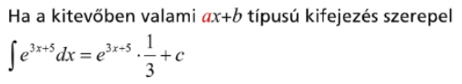
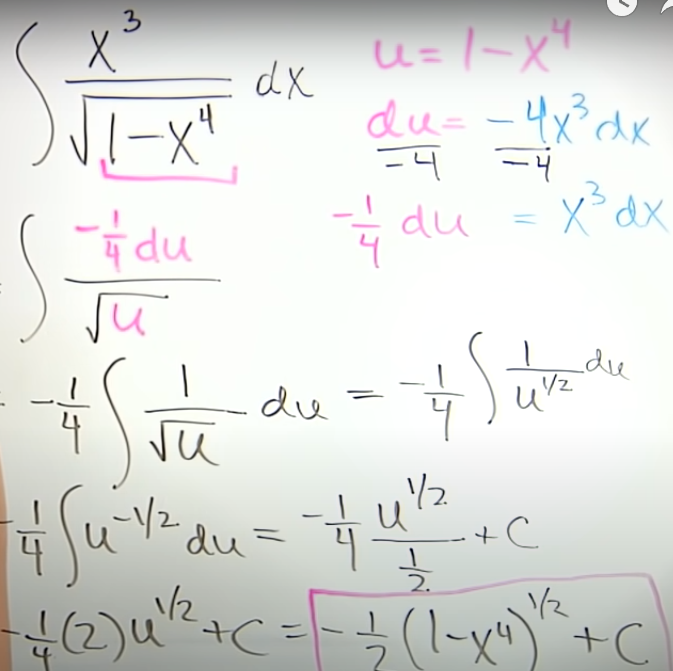
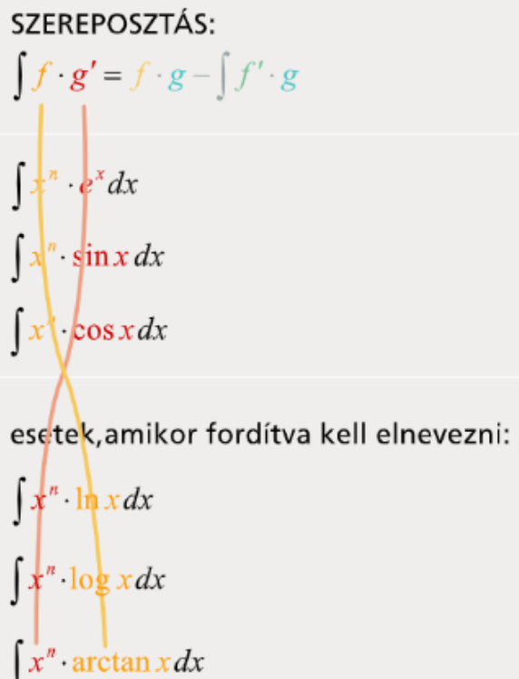
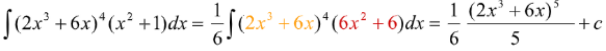
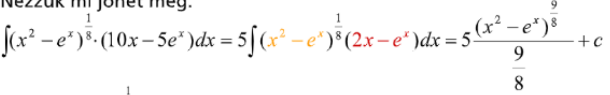
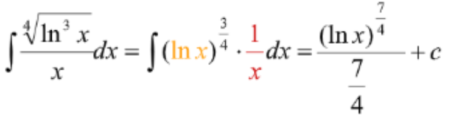
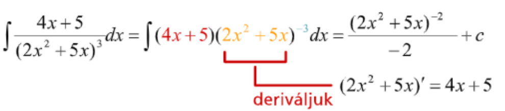
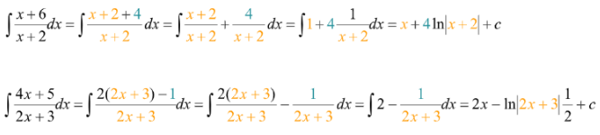
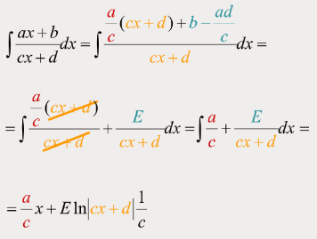

# Integrálás alapjai
## Integrálási szabályok (nincs benne a táblázatban)
- $\int e^g *g'=e^g +c$
- $\int a^g * g'=\frac{a^g}{ln(a)}+c$ 
- $\int \frac{g'}{1+g^2}=arctan(g)+c$ 
- $\int \frac{g'}{\sqrt{1-g^2}} = arcsin(g)+c$     
- $\int (3x-1)^2 dx = \int 9x^2-6x+1 dx=$
	- $\frac{9x^3}{3}-\frac{6x^2}{2}+1x+c=3x^3-3x^2+x+c$
-  $\int\frac{x^4+6x^3}{x}dx=\int x^3+6x^2dx=\frac{x^4}{4}+\frac{6x^3}{3}+c=$
	- $\frac{1}{4}x^4+2x^3+c$
- $\int\frac{1}{x^3}dx=x^{-3}dx=\int\frac{x^{-2}}{-2}+c=\int-\frac{1}{2x^2}+c$
- $\int\frac{5}{x-2}dx=5\int\frac{1}{x-2}dx=5\ln{x-2}$
- $\int 2e^{4x} dx=\frac{2e^{4x}}{4}+c$
- $\int8\sec^2{4x}dx = \frac{8\tan{4x}}{4}+c=2\tan{4x}$ 
- $\int12\sec{3x}\tan{3x}dx=\frac{12\sec{3x}}{3}+c=4\sec{3x}+c$ 
## Helyetesitéses integrálás (U substitution)
- Fontos: az integrál elé került fügvényt is ki kell értékelni a tartományon!
- Hasznos átalakitások
-  
	- $\int 1dt=t$ 
	- ha $t=e^x$ akkor $x=ln(t)$
	- $tan^2(x)=-1+\sec{x}^2 => \int{sec^2}=tanx$  
	- $t=\sqrt[6]{x},\sqrt{x}=t^3$ 
		- $\sqrt[6]{x}=x^{\frac{1}{6}},\sqrt{x}=x^{\frac{1}{2}}$ 
		- $\frac{\frac{1}{2}}{\frac{1}{6}}=\frac{1*6}{2*1}=3$ => $\sqrt{x}=t^3$  
- Egyetemi változat: különbség az x-et itt definiálni kell a dx-hez, és az x-et kell deriválni nem a $t$-t
	1. t-vel egyenlöve tesszük azt ami zavarna az integrálásban
	2. Kifejezzük x-re
	3. $\frac{dx}{dt}$-t egyenlövé tesszük az x deriváltjával
	4. Az utobbit kifejezzük dx-re
	5. Felirjuk a fügvényt a $t$-vel behelyetesitve és a dx értékével megszorozva
	6. Leintegráljuk
	7. vissza helyetesitjük $t$-t
	- $\int x\sqrt{x+1} dx$
		- $t=\sqrt{x+1}, x=t^2-1, \frac{dx}{dt}=2t, dx=2tdt$ 
		- $\int (t^2-1)*t*2t\ dt=\int (2t^4-2t^2)dt$ 
		- $=2*\frac{t^5}{5}-2*\frac{t^3}{3}+C$ 
	- $\int\frac{e^x}{e^{2x}+1}$ 
		- $e^x=t,\ln{t}=x,\frac{dx}{dt}=\frac{1}{t}$
		- $\frac{t}{t^2+1}\times\frac{1}{t}=\arctan{e^x}+c$ 
- Symbolab változat
	- u legtöbbször a leghosszabb valamiben benne van és külső legtöbbszor deriváltja 
		- 
	- lényege hogy a dx behelyetesitésével lehessen egyszerüsiteni
	- $\int x\sqrt{x+1} dx$
		- $t=x+1, \frac{dt}{dx}=1 (deriválva),dx=1dt,x=t-1(nem\ mindig\ kell)$ 
		- $\int \sqrt{t}^3-\sqrt{t}du$ 
		- $=2*\frac{\sqrt{t}^5}{5}-2*\frac{\sqrt{t}^3}{3}+C$  
	-  $\int\frac{e^x}{e^{2x}+1}$
		- $\int e^{x-(2x+1)}dx, t=-x-1,\frac{dt}{dx}=-1,dx=-1dt$ 
		- $-\int e^t\ dt=-e^t$ 
#### Parciális integrálás
- u-t aszerint kell választani hogy melyik egy egyszerüsödne le jobban
- ha parciális nem ad megoldást újra kell integrálni, ugyan azzal az u,v kiosztással 
- ha a nevező úgyan az akkor az lesz az integráltja (+/- figyelni)  
 - $\int u(x)v'(x) = u(x)v(x)-\int u'(x)v(x)$
 - $\int x\cos{x}dx,u=x,u'=1dx,v'=\cos{x}dx,v=\sin{x}$ 
	- $\int x\cos{x}dx=x\sin{x}-\int\sin{x}dx$
	- $=x\sin{x}-(-\cos{x})$
-  
#### Integrálfügvény
- $\int_0^x t dt=\frac{x^2}{2}-0$
- f(t): 0, ha t<5 $e^{1-t}$, ha t>=5
- $\int_5^xf(t)$ 
	- ha x >5:  $-e^{1-x}+e^{-4}$ 
	- ha x <=5:  0
## Alap intergrálok
- Beszorzás
	- 
- Leosztás
	- 
- Tört szorzattá alakitás
	- 
	- 
	
- Törtszétválasztás	 
	 - [[Racionális fügvények integrálása]]
	 - 
	- 
