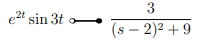
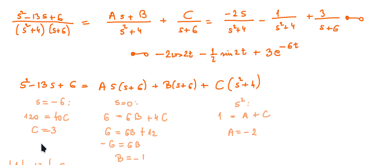
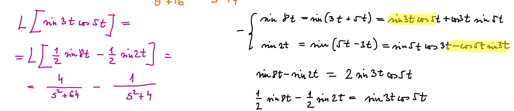

## Laplace transzformáció
- $\frac{-2}{s^2+9}=-\frac{2}{3}sin(3t)$ Rerverse laplace-nál osztással átalakithatjuk hogy müködjön
- $5^t=(e^{ln5})^t trans \frac{1}{s-ln5}$
- szorzót ki lehet hozni
- szorzatnál $d^n$  n-edik és a tranformáltyát kell deriválni
	- $L\left\{t^kf\left(t\right)\right\}=\left(-1\right)^k\frac{d^k}{ds^k}\left(L\left\{f\left(t\right)\right\}\right)$ 
- $2\sin{\alpha}\cos{\beta}=\sin{(\alpha+\beta)}+\sin{(\alpha-\beta)}$ 
- $e^{at}f(t):s helyére (s-a)$    
- 
- $25 trans \frac{25}{s},25xtrans\frac{25}{s^2}$   
- szétválasztással
	- 
- sin és cos
	- 
-   
## inverz laplace meghatározása
- szorzó kihozatala és darabonként laplace
- Diff egyenlet megoldása Laplace-al