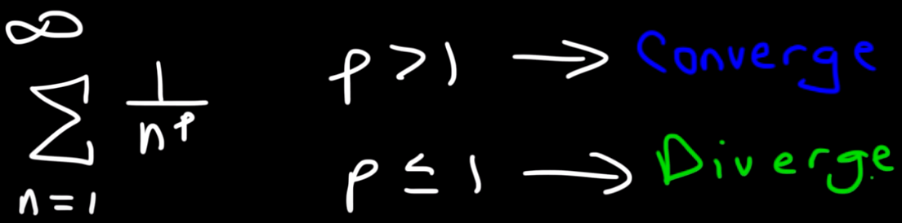
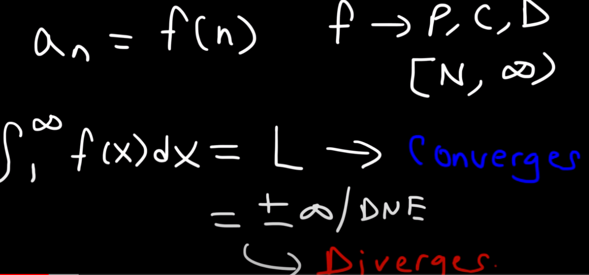
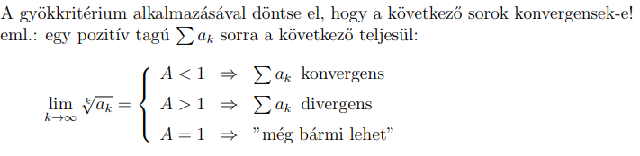
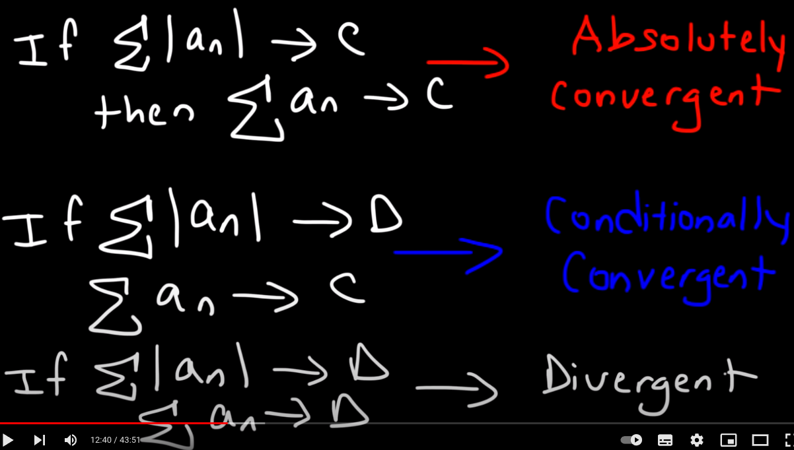
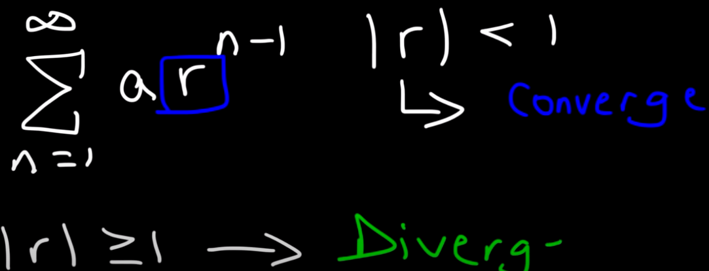
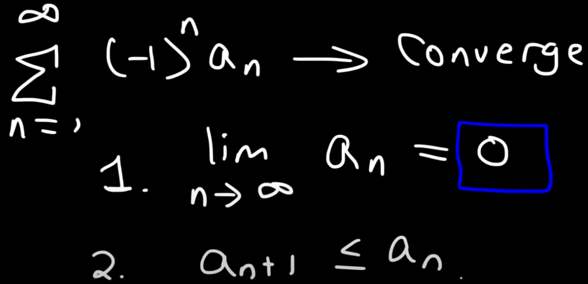
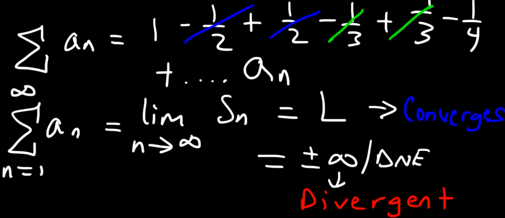
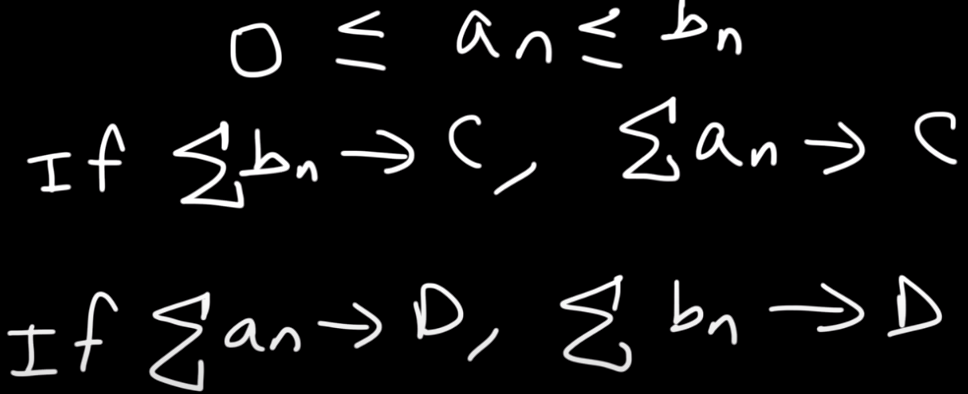
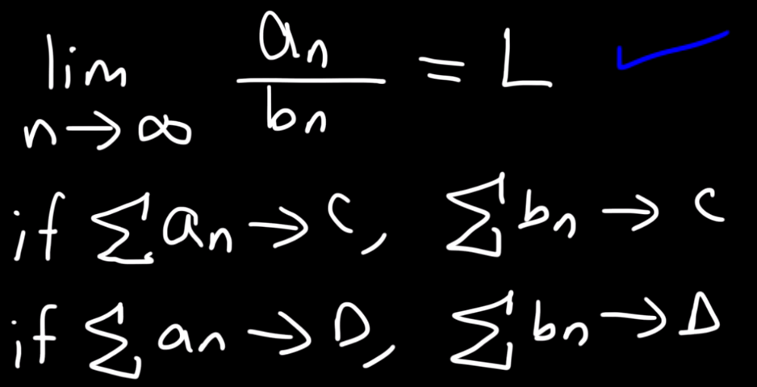

# Numerikus sorok konvergenciája
- Hasznos szabályok
	- $\frac{\frac{x}{y}}{\frac{z}{w}}=\frac{x}{y}*\frac{w}{z}$
	- $\frac{a}{\frac{b}{c}}=\frac{a\cdot \:c}{b}$
	- $3^{k+1}=3^k*3$ 
	- $3^{3k}=9^k$
	- $\frac{n!}{\left(n+m\right)!}=\frac{1}{\left(n+1\right)\cdot \left(n+2\right)\cdots \left(n+m\right)}$ => $\frac{k!}{\left(k+1\right)!}=\frac{1}{\left(k+1\right)}$ 
	- ki lehet egyszerüsiteni a faktoriálisokat
		- $\left(k+7\right)!=\left(k+7\right)\cdot \left(k+6\right)\cdot \ldots \cdot \:2\cdot \:1$ 
- Konvergencia szükséges feltétele: $\lim _{x\to \infty \:}a_k=0$. 
	- ha nem egyenlö 0 akkor divergens
	- Mindig érdemes ezt vizsgálni elsőnek, felesleges melótól menthet meg
	- [[Határérték számitás]]
 - Mértani sorok konvergenciája
	 - Ha $q^k$ és $-1<q<1$ akkor konvergens 
- Majorálás, minorálásás
	- "Konvergens sorral majorálunk, divergens sorral minorálunk"
	- Majorálás: a választott konvergens sornak nagyobb kell lennie mint a fügvényünknek
	- Minorálás: a választott divergens sornak kissebbnek kell lennie mint a fügvényünknek
	- Választás: elhagyunk elemeket a sorból beszórzás után vagy hozzáirunk valami hogy tudjuk egyszerüsiteni
	- 
	-  Elhagyhatóak a sorból nem k tagok
		- vissza lehet vezetni divergensre:  $\frac{1}{k}$ 
		-  
- Integrálkritérium
	- Akkor használjuk, ha már nagyon el vagyunk keseredve, és mindegyik előző kritérium 1-et dobott határértéknek, és nem lehet majorálni-minorálni sem.
	- 
- Hányadoskritérium (ratio test)
	- 
	- ha valami faktoriális, vagy $a^{k+x}$  szerepel a sorban.
	- ha van a tört mindkét oldalán $k$ 
	- $(\frac{x}{y})^{k+v}$ : formára alakitás határértékhez  
	-  $\frac{\frac{x}{y}}{\frac{z}{w}}=\frac{x}{y}*\frac{w}{z}$ 
- Gyökkritérium
	- 
	- root test
	- Ha $a^n$ van az egész akkor érdemes
	- Általában akkor használjuk, ha valami k.gyök szerepel a sorban.
- ABS value test
	-  
- Geometric test
	- 
- Alternating series test (Leibniz-féle sor)
	- Leibniz-féle sor: elkezded felírni a sor tagjait, és ha pozitív és negatív tagok váltják egymást, a tagok abszolút értéke egyre kisebb, akkor ez egy Leibniz-féle sor. Ez meg csak akkor konvergens, ha az általános tag határértéke 0. Pl. akkor jöhet szóba, ha (-1)k vagy valami hasonló kifejezés van a sorban mint szorzó.
	- 
- Teleszkópos sorozat (telescoping series)
	- Ha az összegnek van határértéke és az nem végtelen akkor konvergens
	-  
## Két sorozat összehasonlitása
- Direct comparison
	- 
- Limit comparison test
	- 
 