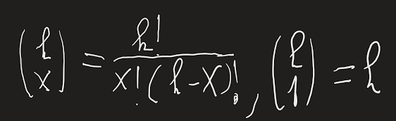
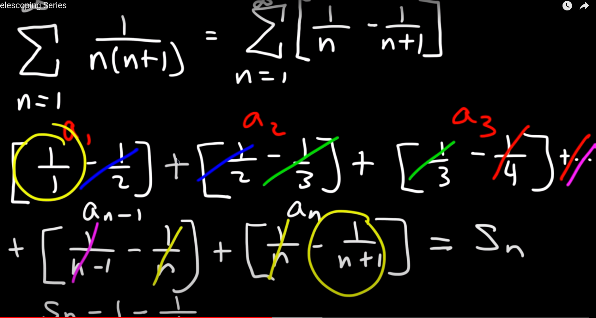
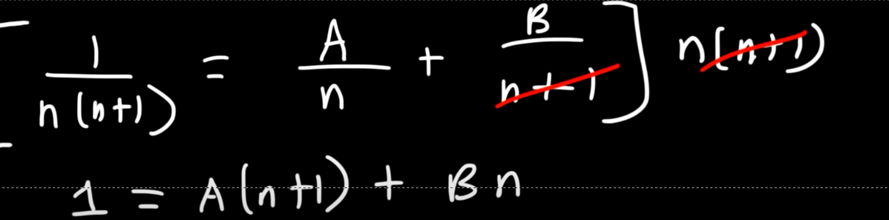
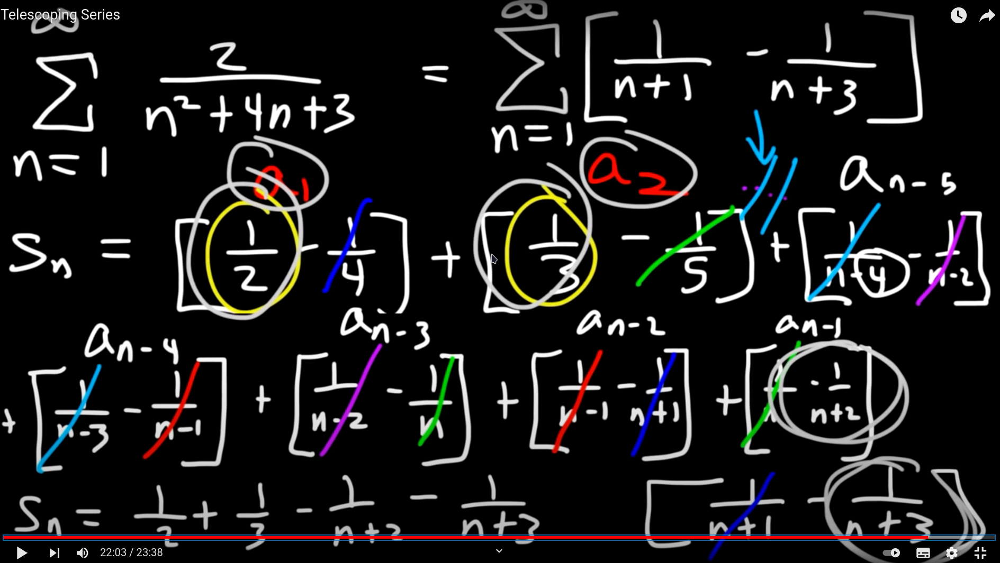

# Numerikus sorok összege
- Hasznos összefüggések
	- $\frac{a}{\frac{b}{c}}=\frac{a\cdot \:c}{b}$
	- $3^{k+1}=3^k*3$ 
	- $3^{3k}=9^k$
	- $x^0=1$ 
	- $\frac{\left(k-3\right)!}{k!}=\frac{(k-3)!}{(k-1)(k-2)(k-3)!k}=\frac{1}{\left(k-2\right)\left(k-1\right)k}$ 
	- 
 - Mértani sorok
	-  
	- $S_n=\frac{a_1}{1-q}$ 
	- $\sum\frac{2}{5^{k+2}}=\frac{2}{25}\sum(\frac{1}{5})^k$ : ha van fent 1-es akkor azt $1^k$-nek ism lehet venni igy $k$-t ki lehet vinni
	- az alsó 1-est egy nevezöre kell hozni az alsó törttel
		- $\frac{1}{1-\frac{x}{x+2}}=\frac{1}{\frac{2}{x+2}}=\frac{x+2}{2}$  
- Teleszkópos sorozat
	1. Szétválasztás(elsö óra)
	2. Behelyetesités és egyszerüsités
	3. Maradék leirása az összeg?
	- 
	- 
	- n-5 bir hogy eljussunk n-1-ig	
	- 
		- kiesnek és ami marad azt leirjuk és levonjuk $\frac{1}{2}+\frac{2}{3}-\frac{1}{n+2}-\frac2{n+3}$ 