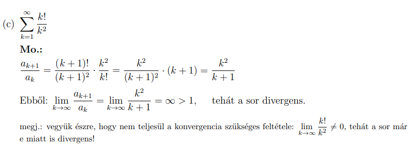
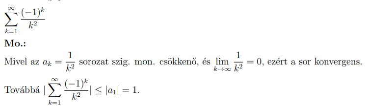

# Numerikus sorok
## Szabályok

- $\frac{a}{\frac{b}{c}}=\frac{a\cdot \:c}{b},\frac{\left(k-3\right)!}{k!}=\frac{1}{\left(k-2\right)\left(k-1\right)k},\frac{\left(k+1\right)!}{k!}=\left(k+1\right),$ $\frac{k!}{\left(k+1\right)!}=\frac{1}{\left(k+1\right)}$   

- 
	- ha nem biztos hogy melyik teszt kell ezt próbáljuk!!!!
- 

	- $2^{-2k}=\left(\frac{1}{4}\right)^k$ 
- $\frac{1}{k},\frac{1}{k^2}$ minoritásával is lehet divergenciát bizonyitani
-  
- 
- 
- 
- !
- 
	
	- folytonos,csökken,pozitiv
 

		
	- Néha nem egyértelmü akkor szét kell választani 
	ennek a lim végtelenbe 
		

## Mértani számsor konvergenciája
- 
- 
- 
- 
- 
- 
- 
- 
- szétválasztja a minusz és plusz
## Sorok összege résztörtekre bontással
- 
- 
	- ezt elcseyzted vajda
- 
	- $\frac{a}{\frac{b}{c}}=\frac{a\cdot \:c}{b},\frac{\left(k-3\right)!}{k!}=\frac{1}{\left(k-2\right)\left(k-1\right)k}$ !!!  
	- $\frac{k}{\frac{k!}{3!\left(k-3\right)!}}=\frac{k\cdot \:3!\left(k-3\right)!}{k!}=\frac{k\cdot \:3!}{\left(k-2\right)\left(k-1\right)k}=\frac{6}{\left(k-2\right)\left(k-1\right)}$  
	- 
	- a 6 hogy jön ki a végén: 6(1)=6
- 
	- elöször 2 kiemelés 20+20=40/2=20, mert utána q megfelel szabályoknak
## Divergens sorok szükséges tulajdonsággal (divergence test)
- 
- ha 0 akkor vagy divergens vagy konvergens másik teszt használata szükséges
- 
- 
- 
## harmonikus sorra visszavezethetö sor divergens
- 
## Majoráns minoráns kritérium divergens-e
- 
- 
	- 
	- $\frac{1}{2^{2k-1}}=2^{-2k+1}=\frac{2}{2^{2k}}=\frac{2}{4^k}=2*(\frac{1}{4})^k$  
	- másik képlet ahol k nem 0 ??????
- 
	
- 
- 
- 
- 
- 
- 
- 
- 
-  
## Hányados kritérium
- 
	- 
	- 
		- első átalakitásnál reciprok szorzás
		- $\frac{2^{k+1}}{\left(k+1\right)^{k+1}}\cdot \frac{k^k}{2^k}=\frac{2^{k+1}k^k}{\left(k+1\right)^{k+1}\cdot \:2^k}=\frac{2k^k}{\left(k+1\right)^{k+1}}$ 
	- 
		- $\frac{\left(k+1\right)!k^2}{\left(k+1\right)^2k!}=\frac{\left(k+1\right)k^2}{\left(k+1\right)\left(k+1\right)}=\frac{\left(k+1\right)k^2}{\left(k+1\right)\left(k+1\right)}$  
		- $\frac{\left(k+1\right)!}{k!}=\left(k+1\right)$ 
	- 
		- $\frac{\left(k+2\right)\left(k+3\right)k!}{\left(k+1\right)!\left(k+1\right)\left(k+2\right)}=\frac{\left(k+3\right)k!}{\left(k+1\right)!\left(k+1\right)}=\frac{k+3}{\left(k+1\right)\left(k+1\right)}$ 
		- $\frac{k!}{\left(k+1\right)!}=\frac{1}{\left(k+1\right)}$
	- 
		- $\frac{\left(k+1\right)!k^k}{\left(k+1\right)^{k+1}k!}=\frac{\left(k+1\right)k^k}{\left(k+1\right)^{k+1}}=\frac{k^k}{\left(k+1\right)^k}$
	- 
		- $\frac{\left(k+2\right)!}{2\cdot \:2^k\left(k+1\right)!}\cdot \frac{2^kk!}{\left(k+1\right)!}=\frac{k+2}{2^{1+k}}\cdot \frac{2^kk!}{\left(k+1\right)!}=\frac{k+2}{2^{1+k}}\cdot \frac{2^k}{k+1}$ 
		- $\frac{\left(k+2\right)\cdot \:2^k}{2^{1+k}\left(k+1\right)}=\frac{k+2}{2\left(k+1\right)}$ 
	- 
		- $\frac{\left(k+1\right)\left(\frac{2}{3}\right)^k\left(\frac{2}{3}\right)}{k\left(\frac{2}{3}\right)^k}=\frac{\left(k+1\right)\frac{2}{3}}{k}$ 
	- 
		- $\frac{\left(k+1\right)\cdot \:2^k}{2^{k+1}k}=\frac{k+1}{2k}$
## Gyökérkritérium
- 
- 
- 
- 
- 
- 
- 
- 
##  integrálkritérium
- 
- 
- 
- 
- 
- 
- 
- 
- 
- 
- 
- 
## Változó előjelü sorok
- 
- 
- 
- 
- 
- 
- 
