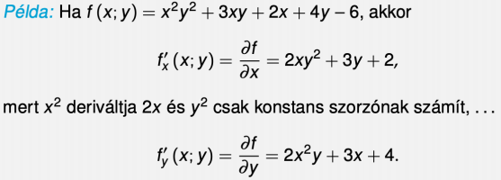
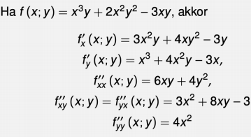

# Parciális differenciál
- parciális derivált: x vagy y szerinti derivált
- Ha x-szerint deriválunk akkor y-t vesszük konstansnak
	- ha $yx^3$ akkor deriváltja $3yx^2$ 
	- ha $x^3+y^2$ akkor deriváltja $3x^2$ 
- 
- magasabb rendü (xy,xx,yy szerint deriválni):
	- xy és yx szerinti derivált megegyezik
	- 