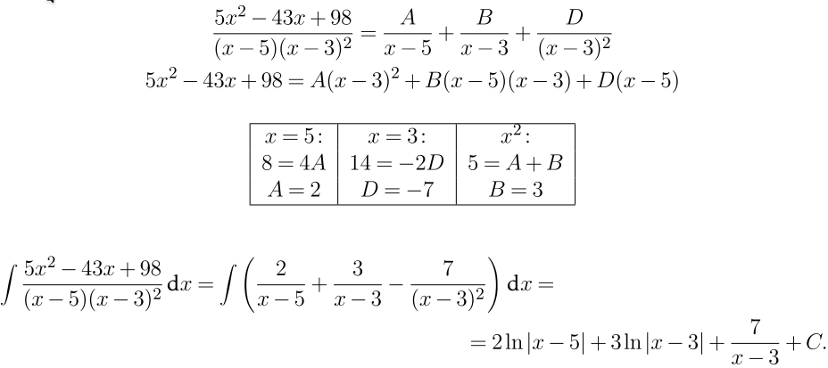
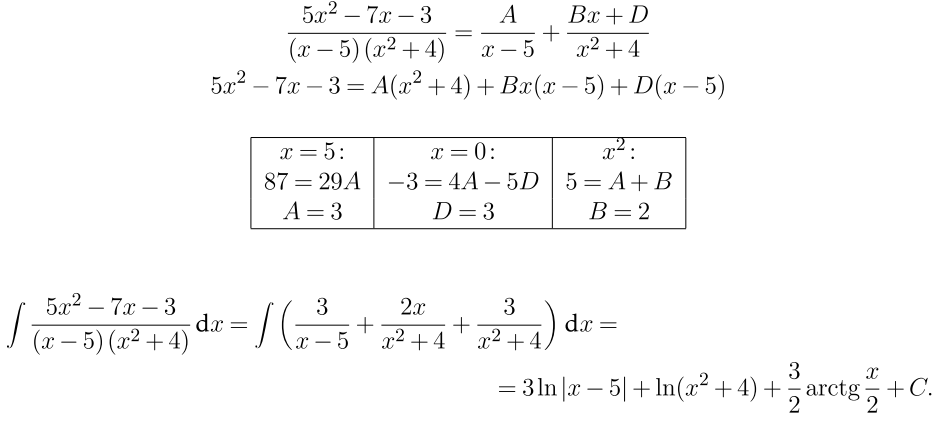

# Racionális fügvények integrálása
## Parciális törtek összegére bontás
- 
- 
- Osztandó meghatározása
	- ha van osztóban $x^2$ : akkor osztandó Bx+D
	- ha $(xxx)^3$ alakú akkor: $\frac{A}{(xxx)^1}+\frac{A}{(xxx)^2}+\frac{A}{(xxx)^3}$  
- Amikor szorzattá alakitás történik akkor azt kell oda irni ami hiányzik: 
	- elsönél: $\frac{A}{x-5}$ nél $(x-3)^2$ hiányzik ezért azzal szorozzuk be
	- beszorzás után x,x^2 kiemelés 
- Változók megállapitása
	- X egyenlövé tenni valamivel hogy változókat ki lehessen ütni
	- vagy kiemeleni x^y mindkét oldalból
- gyakori Integrálás
	- $\int\frac{K}{x+-n}=K*ln(x+-n)$