## Taylor polinom
+ 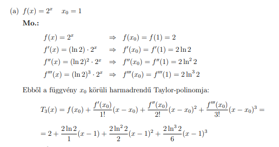
+ 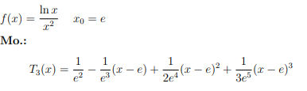
+ 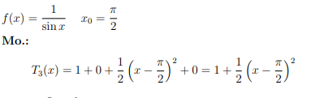
+ 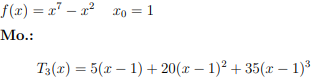

## Taylor sor
- $\sum _{n=0}^{\infty }\frac{f^{n}\left(x_0\right)\left(x-x_0\right)^n}{n!}$ 
- n=0-nál 
- Maclaurin sor és a taylor sor között annyi a különbség hogy ennél mindig c=0
- f(x)=ln(x) taylor sora c=1 
	- első 4 derivált(a lényeg hogy egy patern kiaalakuljon és a végén legalább 3 nem nulla tag maradjon a sum kialakitáshoz)
		- 
	- értéke a fügvénynek és a deriváltaknak c-nél
		- 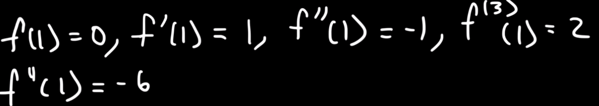
	- taylor sor expanded képlet(az x-1 nél nem deriválás van)
		- 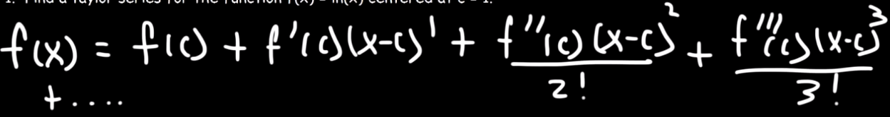
		- 
		- 
	- sum formába átirás
		- 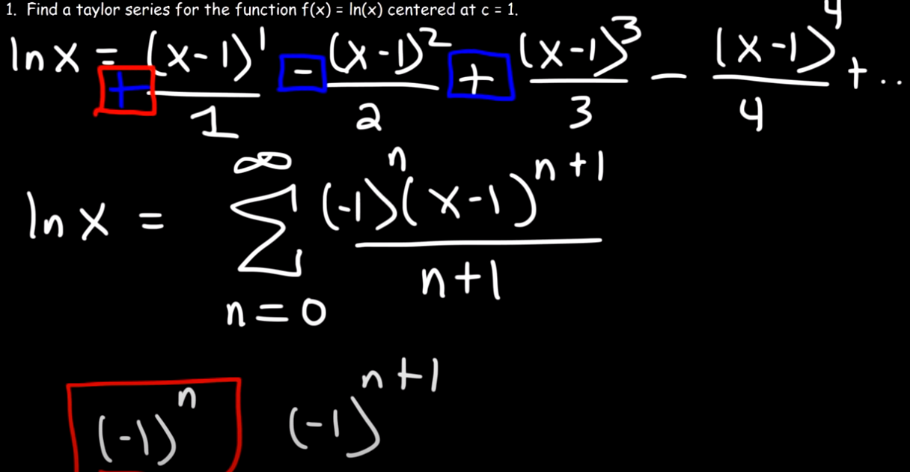     
- f(x)=e^x c=3
	- 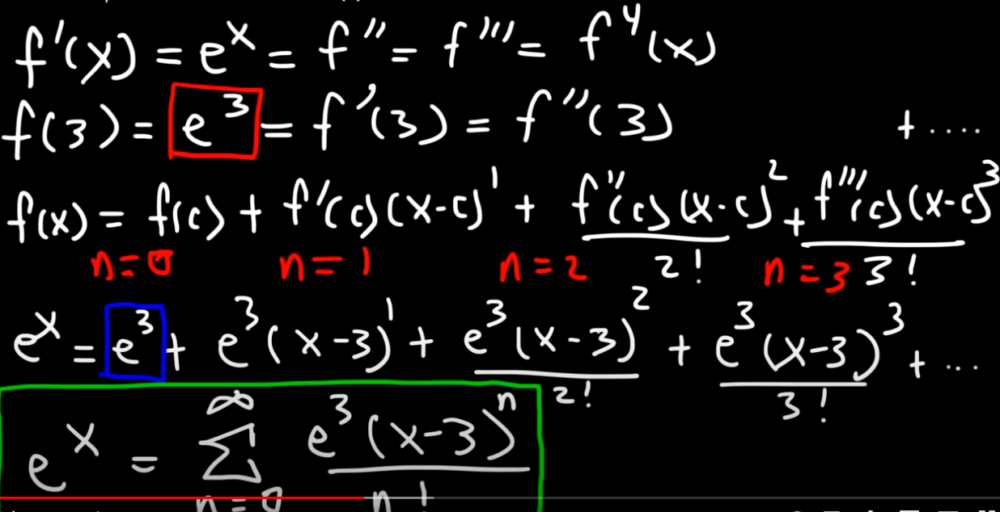
- Maclaurin f(x)=sin(x)
	- 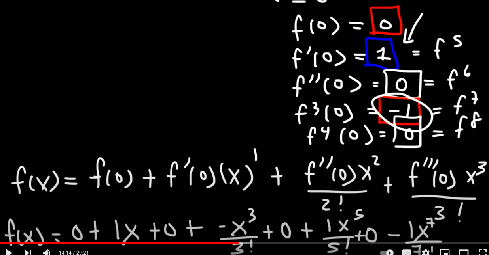
	- 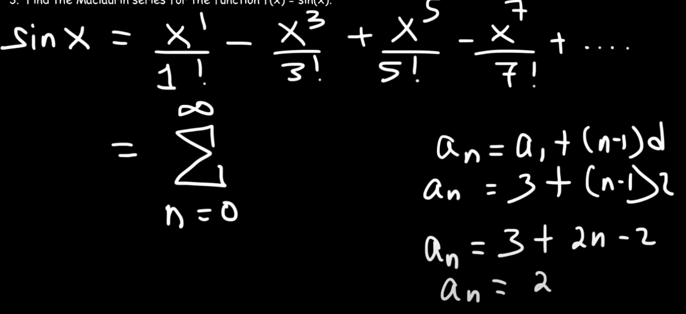
	- 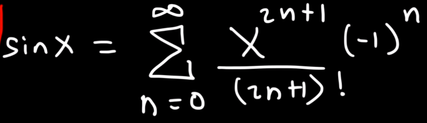
- cos(x) maclaurin sora sin(x) maclaurin sorával
	- sin(x) macnak mindkét oldalának deriváltja
		- 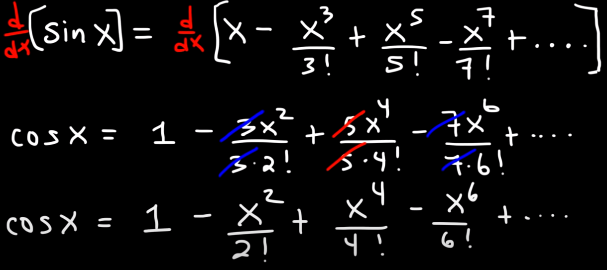
	- átirni sum formába
		- 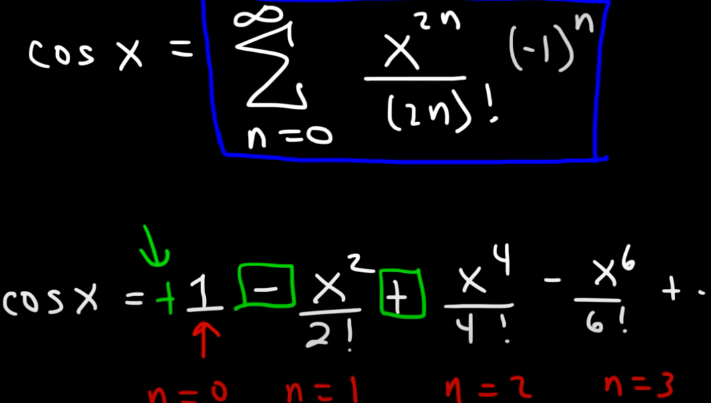
	- egyszerübb megoldás:
		- 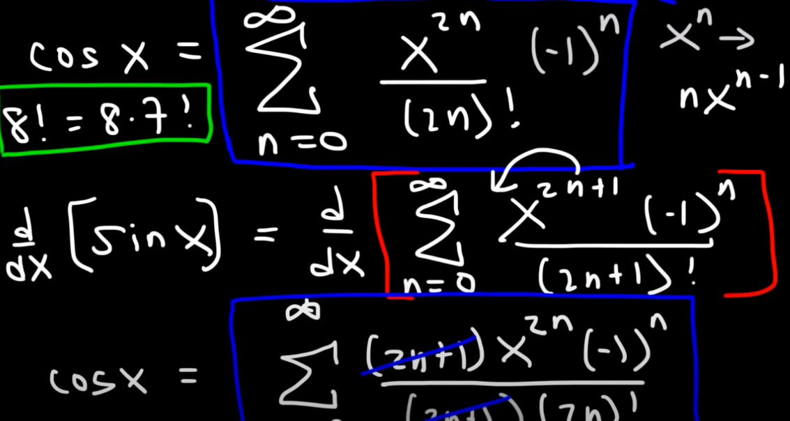
- maclaurin cos(x^2)
	- a cos(x) ismerjük és csak ki kell cserélni a x-et x^2-re
	- 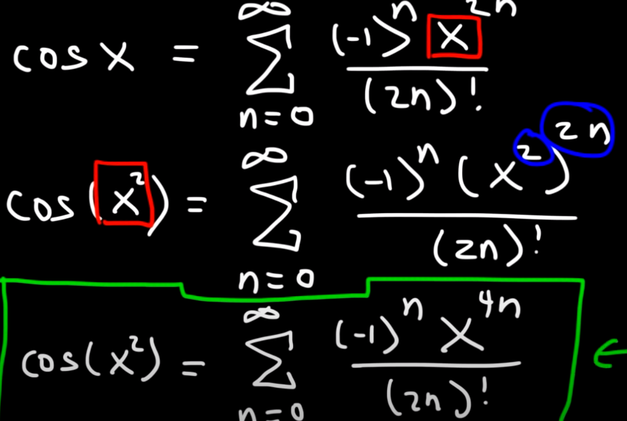
- maclaurin xcos(x)
	- 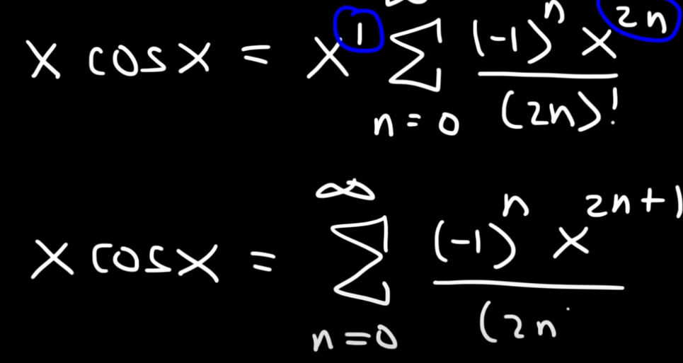
- maclaurin x^2e^(-x)
	- 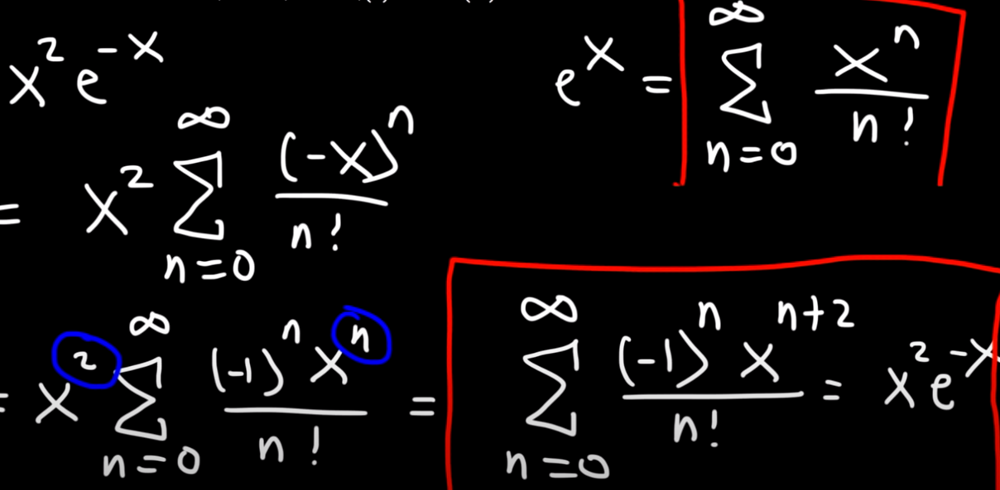
## Maclurian hiba
- Közelités a Leibniz sor újra kezdése elött számolja ki 3 tagig vagyis az integrál értékét
- a hibát a kért 4. tag abszolút értékével adja meg
- 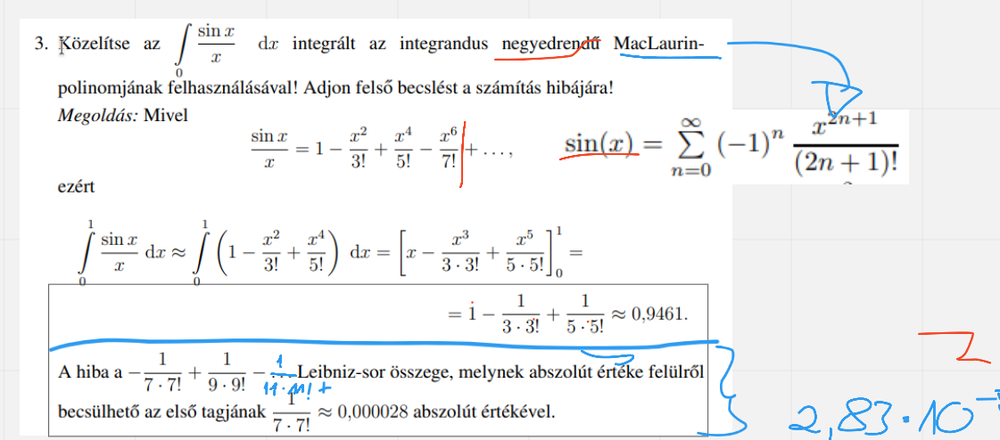      