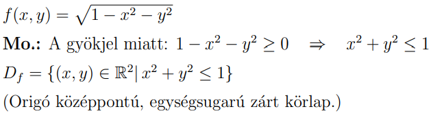
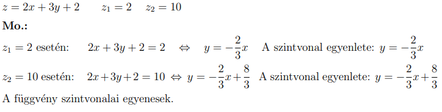
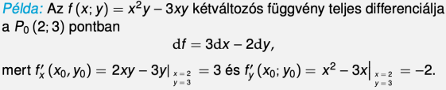
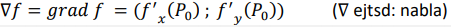
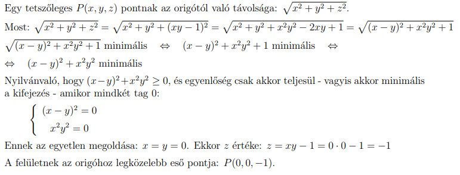
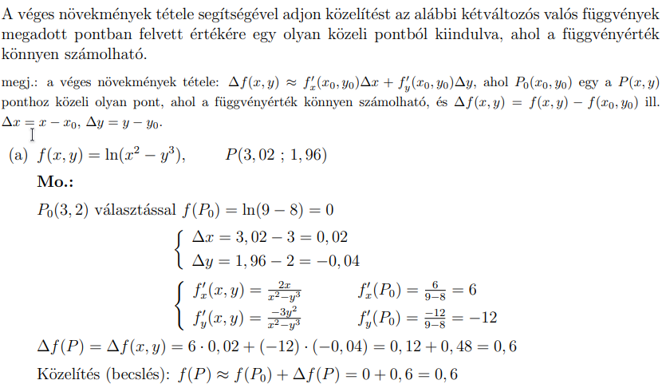

## Többváltozós függvények
- Értelmezási tartomány
	- (x,y) eleme R^2
	- f(x) >= 0 kindulás
	- -1 szorzás miatt megfordul
	- 
- Szintvonal
	- z=x+y, z helyére behelyetesitünk y=x.. -re alakitjuk
	- 
- Parciális differenciál
- Teljes differenciál:
	- Mindig egy adott ponthoz tartozik. 
	- Kiszámolod mindkét változó szerint az első deriváltat, és ezeket összeadod. 
	- Az x szerintit megszorzod dx-el, y szerintit dy-nal.
	- 
-  Gradiens vektor
	- Lényegében egy adott pontbeli első parciális deriváltakat bepakolod egy vektorba. Két változó esetén értelemszerűen ennek a vektornak 2 koordinátája van:
	- 
- Felületnek az origóhoz legközelebb esö pontjat
	- 
- Véges növekmények tétele
	- 