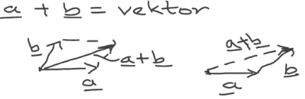
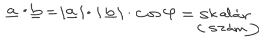
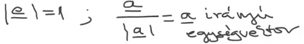
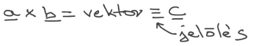
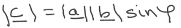
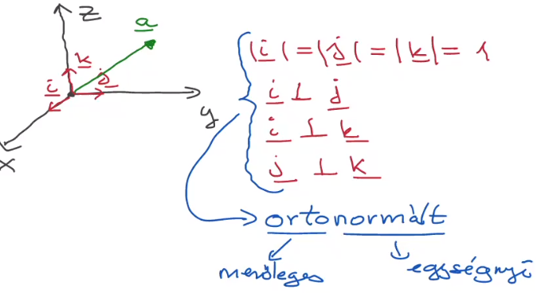
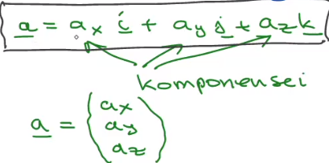
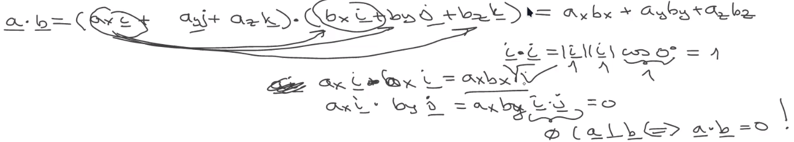
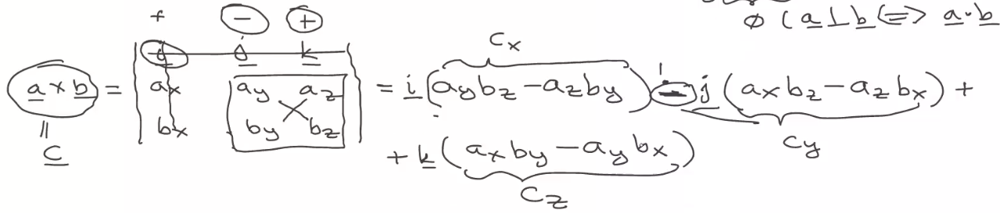
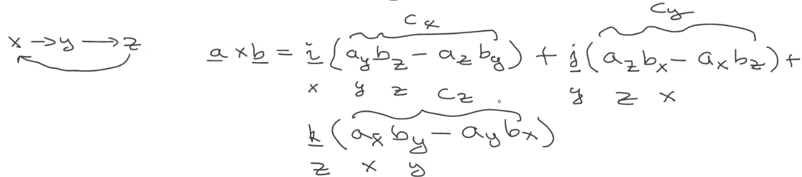

## Matematika gyorstalpaló
- vektorok
	- hossza (valósszám),iránya
	- vektorterekben vannak n dimenzióban
	- 3D-ben -> 3db szám komponensek
	- fizikai mennyiségek: erő,gyorsulás,mágneses indukció,
- skalárok
	- valós vagy komplex számok
	- görög betükkel jelöljök $\alpha,\beta,\gamma ...$ 
	- fizikai mennyiségek: idő,út,energia,tömeg,töltés,sűrűség, hőmérséklet
- tenzorok
	- mátrix reprezentáció
#### Vektor müveletek
- vektorok összeadása
	- 
- skaláris szorzás
	- 
- egységvektor
	- 
- vektoriális szorzás
	- 
- 
- Descartes féle koordináta rendszer 
	- pontok helyzetét leirjuk
	- derékszögü koordináta rendszer
	- 
	- linerárisan független:  
	- komponensek: vektor vetületei
	- egy vektor felirható a komponenseivel
		- 
	- ortonormál rendszer
		- (orto)merőleges egymásra merőleges egyenlö ()(normál)egységnyi vektorok    
	- vektorok skalárszorzása komponensekkel
		- minden tagot minden taggal való szorzás
		-  ha a merőleges b-re akkor skalárszorzatuk 0 	
		- 
	- vektoriális szorzat komponensekkel
		- 
		- egyszerübb megoldás(ciklikus)
			- 
		-  