## Differenciaszámitás
- f(t) -> milyen gyorsan változik a fügvény
- időbeli változást vizsgálunk
- ha ez a határérték létezik akkor ez a derivált
- 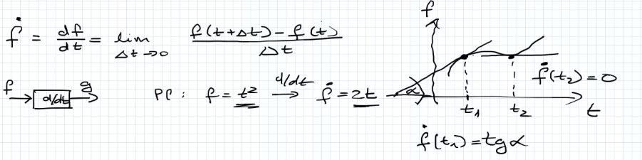
## Integrálás
- határozatlan integrál (primitv fügvény keresés)
	- 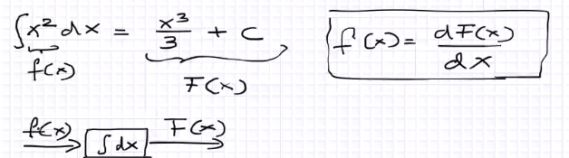
- határozott integrál
	- 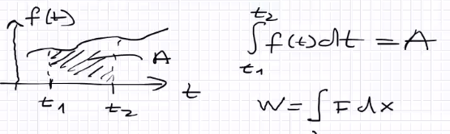
	- munka kiszámitása két hely között ha az erő nem álandó
- Newton Leibnitz
	-  
## Fizikai mennyiségek
- pl.: tömeg, hőmérséklet
- (jelölése) = (iránya(előjele)) + (értéke) + (mértékegysége)
	- m = +3 kg
	- v = - 10 m/s
## Mechanikai alapmennyiségek
- tömeg,hossz,idő -> bármilyen fizika mennyiség kikeverhető
- tömeg: jelölés -> m, mértékegység(SI) -> kg, dimenzió(fiz mennyiség jellege) -> M
- hossz: jelölés -> l, mértékegység(SI) -> m,  dimenzió -> L
- idő: jelölés -> t, mértékegység(SI) -> Sec(s), dimenzió -> T
- a dimenzió nem alapmennyiségeknél
	- térfogat: \[V\] = L^3
	- terület:  \[A\] = L^2
	- 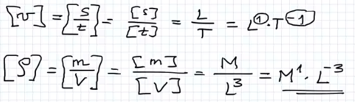
- amit mi dimenziónak gondolnánk az a kitevő 
- arányosságból egyenlőség: $a\alpha b, a=cb$ 
	- arányossági tényezővel (c)
	- 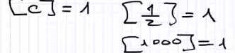
- mire jó a dimenzió?(dimenzió analizis)
	- ellenőrizzük a képletek helyességét
		- nem adja meg az arányossági tényezőt
		- csak a végén szabad behelyetesiteni
		- ha van dimenzió egyezés akkor lehet
		- tömegpont helyzete arányos($\alpha$) az adott tömegpont gyorsulásával és az idő négyzetével
			- $x\alpha a\times t^2$ 
			- 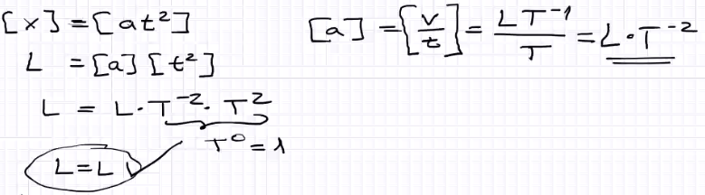  
	-  összefüggések meghatározása fizikai mennyiségek között
		- tőmegpont körpályán mozog egyenletes sebességgel, sebesség mértéke konstant de irány ya nem
			- 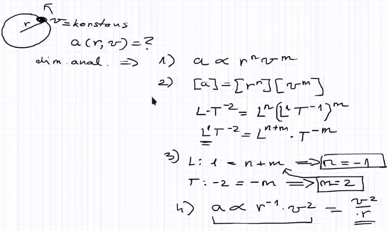
	- nagyságrendi becslés 
		- a nagyságrend legalább 10* különbség
		- 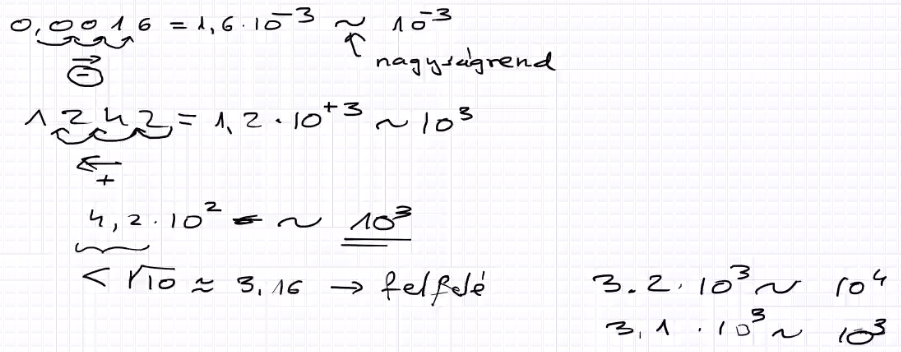
		- hf levegő vétel/70 év 1 perc alatt egy levelgő
## Klasszikus mechanika
- nem kvantum mechanika
- makroszópikus tárgyakkal foglalkozik(nem atomi szint)
- a mozgások lassúak
	- V<< C -> v mozgáss kissebb mint a fény sebessége
- Newton féle mechanika
	- newton axiómák 4db
## Mozgás 1 dimenzióba
- mechanika
	- kinematika -> mozgás leirása, mozgás hogyan jön létre
	- dinematika -> erők
- 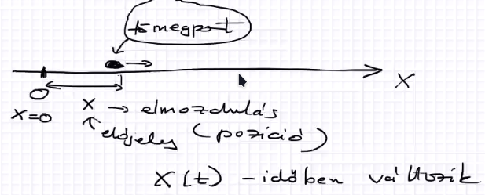
- leirás szemléltetés
	- út-idő grafikon
	- 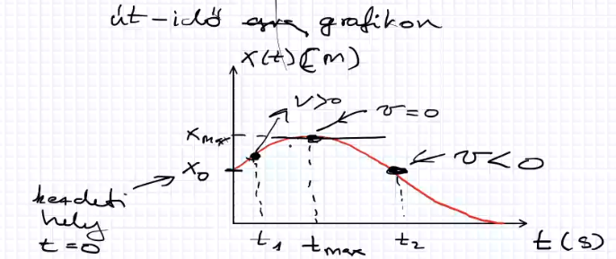
		- meredekség emelkedik -> sebsség pozitiv, meredekség 0 -> meredekség csökken -> negativ lesz (vissza fele megy)
	- pályája
		- 
-  átlagos sebesség
	- előjeles mennyiség
	- ha vissza tér a kezdő pontra akkor az átlagos sebsség 0 
	- 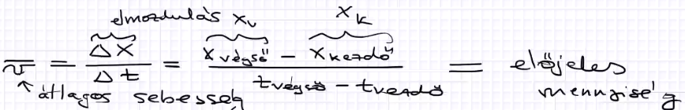
	- 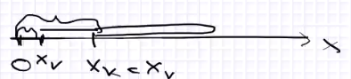
- átlag sebesség
	-  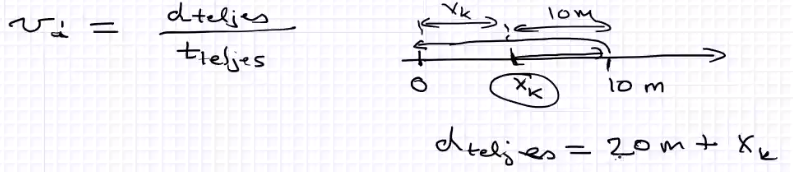
	- csak pozitiv lehet
	- csak akkor lehet 0 ha a teljes út is 0
- pilanatnyi sebesség
	-  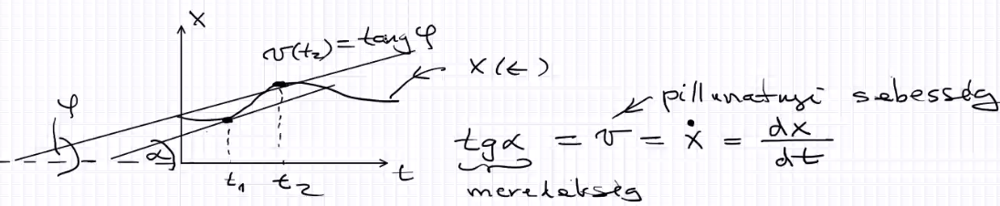
	- 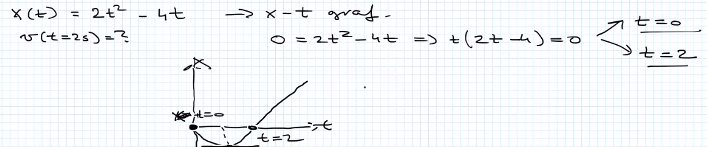
	- 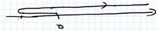
- sebesség
	- 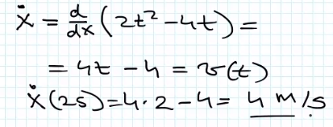
	-  