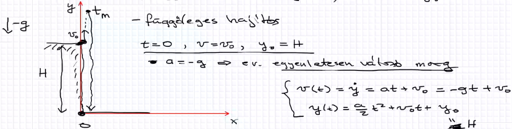

## Pillanatnyi gyorsulás
- sebesség megváltozása egységnyi idő alatt
- mértékegysége: $\frac{m}{s^2}$
- dimenzió: $\frac{L}{T^2}$
- 
- jellemzése (sebesség idő grafikon)
	- 
- példa
	- 
	- 
	- gyorsulás 2sec-nél
		- 
		- a konstansoknak mértékegységekkel kell rendelkezniük
			- 
## Speciális eset
- egyenes vonalú egyenletes mozgás
	- pálya egyenes
	- 
	- 
 - Egyenes vonalú(pálya egyenes) egyenletesen változó mozgás
	 - egyenletesen változó -> v!= állandó a!=állandó
	 - a: gyorsulás, v:sebesség
	 - 
	 - 
	 - 
## Szabadesés
- g - nehézségi gyorsulás
- g kb 10m/s^2
- minden test(függetlenül a tömegétől) ezzel a gyorsulással esik
- 
- 1. feladat : 
	- 
- 2.feladat
	- 
- 3. feladat
	- 
## Ferde hajitás
- 
- 2 részre lehet bontani
	- x irányú
		- 
	- y irányú 
		- 
- 
- 
- 
- 
- 
