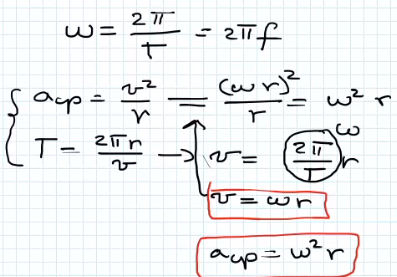
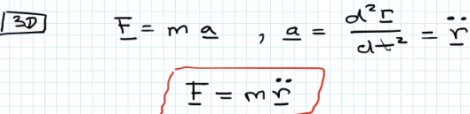

## Körmozgás
- $\phi$ ez irja le a körmozgást  
- r=állandó
- 
- Egyenletes körmozgás
	- 1 sec alatt ugyan annyit fordul el
	- 
	- 
	- 
	- 
	- 
- Nem egyenletes körmozgás
	- 
	- 
	- 
	- 
## Dinamika(erők)
- fizikai axiómák: megfigyeléseken nyugszanak(kisérleti tények) idő folyamán változnak
#### Newton axiómák:
- nagysebességeknél nem érvényes (relativitás)
- kis atomi részecskéknél quantum mechanika
-  hétköznapi életet nagyon jól modellezi
- 1. tehetetlenség törvénye
	- **léteznek inercia rendszerek**,melyekben  minden test megőrzi mozgásállapotát amig valamilyen **erő** azt meg nem változtatja
	- mozgás állapotát a sebesség vektor változtatja
	- mi nem inercia rendszer?
		- tárgy mozog rá ható erő nélkül
		- pl.: mozgó vonatban tárgy mozog
	- ha tálálunk egy inercia rendszert akkor végtelen is van
- 2. mozgás egyenlet
	- def: impulzus,lendület(p)
		- tömeg\*sebesség $m\times\vector{v}$  kg m/s
		- p=impulzus vektor    
		- 
		- 
		- ha a dm/dt=0 akkor m állandó 
		- ha hat a testre egy erő akkor a lendülete változni fog
		- 
		- m=tehetetlen tömeg
		- 
		- 
		- 
	- 3. hatás elenhatás
		- 
		- az egyik erő az egyik testre hat, a másik a másik testre
		- fontos hogy melyik erő melyik testre hat
		- 
		- m zuhan a föld felé de föld nem zuhan a kis m félé
			- 
	- 4. szuperpozició elve
		- ha több erő hat a testre, több gyorsulást össze lehet adni
			- 
			- 
