- test ellenál a gyorsitó ellen
- K: kötél erő
- F: erőket össze lelehet vektoriálisan adni
- 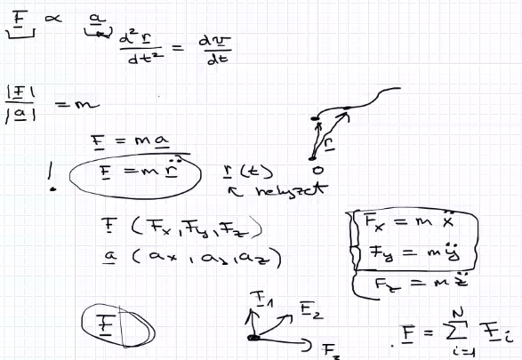
## Egyensúlyban lévő tömegpont
- a=0
- 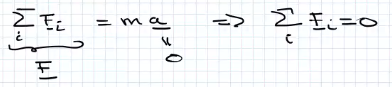
- Menyezetre fellógatunk egy m tömegü testet.
- nehézségi erő lefele
- kötél erő
- 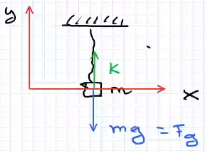
- 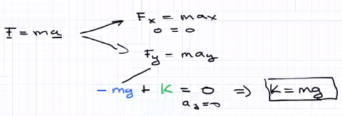
## Erő hatására gyorsuló tömegpont
- erő mereleges felületre: normál erő,tartó erő
- 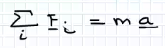
- 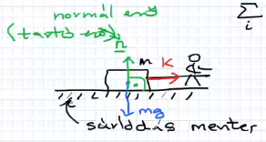
- erődiagram
	- 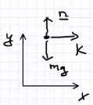
- irányokra való felbontás
	- ha felbontottuk már nem vektorokkal dolgozunk hanem számokkal ezért bontjuk fel
	- 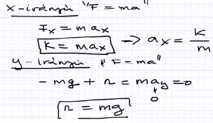
## Példák
1. a vezeték elszakad ha 100 newtonnál nagyob erőt kap. kibirja e ha a lámpa sulya 122 newton
	- 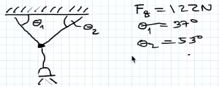
	- 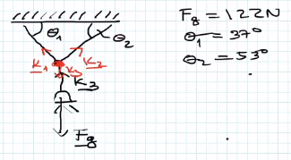
	- 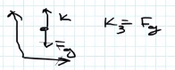
	- 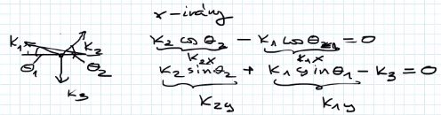
	- miért sin vagy cos?
		- 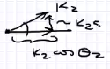
2. milyen lesz a koordináta rendszer?
	- nem elvi kérdés hanem praktika
	- felbontjuk egy a sikra párhuzamos és merőleges részre
	- 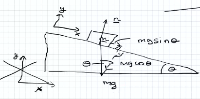
	- határok vizsgálata
	- 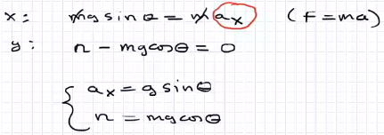
3. milyen lesz a gyorsulás?
	- kell egy feltételezés és ha negativ jön akkor az igazi erő forditott
	- $F=m\times a$  külön kell felirni az m1 és m2-re
	- 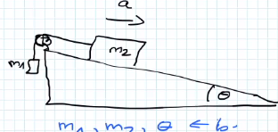
	- egyenletek megoldása
		- 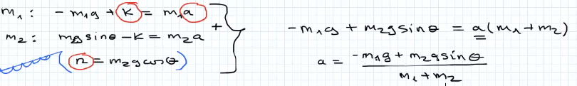
	