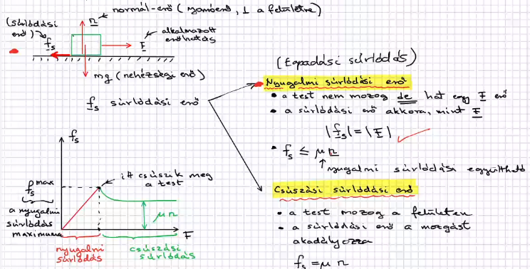
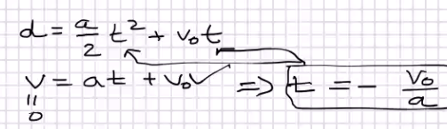

## Surlódási erő
- 
- 
- F=m\*a -> vektror egyenéet és minden iránnyal ki kell számolni
- példa
	- 
	- d:
		- 
## Erő munkája, mechanikai rendszer energia
- erőhatások végeznek munkát
- 
- 
- 
- munka pozitv: erő munkát végez a testen
- munka negativ: ha én ellenállok a gravitációs erőnek akkor gravitációnak a munkája negativ lesz.....
- pl
	- 
- 
- 
- 
- 
- 
-  