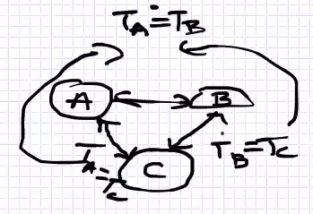

- potenciális miért minusz: erö elmozdulás ellentétes
## Termodinamika
- surlódás elviszi a kinetikus energia egy részét
- rendszer állapota hogyan változik
-  fenomenologikus
	- nem irja le az atomi szinten csak összefüggéseket
- statisztikus
	- részecskék viselkedése hogy jut el a megfigyelt képletekig
- termikus kölcsönhatás
	- közvetlen energiatranszfer
		- idő után egyensúly fog beálni
	- sugárzás energiaátadás
		- minden test kibocsát energiát -> elektromágneses sugárzást
		- az egyik test sugározz a másik elnyeli -> egyensúly
- termodinamika nulladik fötétele
	- 
	- hőmérsékletek megegyeznek
- abszulút nulla
	- nem érhető el csak megközelithető
- rugalmas ütközés
	- gáz molekulák mit billiárd golyók nem fog elveszni az energia
- 1 mol anyagnak az anyagtol függ a tömege
-           