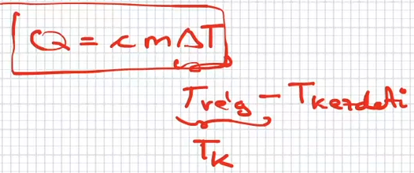

## Termodinamika
- 
- 
- 
- p=nyomás,V=térfogat,n=anyagmennyiség,R=egyetemes gázallandó,T=abszolút hömérséklet(kelvin)
## Példa
- 
- Termodinamika 1. főtétele: energia megmaradás
- 
- Hő: mindig áramló energia a test és a környezet között
- Egy anyag 1c hőmérséklettel való megváltozattása anyagtól is függ
- Hőkapacitás:
	- az adott anyag 1 c megváltoztatásához szükséges energia
- delta T: hőmérsékelt változás, m: tömeg,c: fajhő, C: hőkapacitás
- 
- 
- delta T: nem kell kelvinre váltani, de T-nél igen
- 
