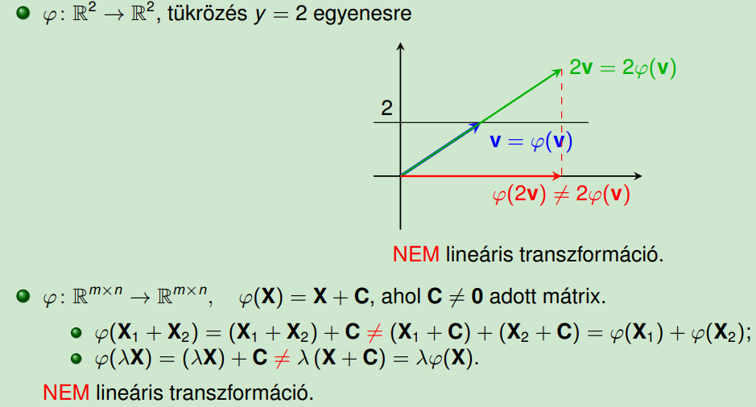
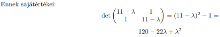
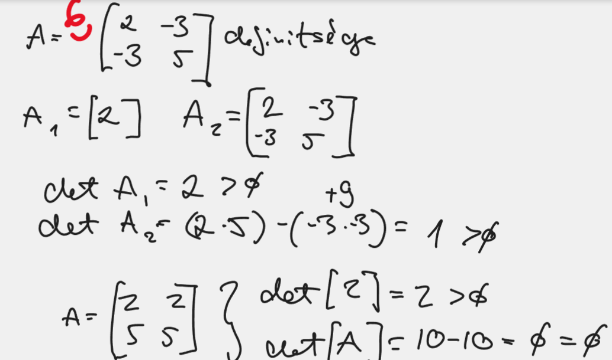

Pálosi Ákos, Dézsi Csaba
> **WARNING: Math is gonna get methy. So be warned, this doc is gonna meth you up real bad, readers be warned!**
# ITMA jegyzet
[Magdi néni előadásai/gyakvideói - DIMAT2](https://www.youtube.com/playlist?list=PLhOYgSrY6RXLH0SzTmhm81pdNMeA3J6tv)
- Csaba: i wanna die, and i will take u with me :D
- Ákos: not if i take you first 
- Csaba: hmmmm
## ÁLTALÁNOS CUCCOK, BEVEZETŐ
### 1: alapfogalmak és műveletek
- Python indexelés
```python
d[0:3] #utolsó index nincs benne
d[-1] #utoló elem a listában
d[::2] # 2-esével listázza az elemeket (elsö index benne van)
d[0:5:2] # 0-5 idexig listázza 2-es léptékkel
d[:-1,:]
d[:] #minden elem
d[:-1] #utolsó soron kívül minden sor == d[:-1][:] == d[:-1:]
d[-1][:] # utolsó sor minden oszlopa == d[:][-1]
d[:][-1] # a mátrix utolsó sorát 

fenti kilistázások nem 'list'-et adnak vissza hanem 'range' objektumot
```
- „Alaki” műveletek:
    - alak megváltoztatása (átméretezés), transzponálás
    - sorok cseréje, oszlopok cseréje
    - kiválasztás, „szeletelés” (vágás, slicing), összeillesztés
- Számmal szorzás megegyezik a matematikai művelettel.
```M = c * A esetén M[i,j] = c * A[i,j]```
- Összeadás (kivonás) megegyezik a matmatikai művelettel.
```M = A + B esetén M[i,j] = A[i,j] + B[i,j]```
- Szorzás nem egyezik meg a matematikai művelettel.
```M = A * B esetén M[i,j] = A[i,j] * B[i,j]```
- „Reciprok” („osztás”) nem egyezik meg a matematikai művelettel.
```M = 1 / B esetén M[i,j] = 1 / B[i,j]```
```M = A / B esetén M[i,j] = A[i,j] / B[i,j]```
- Hasonlóan egyéb műveletek és függvények, általában nem egyeznek meg a matematikai művelettel.
```M = A ** B esetén M[i,j] = A[i,j] ** B[i,j]```: $A^B$
```M = exp(A) esetén M[i,j] = exp(A[i,j])```: $e^A$


- Mi van a „rendes” matematikai müveletekkel?
    - **Szorzás (dot product)**
        - A.dot(B) elvégezhető vektorokon(1D array) vagy mátrixokon(min 2D array)
        - Ha vektorokon végezzük el akkor inner productnak hivhatjuk
        - Ha mátrixon végezzük akkor mátrix szorzásnak felel meg (matrix multiplication)
            - de a numpy matmul vagy A @ B operáció is ugyan azt csinálja
            - 2D esetében az első mátrix oszlopszámának meg kell egyeznie a második mátrix sorainak számával => igy müködik:
                - ```A.shape == (m,n)``` és ```B.shape == (n,p)``` és ```M.shape == (m,p)``` 
                ```M[i,j] = (A[i,:] * B[:,j]).sum()```
        - 

    - **Inverz** (költséges számítás).
        - ```M = np.linalg.inv(A)```
        - $\begin{pmatrix}a\:&\:b\:\\ c\:&\:d\:\end{pmatrix}^{-1}=\frac{1}{\det \begin{pmatrix}a\:&\:b\:\\ c\:&\:d\:\end{pmatrix}}\begin{pmatrix}d\:&\:-b\:\\ -c\:&\:a\:\end{pmatrix}$
        - DE Ha van egy diagonális mátrixod (a nem fő átlóba CSAK 0-k vannak) pl Hesse mátrix akkor a tagok reciprokát kell venni
            - $\begin{pmatrix}2&0\\ 0&4\end{pmatrix}^{-1}=\begin{pmatrix}\frac{1}{2}&0\\ 0&\frac{1}{4}\end{pmatrix}$

### 2.:TÖMBÖK
- A kétdimenziós tömbnek két mérete van:
    - 1.: sorok száma
    - 2.: oszlopok száma (ilyen sorrendben).
    - Az m × n méretü M mátrix mérete: ```M.shape = (m,n)```
    - 2D tömb szorzása 1D tömbbel:
        - 2D minden sorát!!!
        - skalárisan szorozzuk 1D-vel
- A háromdimenziós tömbnek három mérete van:
    - rétegek száma
    - sorok száma
    - oszlopok száma (ilyen sorrendben).
    - A k rétegben m × n méretű márixokat tartalmazó M 3D tömb mérete: ```M.shape = (k,m,n)```
    - **3D** tömb szorzása **1D** tömbbel:
        - 3D minden rétegében!!!
        - minden sorát!!!
        - skalárisan szorozzuk 1D-vel
        - ```(k,m,n) és (n,)``` szorzás eredménye ```(k,m)``` méretű.
    - **3D** tömb szorzása **2D** tömbbel
        - 3D minden rétegét!!!
        -  szorozzuk 2D-vel.
        - ```(k,m,n) és (n,p)``` szorzás eredménye ```(k,m,p)``` méretű.
    - Ez **3D+** tömb szorzása:
        - When calculating the dot product($A @ B$) of two N-D arrays $A$ and $B$ using ```np.dot(A,B)```, the result is a sum product over the last axis of $A$ and the second-to-last axis of $B$. Specifically, if $A$ has shape $(i,j,k)$ and $B$ has shape $(k,l,m)$, then the resulting array $M$ will have shape $(i,j,l,m)$ 

## BROADCASTING
- [Broadcasting csodái :D -> python array broadcasting](https://jakevdp.github.io/PythonDataScienceHandbook/02.05-computation-on-arrays-broadcasting.html)
- **CSAK bal oldal**ról lehet bővíteni a kisebb méretű mátrixot. 1-esekkel bővítjük és az 1-eseket tudjuk utánna kinyújtani
- **Broadcasting** => dimezió kiterjesztést jelent
- összeadásnál alkalmazható
- Ha valamelyik dimenzió **1**, akkor kiterjesztheto, különben nem lehet
- A nem-létezo dimenziók mindig elöl állnak, azaz hátulról (jobbról) olvasva kell a méreteknek egyezni.
- FONTOS: $(2,)$ ez egy csak egy skalár (szám) nem vektor, lényegében egy $0$D-s tömb
> - 3 szabály
    - **Rule 1:** If the two arrays differ in their number of dimensions, the shape of the one with fewer dimensions is padded with ones on its leading (left) side.
    - skalárral/$0$D-s mátrixxal való broadcasting
    ```
    M.shape = (2, 3)
    a.shape = (3,) => (1, 3) => (2, 3)
    ```
    - **Rule 2:** If the shape of the two arrays does not match in any dimension, the array with shape equal to 1 in that dimension is stretched to match the other shape.
    ```
    M.shape = (2, 3)
    a.shape = (1, 3,) => (2, 3)
    ```
    - **Rule 3:** If in any dimension the sizes disagree and neither is equal to 1, an error is raised.
    
    
- Tehát:
    - ha nem megfelelő a dimenziók száma, $1$-essel bővíthetünk a bal oldalon
    - ha 2 mátrix csak abban térnek el hogy az egyikben adott dimenzióknál $1$-es szám van akkor a kettő összeadható, mert azt ki tudjuk nyújtani

- Megjegyzés: Ahogy a képen is látszik, mind a kettő mátrix adott dimenzióját lehet nyújtani
- Példa:
    - 

## NORMA
- Vektor: 1 dimenziós mátrix
- Vektortér: Vektortér kb. amelynek elemei korlátlanul és egyértelmüen **összeadhatók** és számmal **szorozhatók**.
- Def: 
- Vektor hosszának számítása:
    - általános alak: $|a|=\sqrt{\sum_{n=1}^{n}a_n^2}$ 
    - vegyük ```a=[2,2,3]``` vektort
        - ebben az esetben: $|a| = \sqrt{2^2+2^2+3^2} = \sqrt{17}$
> - Norma: Általánosított vektorhossz
> - **Szabályok:**
    **1.:** ```∥v∥ = 0 ⇐⇒ v = 0```, ha a vektor hossza 0, maga a vektor is 0
    **2.:** ```∀v ∈ V és ∀λ ∈ T``` esetén ```∥λv∥=|λ|·∥v∥```(homogenitás / skálázhatóság)
        - **Magyarul:**
        - vesszük ```v=[1,2,3]``` vektort ```λ=2-vel```
            - $\sqrt{\left(1\cdot 2\right)^2+\left(2\cdot 2\right)^2+\left(3\cdot 2\right)^2}=2\cdot \sqrt{1^2+2^2+3^2}$
    **3.:** ```∀u ∈ V``` és ```∀v ∈ V``` esetén ```∥u + v∥ ⩽ ∥u∥ + ∥v∥```. (szubadditivitás / háromszög-egyenlotlenség) 
        - Ha vekorokat összeadjuk és utána vesszük a hosszát az kissebb egyenlő azzal hogy előszőr mindkét vektor hosszát vesszük és utána adjuk őket össze
 

- Példa:
## METRIKA
- Általánosított távolság.
- Két vektor távolsága
    - $v=[v_1,v_2],w=[w_1,w_2]$ 
    - $d(v;w)=\sqrt{(v_1-w_1)^2+(v_2-w_2)^2}$
- Adott $H$ halmaz (nem feltétlenül vektortér). A
>  - $d : H × H →R_0^+$
>  - függvény **metrika**, ha
>      1. ```d(x;y) = 0 ⇐⇒ x = y``` 
>      2. ```∀x, y ∈ H esetén d(x; y) = d(y; x)``` - **szimmetria**
>      3. ```∀x, y, z ∈ H esetén d(x; z) ⩽ d(x; y) + d(y; z).``` - **háromszög-egyenlotlenség** 
- V minden normájából származtatható metrika V × V-n:
    - ```d(u; v) = ∥u − v∥ .```
- V × V minden metrikájából származtatható norma V-n:
    - ```∥v∥ = d(0; v). ```
### Példa a 3 szabályra
- $v=[1,2,3],w=[4,5,6],t=[7,8,9]$
> - 1. v=v,d(v,v)=0 => 
>     - $d(v,v)=\sqrt{(1-1)^2+(2-2)^2+(3-3)^2}=0$
> - 2. d(v; w) = d(v; w) => 
>     - $d(v,w):\sqrt{(1-4)^2+(2-5)^2+(3-6)^2}=3\sqrt{3}=$ $=d(w,v):\sqrt{\left(4-1\right)^2+\left(5-2\right)^2+\left(6-3\right)^2}$
> - 3. d(v; t) ⩽ d(v; w) + d(w; t) => 
>     - $d(v;t):\sqrt{\left(1-7\right)^2+\left(2-8\right)^2+\left(3-9\right)^2}=3\sqrt{3}⩽$
>     $d(v; w):\sqrt{(1-4)^2+(2-5)^2+(3-6)^2}+d(w; t):\sqrt{\left(4-7\right)^2+\left(5-8\right)^2+\left(6-9\right)^2}$
>     $=3\sqrt{3}+3\sqrt{3}=6\sqrt{3}$ 


- **MAE RMSE/MSE**: becslési hibák megtalálása
- 
    - x becslései 0.1 el térnek el (1-0.9=0.1) ezeket összeadva jön ki a 0.4
## BÁZIS, VEKTORTÉR
[ELTE vektorok és vektor terek](https://nimbus.elte.hu/~hagi/segedanyag/vektorszamitas_felev2/vektor_felev2_jegyzet2019.pdf)
> - **lineáris függetlenség**: A lineáris algebrában vektorok egy halmazát lineárisan függetlennek nevezzük, ha egyikük sem fejezhető ki a többi vektor lineáris kombinációjaként. Ellenkező esetben lineárisan összefüggő vektorokról beszélünk.
> - **Síkvektor**t definiáló szabályok
>     1.  Az elemek irányított szakaszok, amelyeket nyíllal szemléltethetünk.
>     2.  Az elemeknek van nagyságuk és irányuk.
>     3.  Bármely két elemnek értelmezve van az összege, és ez az összeg halmazbeli, azaz annak egy adott eleme.
>     4.  Bármely elemnek értelmezve van egy valós számmal való szorzása (a skalárszorosa),és a skalárszoros is a halmaz eleme.
>     5.  Az elemek között értelmezve van skaláris szorzás. Vigyázat: ez nem ugyanaz, mint az el®bbi pontban említett skalárral való szorzás! A skaláris szorzás eredménye nem a halmaz eleme, hanem egy valós szám

> - **Vektortér**: Az összes definiált síkvektor halmaza
> **Lineáris kombináció**: Skalárok és vektor elemeinek szorzata
>     - $λ_1v_1+λ_2v_2....$
> - Az $a_1,…,an ∈ V$ vektorokat a V vektortér **generátorrendszer**ének nevezzük, ha V minden eleme előáll az $a_i$ vektorok **lineáris kombinációjaként**.

> - Vektortér **bázis**ának nevezzük a vektortér **lineárisan független** generátorrendszerét.


## LINEÁRIS LEKÉPEZÉSEK
- Lineáris leképezés
- $V_1$ és $V_2$ ugyanazon T test feletti vektorterek.
- A φ: $V_1$ → $V_2$ függvény lineáris leképezés, ha
    - $∀a, b ∈ V_1$ esetén $φ(a + b) = φ(a) + φ(b)$ =>φ **összegtartó** = két vektor összegének képe a két vektor képének összege
    - $∀λ ∈ T, ∀a ∈ V_1$ esetén $φ(λa) = λφ(a)$ => φ **aránytartó** = egy vektor számszorosának képe a vektor képének ugyanezen számszorosa


### Lineáris transzformációk
- φ lineáris leképezés **lineáris transzformáció**, ha $V_1 = V_2$




- Ha φ lineáris transzformáció, akkor **φ(0) = 0**
    - eeelvileg: Azért, mert 0-t behelyetesitve ki tudjuk deríteni, hogy az értéke megváltozik-e a transzormáció során. Ha **NEM** változik, akkor **lineáris transzformáció**ról beszélünk

### Transzformáció mátrixa
- Magyarul: a tranformációt leiró mátrix


### Összetett transzformáció
- Adottak 
    - $φ_1, φ_2 : V → V$ lineáris transzformációk
    - az (ugyanabban a bázisban felírt) $A_1, A_2$ mátrixokkal írhatjuk le a $φ_1, φ_2$-t 
    - $V$ vektorain végezzük el előbb a $φ_1$, majd a $φ_2$ transzformációt, azaz alkalmazzuk a $φ_2 ◦ φ_1$ kompozíciójukat
- Fentiekből jön, hogy:
    - $(φ_2 ◦ φ_1) (v) = φ_2 (φ_1 (v)) = φ_2 (A_1v) = A_2 (A_1v) = (A_2A_1) v$
    - **Magyarul:** transzformáljuk a v-t és ennek az eredményét is transzformáljuk
    - Tehát $(φ_2 ◦ φ_1)$ mátrixa $A_2A_1$
> Nagyon ügyeljünk a **sorrendre**: a mátrixok szorzása **NEM kommutatív**. Az előbb alkalmazandó transzformáció
mátrixa áll hátrébb a szorzatban


~~Tranformationceptioooon~~

## KÉP ÉS MAGTÉR
> - megjegyzés: 
> egy $R^{4x20}$ as transzformációs mátrix esetében a 20 dimenziós vektorokat **legfeljebb** 4 dimenzióva képezzük
### Képtér
>  **DEF**:
> - $φ: V → V$ lineáris transzformáció
> - értékkészlete $φ(V): φ$
>     - $φ(V) = \{φ(v) | v ∈ V\} = \{Av | v ∈ T^n\} = ⟨a_1, . . . , a_n⟩.$
- Tehát:
    - $R^n$ lineáris leképezésének az értékkészlete = $R_φ$
        - az értelmezési tartományon vett értékkészlet
    - Transzformáció eredménye a képtér
    - $φ$ értékkészlete **altér** $V$-ben ($V_2$-ben), ezért 
        - **képtér**-nek nevezzük
        - **jele**: Im(φ).
    - $ϱ(A) = dim Im(φ)$


- az oszlopvektorainak(x vektorokok) vett lineáris kombinációja:
    - $A=[a_1, ..., a_n]$
    - $x=[x_1, ..., x_n]$
    - $Ax = x_1a_1 + x_2a_2 + ... + x_na_n$

### Magtér
- tengelymetszetek, zérushelyek halmaza
    - olyan $x$-ek az értelmezési tartományból amikre a $φ$ az $x$ helyen **null vektor**
    - $Ker(φ)=\{x∈R^n|φ(x)=0\}$
- olyan n dimenziós vektorokból áll amik 0-ra vetítik a mátrixot (ún. **Null tere** = $N(A)$)
    - homogén lineáris egyenlet rendszer megoldásai

### Általános példa:
> - Adott az $A∈R^{kxn}$ mátrix
>     - képtere: $ImA = \{Ax | x∈R^n\}$
>     - magtere: $KerA = \{x∈R^n | Ax = 0\}$
### Példa mátrixal
> 

### Dimenzió-tétel
- Ha $φ: V(1) → V(2)$ lineáris transzformáció (leképezés), akkor:


## Sajátérték és sajátvektor
- [BME-s papír -> definíciók, példák, feladatmegoldások](https://math.bme.hu/algebra/a2/2009/5_Sajatertek.000.pdf)

- $A φ: V → V$ lineáris transzformáció:
    - **sajátvektora:** $s ∈ V$ $\backslash$ $\{0\}$ vektor
        - értékkészlete: saját maga kivéve a $0$ vektor
        - saját vektora : $v$, ha $Av = λv$
    - **sajátértéke:** $λ∈T$ , ha $φ(s) = λs$
        - $λ∈R$ szám esetén → $λ$-t a $v$-hez tartozó saját értéknek nevezzük
>  - Magyarul:
>     - Ha $A$ mátrixot beszorozzuk egy $λ$ számmal és az  erredmény párhuzamos az $A$ mátrix és $v$ vektor szorzatával. 
>     - Ekkor a $v$ vektort az A mátrixnak a  **sajátvektorának** , a $λ$-t pedig $v$ vektorhoz tartozó **sajátértékének** nevezzük
 
> - Megjegyzés: 
>     - Minden φ lin. transzf. esetén $φ(0) = 0 = λ · 0$.
>     - Illetve $0$ vektor esetén mindig párhuzamos lesz az eredmény, ezért exclude-oljuk a sajátvektorok halmazából


### Saját-altér
> - **DEF**: a négyzetes $A$ mátrix $λ$ **sajátérték**hez tartozó **sajátvektor**ai és a **nullvektor** alkotta alteret a λ sajátértékhez tartozó **sajátaltér**nek nevezzük

- $φ(s_1 + s_2)$ = $φ(s_1) + φ(s2)$ = $λs_1 + λs_2$ = $λ(s_1 + s_2)$
- $φ(µs)$ = $µφ(s)$ = $µ(λs)$ = $λ (µs)$

- sajátvektor definiálásánál $0$-t kivettük a vektorterünkből és nem vettük figyelembe itt a **0 is tagja a vektorterünknek**


### Sajátérték kiszámítása
- Az egyetlen változó amit nem ismerünk az a $λ$ vagyis, a sajátérték
- Legyen $s ∈ V a φ: V → V$ lineáris transzformáció
    - sajátvektora: $λ ∈ T$ 
    - sajátértékkel: $A ∈ T^{n×n}$
    - a $φ$ mátrixa egy rögzített bázisban, $s ∈ T$
    - $n$ pedig $s$ koordinátái ugyanabban a bázisban

$$φ(s)=λs,\\ As=λs,\\ As−λs=0,\\ (A-λ)s=0,\\ (A − λE)s=0$$
- Az $E$ egységmátrixra azért van szükség mert $λs$ skalár, és azt nem tudjuk kivonni a mátrixból (technikailag am de, de nnna ez így jó és kész), viszont mátrix mínusz mátrix már értelmezhető
- **Homogén lineáris egyenletrendszer**t kaptunk, amelynek $s=0$ **mindig** megoldása.
- **Nem**-triviális megoldást úgy kaphatunk, ha a lineáris egyenletrendszernek nem egyértelmű a megoldása. Ennek létezését (pl. Cramer-szabály alapján) úgy biztosíthatjuk, ha
$$det (A − λE) = 0.$$
- Ez a transzformáció **sajátérték-egyenlete**, vagy a **sajátértékek karakterisztikus egyenlete**
- A sajátvektor kiszámitásánál $As=λs$ használjuk ahol a $λ=2$ és "soronként" egyenletrendszert csinálunk belöle, az egyenletrendszer megoldása után a sajátvektor felső tagja az $y$ lesz az alsó az $x$ lesz.

- Itt a sajátvektor kiszámolásához $det (A − λE) = 0.$ ezt használja, ahol a A mátrix tagjai az $(1,2,2,-2)$ és ebb9l kivonja az $E$ egységmátrixal beszorzott sajátértéket (-3) 


- A sajátértékek és sajátvektorok függetlenek attól, hogy milyen bázisban felírt mátrixból számítjuk ki őket(invariánsak; a definícióból nyilvánvaló)
- Az $n×n$-es valós szimmetrikus mátrixoknak mindig van $n$ db valós **sajátértéke**
- A szimmetrikus mátrixok különböző sajátértékeihez tartozó bármely sajátvektorai merőlegesek egymásra (vagyis a hozzájuk tartozó saját-alterek is merolegesek)
    - Az eloző példában:
$$s_1·s_2 = \begin{bmatrix}2\\1\end{bmatrix} · \begin{bmatrix}1\\-2\end{bmatrix} = 0$$


## Szinguláris érték, szinguláris vektorok
- szingulársi érték jele: $σ_i$
- szinguláris értékek a sajátértékek gyökei
    - $σ_i=\sqrt{\lambda_i}$
**DEF**:
> - A pozitív $σ_1 ⩾ σ_2 ⩾ · · · ⩾ σ_r > 0$ számok az $r$-rangú valós $A$ mátrix szinguláris értékei:
>     - ha a **sortér**nek van olyan $(v_1; v_2; . . . ; v_r)$ **ortonormált bázisa**
>     - és az **oszloptér**nek van olyan $(u_1; u_2; . . . ; u_r)$ **ortonormált bázisa**, hogy: $$Av_i = σ_iu_i; i = 1; . . . ; r$$

- A v$_i$ vektorokat jobb, az u$_i$ vektorokat bal szinguláris vektoroknak nevezzük

#### Mátrix rangja
- A mátrix Gauss-elimináció után kapott lépcsőfokok azaz a nem nulla nemnulla együtthatókkal rendelkező sorvektorok a mátrix rangja
- Példa:


#### Ortonormált bázis:
> - Legyen $V$ vektortér, amelyen definiálva van egy skaláris szorzat (azaz egy $V×V→R$ szimmetrikus, bilineáris, pozitív definit függvény).
> - Az $e_1...1_n$ vektorrendszert $V$ **ortonormált bázisának nevezzük**, ha **minimális generátorrendszer** $V$-ben, minden vektora egység hosszúságú és bármely két vektora egymásra merőleges.

#### Sortér, oszloptér
> - Egy mátrix...
>     - **oszlopvektor**ai által kifeszített alteret **oszloptér**nek
>     - **sorvektor**ai által kifeszített alteret **sortér**nek nevezzük
> - Példa: Az $m×n$-es valós $A$ mátrix **sortere** $R^n$ vektorok által kifeszített altér, **oszloptere** pedig $R^m$ vektorok alkotta altér


### Kiegészítés bázissá
Egészítsük ki $V_1$-et és $U_1$-et a terek ortonormált bázisává:
$$V = \begin{bmatrix}V_1\\V_2\end{bmatrix} =
    [v_1 v_2 . . . v_r | v_{r+1} . . . v_n]$$


$$U = \begin{bmatrix}U_1\\U_2\end{bmatrix} =
    [u_1 u_2 . . . u_r | u_{r+1} . . . u_m]$$

### A teljes tér bázisával


### Szinguláris érték felbontás (SVD)
- Az SVD elsődleges célja a lehetőleg minél kevesebb releváns adat elvesztével járó adatcsökkentés. Ezt dimenziócsökkentéssel tudjuk elérni. Mely dimenzókat hagyjuk el?
    - Első körben azokat dobjuk ki, ahol a szinguláris értékek 0-ák. Ezután nagyság szerint a kisebb szinguláris értékekhez tartozó dimenziókat hagyjuk el
- SVD vs redukált SVD
    - Az SVD redukált alakja az SVD egy speciális esete, amelyben az eredeti mátrix egy sor- és oszlopfaktorizációval készült mátrix szorzatára bontható fel. 
    - Az SVD és az SVD redukált alakja közötti különbség az, hogy az utóbbi esetben a mátrixnak csak a legnagyobb szinguláris értékei maradnak meg
- Olyan $V$-ket keresünk, hogy $σ_j$ * $u_i$ számszoros ($i=\{1,2...n\}$)
    - Magyarúl maybe: Olyan $V$-ket keresünk amelyek a sajátértékek (σ) és bal sajátvektorok(u) szorzata?
- Használatai:
    - Forgatás, tükrözés, nagyítás, kicsinyítés
    - Image Compression - kicsinyítés:
        -  [Geeks4geeks Application of SVD - python implementációval együtt](https://www.geeksforgeeks.org/singular-value-decomposition-svd/)
            -  "*<sup>In this code, we will try to calculate the **Singular value decomposition** using **Numpy and Scipy**.  We will be **calculating SVD**, and also performing **pseudo-inverse**. In the end, **we can apply SVD for compressing the image**</sup>*"
            
    - Adatbányászatban is használt - **Dimension Reduction**:
        - [SVD magyarázó moodle-ből](https://elearning.uni-obuda.hu/main/pluginfile.php/1132265/mod_resource/content/1/dim%20reduction%20with%20SVD.pdf)
        - Why should we reduce dimensions:
            - Discover hidden correlations/topics
            - Words that occur commonly together
            - Remove redundant and noisy features -> not all words are useful
            - Interpretation and visualization
            - Easier storage and processing of the data


- Az $A$ mátrix szinguláris érték (szerinti) felbontása (SVD, singular value decomposition)
$$A = U Σ V^T$$
    - $A$: bemeneti mátrix $m×n$ pl (m dokumentumok n kifejezések) 
    - $U$: Bal szinguláris vektorok => $m×r$ matrix pl (m dokumentumok, r concepciók)
    - $\sum$: szinguláris értékek => $r×r$ mátrix errőssége egyes koncepcióknak ahol az r a mátrix rangja
    - $V$: jobb szinguláris vektorok => $n×r$ pl (n kifejezések, r koncepciók)
        - Igy a definicióban emlitett traszponált V ($V^T$) mérete $r×n$!!!

- **redukált** szinguláris érték (szerinti) felbontása pedig
$$A = U_1 Σ_1 V^T$$


- 1. Meghatározzuk $A^TA$ sajátértékeit $(λi)$ és sajátvektorait $(s_i)$.
- 2. a **sajátértékek gyökei a szinguláris értékek**: $σ_i = \sqrt{λ_i}$
- 3. a **jobb szinguláris vektorok a sajátvektorok**: $v_i = \frac{s_i}{|s_i|}$
- 4. A **bal szinguláris vektorok**:
        - 4.1 mivel $Av_i = σ_iu_i$, ezért $u_i = \frac{1}{σ_i}Av_i$
        - 4.2 Másik lehetoség: a bal szinguláris vektorok **megegyeznek** az $AA^T$ **sajátvektoraival**.
- 5. A szinguláris vektorokból felírható $V_1$ és $U_1$, a **redukált szinguláris** felbontás.
- 6. A $V$-hez és az $U$-hoz ki kell egészíteni $V_1$-et és $U_1$-et ortonormált bázissá.
- Példa sajátérték és sajátvektor számitásra
    - 

- Levezetett feladatmegoldás SVD:
    - [BME-s SVD megoldás példafeladatokkal, magyarázatokkal](http://sandbox.hlt.bme.hu/~gaebor/ea_anyag/FelsobbMat/SVD.pdf)

- Példa feladat levezetéssel:
>
> 
> 
> 
> 
> 
> 
> 
> 
> 
> 
> 


### SVD HATÁSA
- Legyen $A$ egy r-rangú, $m × n$-es valós mátrix.
- Az $x → Ax$ leképezés az $R_n$ tér $e^Te$ = $1$ egyenletet kielégítő egységgömb felületén lévo pontjait az $R^m$ tér egy $r$-dimenziós alterének...
    - egy **ellipszoidjának felületére** képezi, ha $r = n$
    - egy **ellipszoidja által határolt** tartományára képezi, ha $r < n$


## OPTIMALIZÁLÁS
### Mátrixok definitsége
[Mátrix definitség fogalma & megoldási módszerek leírása](https://www.uni-miskolc.hu/~matente/oktatasi%20tananyagok/MÁTRIX%20DEFINITSÉGÉNEK%20FOGALMA%20ÉS%20TESZTEK%20A%20DEFINITSÉG%20ELDÖNTÉSÉRE.pdf)
- $x^T$ az x mátrix transzponáltját jelenti
- Az $A ∈ R^{n×n}$ mátrix **pozitív definit**, ha
$$x^T Ax > 0,$$ $$[x^T Ax < 0],$$ $$(x ∈ R^n, ∀x \neq 0)$$

- Az $A∈R^{n×n}$ mátrix **pozitív szemidefinit**, ha
$$x^T Ax ⩾ 0,$$ $$[x^T Ax ⩽ 0],$$ $$(∀x ∈ R^n)$$

- Az $A ∈ R^{n×n}$ mátrix **indefinit**, ha egyik fenti kategóriába sem tartozik.
- Megjegyzés.: Az A mátrix pontosan akkor **negatív [szemi]definit**, ha $−A$ pozitív [szemi]definit.

- Az $[a_{ij}]^n_{i,j=1} ∈ R^{n×n}$ mátrix $k$-**adik** **főminormátrix**a az


- Tétel: A szimmetrikus $A ∈ R^{n×n}$ mátrix pontosan akkor **pozitív [negatív] definit**, ha


>   - **Tételek**:
>      - Az $A ∈ R^{n×n}$ szimmetrikus mátrix **pontosan akkor pozitív [negatív] definit**, ha $A$ **minden sajátértéke** pozitív[negatív] (valós) szám.
>  
>      - Az $A ∈ R^{n×n}$ szimmetrikus mátrix pontosan akkor pozitív [negatív] szemidefinit, ha A **minden sajátértéke** nem-negatív [nem-pozitív] (valós) szám.
>         - nem-negatív: 0, vagy pozitív(sajátértékek⩾0)
>         - nem-pozitív: 0, vagy negatív(sajátérték⩽0)    
>     
>     - Az $A ∈ R^{n×n}$ szimmetrikus mátrix **pontosan akkor** **pozitív definit**, ha az $A = LU$ felbontásában
>         - ahol $L$ egység alsóháromszög-mátrix és $U$ elsőháromszög-mátrix
>         - az $U$ mátrix minden diagonális eleme pozitív
>         - **diagonális elem:** a főátlón található elemek
>         - A háromszögmátrix olyan négyzetes mátrix, melynek a főátlója alatti összes elem vagy a főátlója feletti összes elem zéró.

- Megoldási módok (lásd fentebb a linket részletes levezetésért):
    - Gauss-módszeres megoldás:
        - Gauss-módzserrel előállítjuk az alsó háromszög mátrixunkat ezzel együtt kijön az $U$
        - **Pozitív definit:** a felső $U$ háromszögmátrixba bele kell venni a főátló elemit és csak ezeknek az elemeknek kell pozitívnak lenniük. Ezek alapján a lenti mátrix eleget tesz a definíciónak
    $$U = \begin{bmatrix}
    \color{red}{4} & -2 & 2 \\
    0 & \color{red}{4.5} & -3 \\
    0 & 0 & \color{red}{1.6}
    \end{bmatrix}$$
    
        - **Negatív definit:** Ha $A$ mátrix $-1$-szeresét vesszük, és a főátló elemei mind pozitívak, akkor  az $A$ mátrix

    - Főminor megoldási mód:
    

- pozitív[negatív] definit: Ha minden minormátrix determinánsa pozitív[negatív]
- pozitív[negatív] szemidefinit: Ha minden minormátrix determinánsa pozitív[negatív], és van benne 0. Ez a megfogalmazás így fura, szval:
    - $\{det(A_1), det(A_2)...\} ≥ 0$, vagy $\{det(A_1), det(A_2)...\}≤0$
- indefinit: Ha egyik sem. Lehet benne 0 és minusz vagy plusz előjelű determináns

## Többváltozós deriváltak
- Több változós deriváltnál azokat a változókat amikkel nem derviálunk konstansnak vesszük, pl ha  $x$ és $y$ változónk van és x-szerint kell deriválni akkor y-t konstnansnak kell kezelni
    - ha csak egy változó alapján deriválunk az elsőrendü parciális deriválásnak hivjuk
$$\text{x szerint: }\frac{\partial \:}{\partial \:x}\left(x^2+2y\right)=2x$$ 
$$\text{y szerint: }\frac{\partial \:}{\partial \:y}\left(x^2+2y\right)=2$$
- Kétszeresen deriválunk azt másodrendü parciális deriválásnak nevezzük
    - PL $f'_{xy}$ vagyis elöször x aztán y szerint deriválunk akkor 
        - $\frac{\partial }{\partial \:x}\left(x^2+3yx\right)=2x+3y\\ \frac{\partial \:}{\partial \:y}\left(2x+3y\right)=3$
        1. elöször x szerint: y-t számnak vagyis konstansnak vesszük és lederiválunk
        2. y szerint: az elözö deriválás eredményét lederiváljuk úgy hogy az x-eket konstansnak vesszük 
- ∇: ez a szar a '**Nebla**', jelentése ismeretlen :D, a vadonban, matematikai és fizikai papírokban viszonylag gyakran előfordul a gradiens vektorok témakörében
- Az $f : R^n → R$, $n$-változós valós függvény **gradiense** (graidensvektora)
$$∇f(x) =
\begin{bmatrix}
    \frac{∂f(x)}{∂x_1} ; . . . ;\frac{∂f(x)}{∂x_n}
\end{bmatrix}^T
= ∇xf(x)$$

- Az $f : R^n → R$, $n$-válozós valós függvény Hesse-mátrixa


- **Hesse mátrix**: egy többváltozós valós függvény másodrendű parciális deriváltjaiból alkotott négyzetes mátrixát nevezzük. Lényegében ez a szar itt (ugyan az mint a fenti ábra, csak anál jegyzetből van, nem dimat):
$$\begin{bmatrix}
f\:'_{xx}\left(P_0\right)&f\:'_{xy}\left(P_0\right)\\ f\:'_{yx}\left(P_0\right)&f\:'_{yy}\left(P_0\right)
\end{bmatrix}$$


### Gradiensmátrix:
- a **Hesse-mátrix** azonos a gradiens mátrix másik nevével. A Hesse-mátrix egy olyan mátrix, amelynek elemei a függvények második deriváltjai
- 1-m változót szerint derivál le és egymás mellé rakja az eredménynt
$$F : R^n → R^m \\
F(x) = [F_1(x) ; . . . ; F_m(x)],\\
F_i : R^n → R$$ 
- vektor-vektor függvény gradiense (gradiensmátrixa) a
$$∇F(x) = [∇F_1(x) ; . . . ; ∇F_m(x)] ∈ R^{n×m}
$$
- Az $f(x)$ mennyiség $O(g(x))$ = **ordó** $gx$ nagyságrendü
    - ha $∥f(x)∥ ⩽ K ∥g(x)∥$ egyenloség igaz valamely $K > 0$ konstans esetén

### Taylor-sorok:
- Taylor-sor összegfüggvénye (anal2 definició kicsit érthetőbb mint a lenti borzalom :D) ahol az $f^{(k)}$ a f-adik deriváltat jelöli
$$f(x)=\sum_{k=0}^\infty f^{(k)}(a)\frac{(x-a)^k}{k!}$$
- A **Taylor-sor magyarúl**: hatványsorokkal megközeliteni egy bonyolult fügvénynt
- Taylor sor formális definiciója

- Taylor polinom szélsőértékhely kapcsolata
    - A Taylor-polinomokat használhatjuk szélsőértékek meghatározására is. ha egy függvénynek van lokális minimuma vagy maximuma egy adott pontban, akkor az első deriváltjának értéke 0 lesz abban a pontban. A második derivált értékének előjele megmutatja, hogy minimumról vagy maximumról van-e szó. Ha a második derivált pozitív, akkor minimumról van szó, ha negatív, akkor maximumról. Ha 0, akkor további vizsgálat szükséges. (feladat kérdezte :( )
#### Két speciális esetet különítünk el:
#### 1.eset :
> - Az $f : R^n → R$ függvény $x_0 ∈ R^n$ pontbeli lineáris közelítése az f elsorendű Taylor-polinomja:
> $$f(x_0 + p) ≈ f(x_0) + ∇f(x_0)^T p,\\ p ∈ Rn$$
> - A közelítés hibája $O(∥p∥2)$, ha $f$ **kétszer folytonosan** differenciálhat:
> $$y = y(p) = f(x_0) + ∇f(x_0)^T p$$
> 
#### 2.eset.:
> - Az $f : R^n → R$ függvény $x_0 ∈ R^n$ pontbeli **kvadratikus közelítése** az f másodrendű Taylor-polinomja
> $$f(x_0 + p) ≈ f(x_0) + ∇f(x_0)^T
> p +\frac{1}{2}p^T ∇^2f(x_0) p,\ \ (p ∈ R^n)$$
> 
> - A közelítés hibája $O(∥p∥^3)$, ha f háromszor folytonosan differenciálható.
> - Az $$y = f(x_0) + ∇f(x_0)T_p +\frac{1}{2}p^T ∇^2f(x_0) p$$ másodfokú függvény az f függvény grafikonjának érinto paraboloidja az $\frac{x_0}{f(x_0)}∈ R^{n+1}$ pontban

### Függvények szélsőértéke
##### Abszolút szélsőértékhely
- Az $f : R^n → R \ \ \ (n ⩾ 1)$ függvény abszolút (globális) minimumhelye [maximumhelye] az $x^∗ ∈ D(f)$ pont, ha
$$f(x^∗) ⩽ f(x)\ \ \ [f(x^∗) ⩾ f(x)]\ \ \ ∀x ∈ D(f).$$
- **Magyarúl**
    - $x^*$: abszolút minimum vagy maximumhely jelölése
    - $D(x)$: Értelmezési tartomány
    - $x^*$ minimumhely ha: $f(x^∗) ⩽ f(x)$
    - $x^*$ maximumhely ha: $f(x^∗) ⩾ f(x)$
##### Gömbi környezet
- Az $S(x^∗; δ) = {x ∈ R^n| \ ∥x − x^∗∥ \ < δ}⊂R^n$ halmaz az $x^∗ ∈ R^n$ pont δ sugarú (δ > 0) nyílt (gömbi) környezete
- remélhetőleg erről a környezetröl van szó
- Az $S(x^∗; δ)$ az $x^∗$ pont $δ$ sugarú környezetét jelenti. Ez azt jelenti, hogy az összes olyan pontot tartalmazza, amelyek távolsága az $x^∗$ ponttól kisebb, mint $δ$. Más szóval, ez az összes olyan pont halmaza, amelyek a következő feltételnek megfelelnek: $\|x - x^∗\| < δ$, ahol $\| \cdot \|$ az euklideszi távolságot jelenti.
##### Lokális szélsőértékhely
```

f(x)
  |          .-.
  |       .-´   `-.
  |    .-´         `-.
  | .-´               `-.
--´----------------------`--> x
   x* - δ   x*   x* + δ

```
- Az $f : R^n → R$ (n ⩾ 1) függvény lokális **minimum [maximum]helye** az $x^∗ ∈ D(f)$ pont, ha létezik $δ > 0$, hogy
$$f(x^∗) ⩽ f(x)\\ [f(x^∗) ⩾ f(x)]\\ ∀x ∈ D(f) \ ∩ \ S(x^∗; δ).$$

##### Erős/szigorú szélsőértékhely
- Az $x∗ ∈ D(f)$ **minimum [maximum]hely** erős (szigorú), ha valamely $δ > 0$ esetén
$$f(x^∗) < f(x), \\ [f(x^∗) > f(x)] \\ ∀x ∈ D(f) ∩ S(x^∗; δ), x \neq x^*$$

##### Gyenge szélsőértékhely
- Ha a szélsoértékhely nem erős (szigorú), akkor **gyenge**.

##### Szélsőérték
- A szélsoértékhelyen (minimumhelyen/maximumhelyen) felvett függvényérték a szélsőérték (minimumérték/maximumérték).

---
#### Egyváltozós
##### Elsorendü szükséges feltétel (szélsoértéke van)
- Ha $f : R → R$ függvénynek $x^∗$ pontban szélsoértéke van, és f folytonosan differenciálható $x^∗$ pontban, akkor $f′(x^∗) = 0$.
- **Magyarúl:** Ha elsőderiváltba behelyetesitjük a minimum/maximum helyet és nullát kapunk akkor van szélsőértéke a fügvénnyek ami igy az $x^∗$ lesz. IT EXISTSS

##### Másodrendű szükséges feltétel (minimuma [maximuma] van)
- Ha $f : R → R$ függvénynek $x^∗$ pontban minimuma [maximuma] van, és $f$ kétszer folytonosan differenciálható $x^∗$ pontban, akkor $$f′(x^∗) = 0\\ és \\f′′(x^∗) ⩾ 0 \ \text{vagy}\ [f′′(x^∗) ⩽ 0]$$

##### Másodrendű elégséges feltétel
- Ha $f : R → R$ függvény kétszer folytonosan differenciálható $x^∗$ pontban, $f′(x^∗) = 0 \  \text{és} \ f′′(x^∗) > 0 [f′(x^∗) < 0]$, akkor $x^∗$ az f függvény minimumhelye [maximumhelye].

---
#### **Többváltozós**
## Stacionárius pont
- Elöször meghatározzuk a szélsöértékeket és ha ezeket behelyetesitve x és y alapján derivált függvényekbe és 0-t kapunk az a szélsőérték egy stacionárius pont is
- Lépések:
    1. x és y alapján lederiváljuk a fügvénynt
    2. Szélsőértékek meghatározása ($P_0$ pontok): A deriválás eredményéül kapott fügvényeket egyenlővé tesszük 0-val vagyis megnézzük hogy milyen értéket kell hogy x és y felvegyen hogy behelyetesités után 0-t kapjunk => $f(x,y)=0$ akkor $P_0(x,y)$
    3. Ha az 1. és 2. rendü deriváltnál is létezik egy szélsőérték akkor az **staciónárius pont is** 
    
 
##### Elsőrendű szükséges feltétel
- Ha $f : R^n → R$ függvénynek $x^∗$ pontban szélsőértéke van, és $f$ folytonosan differenciálható $x^∗$ pontban, akkor: $∇f(x^∗) = 0$

##### Terminológia
- A $∇f(x^∗) = 0$ elsorendű szükséges feltétel elnevezése **stacionárius egyenlet**.
- 
##### Másodrendű szükséges feltétel
- Ha $f : R^n → R$ függvénynek $x^∗$ pontban minimuma [maximuma] van, és $f$ kétszer folytonosan differenciálható $x^∗$ pontban, akkor $∇f(x^∗) = 0$, és a $∇^2f(x^∗)$ Hesse-mátrix pozitív [negatív] szemidefinit.

##### Másodrendű elégséges feltétel
- Ha $f : R^n → R$ kétszer differenciálható $x^∗$ pontban, $∇f(x^∗)=0$, és a $∇^2f(x^∗)$ Hesse-mátrix pozitív [negatív]definit, akkor $x^∗$ az $f$ függvény minimumhelye [maximumhelye].
#### Megjegyzések
- A Hesse-mátrix definitsége a függvény adott pontbeli (lokális) görbültségével van kapcsolatban. A Taylor-sor alapján:
    - Ha $∇^2f(x^∗)$ pozitív szemidefinit, akkor az $f$ függvény $x^∗$ pontban lokálisan konvex (ha pozitív definit, akkor szigorúan konvex), mert grafikonja az adott pontban az érintosíkhoz képest minden irányban felfelé görbül.
    - Ha $∇^2f(x^∗)$ negatív szemidefinit, akkor az f függvény $x^∗$ pontban lokálisan konkáv (ha negatív definit, akkor szigorúan konkáv), mert grafikonja az adott pontban az érintosíkhoz képest minden irányban lefelé görbül

- A szükséges feltétel szemléletesen azt állítja, hogy minimumhelyen [maximumhelyen] a függvény grafikonjának érintosíkja vízszintes, és a függvény (lokálisan) konvex [konkáv].
- Az elégséges feltétel szemléletesen azt állítja, hogy ha egy pontban a függvény grafikonjának érintosíkja vízszintes, és ott a függvény (lokálisan) szigorúan konvex [szigorúan konkáv], akkor a pont erős (szigorú) minimumhely [maximumhely].


#### Megjegyzések 2
- A ∇f(x) = 0 ($f : R^n → R$) egyenlet megoldását általában az f **stacionárius** pontjának, ritkábban kritikus pontjának nevezik.
- Az $f$ függvény $x^∗$ **stacionárius** pontja nem-elfajult (nem-degenerált), ha $det(∇^2f(x^∗)) \neq 0$.

- Az $f$ függvény $x^∗$ nem-elfajuló **stacionárius** pontjaiban a $∇^2f(x^∗)$ Hesse-mátrixnak $ℓ$ pozitív és $n − ℓ$ negatív sajátértéke van $(0 ⩽ ℓ ⩽ n)$, azaz nincs 0 sajátértéke.
    - Ha $ℓ = 0$, akkor $∇^2f(x^∗)$ negatív definit ($x^∗$ maximumhely).
    - Ha $ℓ = n$, akkor $∇^2f(x^∗)$ pozitív definit ($x^∗$ minimumhely).
    - Ha $0 < ℓ < n$, akkor **Morse**-féle $ℓ$-nyeregrol, vagy egyszerűen **nyeregpontról** beszélünk.
- Nyeregpontban nincs szélsoérték.
- Elfajult (degenerált) **stacionárius** pontban azonban lehet szélsoérték (lásd, pl. $f(x_1; x_2) = x^{4}_1 + x^{4}_2$ a $x^∗ = [0; 0]^T$ pontban), de ezek vizsgálata bonyolult.


## NUMERIKUS MINIMUMKERESŐ ELJÁRÁSOK
- [Numerical Optimization Techniques - Princeton](https://www.cs.princeton.edu/courses/archive/spring10/cos424/slides/6-opt.pdf) Boncolgatott témák:
    - Line search
    - Coordinate-Gradient-Steepest Descent
    - Hessian matrix
    - Newton method
    - Conjugate Gradient algorithm
    - Stochastic Gradient Descent
- Prog1-ben tanult Logaritmikus kereséshez hasonló módszerek. Legalábbis felfogás szempontjából:
    - folyamatosan egyre jobban közelítjük a megoldást
        - vagy az intervallumok szűkítésével
        - vagy a fv tulajdonságait kihasználva egyéb matematikai megoldásokkal
### Egyváltozós függvények numerikus minimumkereső eljárásai
#### Direkt és indirekt kereső eljárások
- **Direkt** kereso eljárások:
    - Egy $[a_0; b_0]$ intervallumból indul, amely tartalmazza az $x^∗$ minimumpontot(befoglaló intervallum)
    - A kezdeti befoglaló intervallumot szűukíti az eljárás addig, amíg a megfelelo pontosságot el nem éri.
- **Indirekt** kereso eljárások:
    - Az $f′(x) = 0$ (többváltozós esetben a $∇f(x) = 0$) stacionárius egyenletet oldja meg numerikusan

#### Egyváltozós függvények direkt eljárásai
#### Unimodális függvény
> - **unimodális**: Szimmetrikus, szabályos
- Az $f : [a; b] → R$ függvény unimodális, ha bármely $x_1, x_2 ∈ [a; b], x_1 < x_2$ pont esetén 
$$x_2 ⩽ x^∗ ⇒ f(x_1) > f (x_2),\\
x^∗ ⩽ x_1 ⇒ f(x_1) < f (x_2)$$
- **Szemléletesen**: ha $f$ **unimodális** és $x^∗$ a minimumpontja, akkor $f$ az $x^∗$-tól **balra szigorúan monoton fogy** (igen a tanár így írta :D), míg **tőle jobbra szigorúan monoton nő**

#### Szigorúan konvex függvény
- Az $f : [a; b] → R$ függvény szigorúan konvex, ha bármely $x, y ∈ [a; b], x \neq y$ esetén
$$f(λx + (1 − λ) y) < λf(x) + (1 − λ)f(y), \ \  ∀λ ∈ (0; 1).
$$
- Észrevétel: A szigorúan konvex függvények unimodálisak.
#### Megállapítás
- Vegyünk két közbülső pontot: $a < c < d < b$. Ha f unimodális, akkor
    - ha $f(c) < f(d)$, akkor $x^∗ ∈ [a; d];$
    - ha $f(c) ⩾ f(d)$, akkor $x^∗ ∈ [c; b]$
#### Szemléletesen
- A befoglaló intervallum bal vagy jobb végpontját aszerint lehet „beljebb húzni”, hogy a két közbülső pontban felvett értékkel biztosítani lehessen, hogy a függvény megtartja unimodális jellegét (az „U” alakját).
- Egyetlen közbülso pont felhasználásával nem lehet az intervallumot szűkíteni.

#### Általános kereso eljárás

```pseudo=
input [a, b], ε > 0
repeat
    select c, d ∈ (a, b) such that c < d.
    if f(c) < f(d)
        b = d
    else
        a = c
    end
end until b − a < ε
```
- Közbülso pontok megválasztása:
    - Az egyik belso pont az új intervallum végpontja lesz, a másik pedig belso pontja.
    - Az utóbbi helyen már egyszer kiszámított függvényértéket jó lenne felhasználni a következo ciklusban, gyorsítva ezzel az eljárást.
    - Kellene, hogy az új belső pont az új intervallumban is „jó” helyen legyen, vagyis a régi-új belső pont ugyanolyan arányban ossza az új intervallumot, mint a régit.
    - **Megoldás: aranymetszés**

#### Aranymetsző minimumkereső eljárás
- Az aranymetszés aránya:
$$φ = \frac{1 +
\sqrt{5}}{2} ≈ 1,618$$
- a két osztópont következő arányban osztja az intervalloumot:
$$τ_2 = \frac{1}{φ} = \frac{\sqrt{5} − 1}{2} ≈ 0,618 \\
τ_1 = 1 − τ_2 = \frac{3−\sqrt{5}}{2}≈ 0,382$$
- Megjegyzés: $τ_1 < τ_2$
- algoritmusa:
Set $τ_1 = \frac{3-\sqrt{5}}{2} ≈ 0.382, \ \ τ_2 = \frac{\sqrt{5}-1}{2}≈ 0.618.$
```pseudo=
Input [a, b], ε > 0
c = a + τ_1 (b − a), Fc = f(c)
d = a + τ_2 (b − a), Fd = f(d)
while b − a ⩾ ε do
    if F  < F_d
        b = d, d = c
        c = a + τ1 (b − a)
        F_d = F_c , F_c = f(c)
    else
        a = c, c = d
        d = a + τ2 (b − a)
        F_c = F_d , F_d = f(d)
    end
end
```

### Konvergencia
- ⊃: tartalmaz (subset)
- $x^*$-t minimum pontot szeretnénk megközeliteni
- Világos, hogy a kiszámított intervallumsorozat kielégíti a 
$$[a_0; b_0] ⊃ [a_1; b_1] ⊃ . . . ⊃ [a_k ; b_k ] ⊃ . . .$$
relációláncot úgy, hogy minden egyes $[a_k ; b_k ]$ intervallum tartalmazza az $x^∗$ minimumpontot.
- Ha $b_k − a_k < ε$, akkor az $[a_k ; b_k ]$ bármelyik pontja választható az $x^∗$ minimumpont legfeljebb $ε > 0$ hibájú közelítésének.
- A **legjobb közelítés** azonban $\tilde{x} = \frac{a_k + b_k}{2}$,
    - amelynek hibája $|x − x^*|<\frac{ε}{2}$

- Az aranymetsző eljárás **konvergenciája lineáris**.
- Az aranymetszo eljárást alkalmazzák nem-unimodális függvényre is, de ebben az esetben a konvergencia nem garantálható

#### Newton-módszer (Newton–Raphson-módszer; érintő módszer)
- Előnye: Gyors
- Hátránya: Ki kell számolni a másofik deriváltat és ennek nehéz a kiszámítása, ha nem ismerjük a képletét
- Analízis I. ismétlés. Az $f(x) = 0$ egyenlet gyökközelíto sorozata:
$$x_{n+1} = x_n −\frac{f(x_n)}{f'(x_n)}.$$
- Ha az $f$ szélsoértékhelyét keressük, akkor az $f′(x) = 0$ stacionárius egyenlet gyökközelíto sorozata:
$$x_{n+1} = x_n − \frac{f′(x_n)}{f′′(x_n)}$$
- Megállási feltétel: ha a Newton-lépés elég kicsi, azaz
$$|x_{n+1} − x_n| =\frac{f′(x_n)}{f′′(x_n)}< ε$$

- Newton-Raphson Method: [GeoGebra](https://www.geogebra.org/m/DGFGBJyU)


### Többváltozós függvények numerikus minimumkereső eljárásai
- $∇f(x)$: első derivált vektor formában és egy pont behelyetesitve
    - $f(x)=x_1^3+2x_2^2;(1;1)\\\frac{d}{dx_1}=3x_1^2;\frac{d}{dx_2}=4x_2$
    - $∇f\left(x\right)=\begin{pmatrix}3\\ \:4\end{pmatrix}$
- Ha a többváltozós $f$ szélsoértékhelyét keressük, a  $∇f(x) = 0$ **stacionárius** egyenlet gyökközelítő sorozata:
$$x_{k+1} = x_k −[∇2f(xk )]^{i−1}∇f(x_k)$$

- Az inverzmátrix kiszámítása igen költséges, ezért inkább az
$$s_k = −[∇2f(x_k)]^{−1} ∇f(x_k)\ \ \ \text{Newton-lépést a}\\
∇^2f(x_k) s_k = −∇f(x_k)\\ \text{lineáris egyenletrendszerből számítjuk ki.}$$

- A Hesse-mátrix szimmetrikus, szerencsés esetben ($f$ szigorúan
konvex) **pozitív definit**

- Az ilyen egyenletrendszerek megoldására léteznek hatékony megoldások

- Newton algoritmus:


#### Kvázi-Newton-módszerek
- A kvázi-Newton-módszerek a Newton-módszerek iterációnkénti alacsony számítási költség˝u, mégis nagy hatékonyságú módosításai. Az alapötlet a $∇^2f(x_k)$ Hesse-mátrix helyettesítése egy szimmetrikus, pozitív definit $H_k$ mátrixszal, amely jól közelíti a Hesse-mátrixot, és a számítási költsége alacsony. A következő algoritmus az egyik leghatékonyabb a numerikus eljárások között.
##### BFGS (Broyden–Fletcher–Goldfarb–Shanno) algoritmus
for k = 0, 1, . . .
$$
\begin{aligned}
\\
&\textbf{s}_{k}=-\textbf{H}_{k}^{-1}\nabla f(\textbf{x}_{k}) \\
&\textbf{x}_{k+1}=\textbf{x}_{k}+\textbf{s}_{k} \\
&\textbf{y}_k=\nabla f(\textbf{x}_{k+1})-\nabla f(\textbf{x}_k) \\
&\textbf{H}_{k+1}^{-1}=\left(\textbf{I}-\frac{\textbf{s}_{k}\textbf{y}_{k}^{T}}{\textbf{y}_{k}^{T}\textbf{s}_{k}}\right)\textbf{H}_{k}^{-1}\left(\textbf{I}-\frac{\textbf{y}_{k}\textbf{s}_{k}^{T}}{\textbf{y}_{k}^{T}\textbf{s}_{k}}\right)+\frac{\textbf{s}_{k}\textbf{s}_{k}^{T}}{\textbf{y}_{k}^{T}\textbf{s}_{k}}\\
\end{aligned}
$$
end
- A $H_0$ a $∇^2f(x^∗)$ egy közelítése, de gyakran egyszerűen az $n × n$-es egységmátrixot választják

#### Vonalmenti minimumkereső eljárások
##### Általános alak
- A vonalmenti keresés általános algoritmusa:
    - Az $x_k$ iterációs pontban találjunk keresési irányt: $s_k$.
    - Menjünk ebben az irányban valamennyit: $x_{k+1} = x_k + α_ks_k$.
- Természetesen, nem mindegy, hogy milyen irányban és mennyit megyünk
    - Rögzítsük, hogy $s_k$ legyen csökkenési irány: $∇f(x_k )^Ts_k < 0$ (tompaszöget zárnak be).
    - Ekkor $α_k ⩾ 0$, amelynek neve learning rate
    - Minimalizáljuk a $g(α) = f(x_k + αs_k)$ egyváltozós függvényt az $α ⩾ 0$ tartományon: $α_k = arg min g(α)$. (Azaz haladjunk csökkenési irányban, egyenes mentén addig, amíg csökkenést tapasztalunk. Ott válasszunk másik irányt.)
- Vonalmenti minimumkereső 


##### Keresési irány megválasztása

- Véletlenszerűen
- Legnagyobb csökkenési irány: $s_k = −∇f(x_k)$.
- Newton-szerű módszerek: $s_k=−H^{−1}_k ∇f(x_k)$, ahol $H_k$ szimmetrikus pozitív definit mátrix.
    1. Lederiváljuk mindkét változó által és behelyetesitjük az adott pontot
    2. Meghatározzuk a második deriváltakat (az első deriválás eredményét újra lederiváljuk) és meghatározzuk az $x_1x_2$ deriváltat is(elöször $x_1$ szerint aztán $x_2$ szerint deriválunk) és mint elöbb behelyetesitjük a megadott pontot
    3. Második deriváltakat berakjuk Hesse mátrixba, elöbb csak a $x_1x_2$  szerinti deriváltat határoztuk meg de ez egyenlő a $x_2x_1$ szerinti deriváltal
    4. A hasse mátrixra és az első derivált behelyetesitése után kapott vektorral elvégezzük a newton módszert
    - 
 
- Az eredeti Newton-módszer konkrétan:
$H_k = ∇^2f(x_k) (\text{ és } α_k = 1)$
- Hooke–Jeeves-módszer:
    - $s_k$ keresési irányok a $±e_1, ±e_2, . . . , ±e_n ∈ R^n$ egységvektorok ciklikusan, azaz 
$$s_k=±e_j, \text{ ha  } k ≡ j\ mod\ n$$
    - a ± közül mindig az, amelyik csökkenési irányba mutat. (A konvergencia nem minden esetben
garantálható.)

- A learning rate megválasztása
    - Konstans.
    - Heurisztikus, pl.: $α_k=\frac{1}{k+1}$
    - Minimalizáló: $α_k = \text{arg min}_{α⩾0} \ f(x_k + αs_k)$

- Kombinált módszerek
    - Newton-módszer vonalmenti minimalizálással.
    - DFP (Davidon–Fletcher–Powell) algoritmus: 
        - BFGS algoritmus vonalmenti minimalizálással


## LINEÁRIS REGRESSZIÓ
### Ismétés és kiegészítés
> - Adottak az $(x_i; y_i), i = 1, 2, . . . , n$ megfigyelések $(X; Y)$-ból.
>     - Cél megtalálni az $f(Y|X)$ regressziós függvény becslését, amely minimalizálja $E*((Y − f(X))^2)$ függvényt
> 
>     - Tapasztalati úton: keressük $\ \ arg \ min_f\frac{1}{n} \sum_i{(y_i − f(x_i))^2}$-t egy nem túl nagy függvényosztályból $(f ∈ F)$
>     - például a nyers leíró változók lineáris kombinációi közül: $$f(x_i) = β_0 + \sum^P_{j=1}\ β_j\ x_{i;j}$$
> 
> 
> - Ha az $F$ függvényosztály véges dimenziós lineáris tér (pl. a legfeljebb d fokú polinomok), akkor f becsülheto az $f_1, . . . , f_r$ bázis rögzítésével. Ekkor $\overset{ˆ}{f}=\sum_k f_k\overset{ˆ}{\beta_k}$ , ahol
> $\overset{ˆ}{β}_k = \text{arg min}_β \frac{1}{n}\sum_i(y_i-\sum_k f_k (x_i)\beta_k)^2$. 
>     - Tehát a függvényosztályon végzett regresszió (r dimenziós) lineáris regresszióvá egyszer˝usödik a transzformált adatokon: $(f_1(x_i) ; . . . ; fr(x_i) ; y_i)$.
> 
> 
> - Geometriai szemlélet: 
>     - $y ∈ R^n$ a célváltozó (response) vektora, $X$ pedig a leírók (predictor), konstanssal kibovített mátrixa, a tapasztalati hiba (empirical risk) pedig $R_{emp}(β) = \frac{1}{n}∥y − Xβ∥^2$
>     - Az $R_{emp}$ minimalizálásához eloször $y$-t az $X$ oszlopterébe vetítjük
>         - ez lesz $\overset{ˆ}{y}$.
>     - Majd $\overset{ˆ}{y}$-ot kifejezzük $X$ oszlopvektorainak lineáris kombinációjaként
>         - így $\overset{ˆ}{β}$ komponensei lesznek az együttható

### Modellválasztás a lineáris modellek között
#### Változók kiválasztása a lineáris modellben
- A modellek között a bennük szereplo változók tesznek különbséget. A cél, hogy megtaláljuk azt a modellt, amelynek legkisebb a várható **teszt vesztesége**: $R(β) = E((Y − Xβ)^2)$. 
    - $R(β)$ másik neve: **risk**. A $\overset{ˆ}{β}$ becslést az $R_{emp}(\overset{ˆ}{β}) = \frac{1}{n}∥y − Xβ∥^2$ tapasztalati risk minimalizálásával keressük.

- Minél bővebb a modell, annál kisebb az $R_{emp}\overset{ˆ}{β}$ minimalizált tapasztalati risk.
    - Vagyis gond, hogy az $R_{emp}\overset{ˆ}{β}$ minimalizált tapasztalati risk alulbecsüli a valós risk értékét.

- Ha $β^∗$ az együtthatók a tényleges modellben, akkor $$R_{emp}(\overset{ˆ}{β}) ⩽ R_{emp}(β^∗),\ \ \text{miközben}\\ E(R_{emp}(β^∗)) = R(β^∗)$$

- Korrigálni szükséges a tapasztalati risk torzítását (bias). Általában használt módszerek: 
    - Mallow-féle $C_p$, $AIC$, $BIC$ és a módosított $R^2$.
    - Az illesztett modelleket a fenti értékek alapján hasonlítjuk össze, és a legkisebb $C_p$, $AIC$ vagy $BIC$ értékű, illetve a legnagyobb módosított $R^2$ értékű modellt választjuk.


### A Teszthiba torzítás-bizonytalanság felbontása
- $Y = f(X) + ε$, ahol $ε$ (fehér) zaj (szórásnégyzete $σ^2$), $\overset{ˆ}{f} ∈ F$ az $f$ becslése az $(x_i; y_1)$, $(i = 1; . . . ; n)$ tanító mintán. (Megj.: $\overset{ˆ}{f}$ véletlenszer˝u, a tanító mintától függ.)
- A teszthiba várható értéke $x_0$-ban:
$$E((Y − \overset{ˆ}{f}(X)|X = x_0)^2)= σ^2+ E((f(x_0) − \overset{ˆ}{f}(x_0))^2)=\\
= σ^2+f(x_0) − E(\overset{ˆ}{f}(x_0)))^2+ D^2(\overset{ˆ}{f}(x_0))$$
    - Az első tag a zaj elkerülhetetlen bizonytalansága.
    - A második tag f becslésének négyzetes torzítása (squared bias).
    - A harmadik tag f becslésének bizonytalansága (szórásnégyzete, varianciája).

- Túl **egyszerű** modell: ($F$ túl szűk halmaz) nem fedi fel az $f$ valós összefüggést (underfitting).
- Túl **bonyolult** modell: ($F$ túl bő halmaz) leköveti az $ε$ zajt is (overfitting).
- A legkisebb teszthiba eléréséhez az éppen megfelelő komplexitású modellt kell megtalálni
- A továbbiak alulparaméterezett ($p < n$, leginkább $p ≪ n$) mintákra vonatkoznak


#### Modellválasztás
- AKA Ezek metrikát adnak hogy milyen hibával tudja megbecsülni az eredményt.
 
- **Mallow-féle:**
    - Az $(x_i; y_i), i = 1, 2, . . . , n$, adott minta esetén meg lehet becsülni a teszt hibáját, ha minden fontos leíró változó szerepel a modellben.
        - Ha valamelyik hiányzik, nagy lesz az **RSS** (residual sum of squares).
        - Egy korrekciós tagot kell alkalmazni, ha a kelleténél több változó szerepel a modellben.
    - A teszthibát úgy becsüljük, hogy veszünk egy újabb „mérést” $y_i$-re, legyen ez $$y^′_i,\ i = 1, 2, . . . , n$$
    - Belátható, hogy:
$$y′−\overset{ˆ}{y}^2 = ∥y−\overset{ˆ}{y}∥^2 +\ 2d\overset{ˆ}{σ}^2$$
    így a $C_p$ statisztika:
$$C_p = RSS + 2d\overset{ˆ}{σ}^2$$
    ahol:
        - $d$ a modellbe bevont leíró változók száma ($d$ dimenziós lineáris regresszió)
        - $\overset{ˆ}{σ}^2$ pedig a zaj szórásnégyzetének becslése a legbovebb modellben.
    - Azt a modellt választjuk, **amelyre $C_p$ minimális**

- **Akaike információs kritérium – AIC**
    - Hasonló becslést kapunk a maximum likelihood becslés (MLE) módszerrel. 
    - A $β$ paraméter becslését a negatív log-likelihood függvény minimalizálásával kapjuk. 
    - Adódik, hogy Gauss-zaj, azaz $ε ∼ N(0; σ^2)$ esetén azt a modellt kell választani, **amelyre alábbi minimális**.
$$AIC=\frac{1}{n}(RSS+2d\overset{ˆ}{σ}^2)$$
    - Megjegyzés:  Más úton, de ugyanazt kaptuk, $C_p$ és $AIC$ lényegében ugyanaz, egymás számszorosai, ugyanott van a minimumhelyük
- **Bayes információs kritérium – BIC**
    - A Bayes-statisztikai becslés módszerrel némileg más információs kritériumot kapunk. Az adódik, hogyGauss-zaj esetén azt a lineáris modellt kell választani, amelyre alábbi minimális.
$$BIC=\frac{1}{n}(RSS+d\overset{ˆ}{σ}^2\text{ln n})$$
    - Megjegyzés: Mivel $\text{ln n} > 2$ bármely $n > 7$ esetén, a $BIC$ statisztika **jobban „bünteti” a sok változót használó modelleket, mint $C_p$ (vagy AIC), így általában egyszerübb (alacsonyabb komplexitású) modell választását eredményezi**.

- **Módosított $R^2$**
    - Szintén népszerű eszköz a különbözo mennyiségű leíró változót használó modellek közötti választásra a módosított $R^2$ statisztika alapján történo választás. Emlékeztető:
$$R^2=1-\frac{RSS}{TSS}\text{, ahol }\\
RSS=\sum_{i=1}^n(y_i-\overset{ˆ}{y}_i)^2\text{ és}\\
TSS=\sum_{i=1}^n(y_i-\overline{y})^2.$$

- Mivel újabb változók bevonásával $RSS$ mindig csökken, így $R^2$ értéke noni fog. A módosított statisztika:
$$\text{Módosított}\ R^2 = 1−\frac{RSS}{TSS}·\frac{n − 1}{n − d − 1}$$
    ahol $d$ a modellbe bevont leíró változók száma.
    - **A $C_p$, $AIC$ és $BIC$ statisztikákkal ellentétben itt azt a modellt kell választani, amelyre a módosított $R^2$ maximális**
### Szelekciós módszerek:
- A lineáris regresszió során a magyarázó változók kiválasztásának célja, hogy olyan változókat válasszunk ki, amelyek jól magyarázzák a függő változó értékét. 
    - Ha túl sok magyarázó változót használunk, akkor a modell túlilleszkedhet az adatokra, ami azt jelenti, hogy a modell túl bonyolult lesz, és nem fog jól teljesíteni új adatokon. 
    - Ha viszont túl kevés magyarázó változót használunk, akkor a modell alulilleszkedhet az adatokra, ami azt jelenti, hogy nem fogja jól magyarázni a függő változó értékét.

- **Legjobb részhalmaz választás (best subset selection)**
    - Ennek során az összes lehetséges változó kombinációt megvizsgáljuk, és kiválasztjuk azt a modellt, amelyik a legjobban illeszkedik az adatokra valamilyen előre meghatározott kritérium szerint.
    - Legjobb részhalmaz kiválasztásának algoritmusa
        - Minden $d = 0, 1, . . . , p$ esetén vegyük az összes lehetséges, $d$ változót használó modellt, $\binom{p}{d}$ ilyen van. 
            - Válasszuk ezek közül a szokásos módon a legkisebb tanuló hibájút (legkisebb $RSS$ vagy legnagyobb $R^2$)
        - Vizsgáljuk a minden egyes d-re kiválasztott legjobb modellt, $p + 1$ ilyen van.
            - Számítsuk ki mindegyikre a $C_p, AIC, BIC$, módosított $R^2$ statisztikák valamelyikét.
        - Válasszuk ki azt a $d$-t, amelynek modellje a legjobban teljesít.
    - Csak akkor kivitelezhető, ha $p$ nem túl nagy, mivel az illesztendo modellek száma $2$

- **Lépésenkénti választás (stepwise selection)**
    - - stepwise selection egy automatikus eljárás a regrssziós modellek illesztésére, amely során a magyarázó változók kiválasztása automatikusan történik. Minden lépésben egy változót adunk hozzá vagy vonunk el a magyarázó változók halmazából valamilyen előre meghatározott kritérium alapján
    - Mohó algoritmusok, amelyek egymásba ágyazott modellsorozatot eredményeznek
    
    - Előre haladó kiválasztás (forward stepwise selection):
        - Induljunk ki a csak konstanst tartalmazó modellbol: $A_0 = \{0\}$.
        - Minden lépésben vegyük be a modellbe azt a változót, amelyik a legnagyobb változást eredményezi a tanuló hibán: $A_{d+1} = A_d ∪ \{ℓ_d \}$, ahol $ℓ_d \notin A_d$, és amelyre $RSS$ a legkisebb.
        - Folytassuk, amíg $A_p$-t nem kapjuk (amíg minden változót be nem választottunk).
    
    - Visszafelé haladó kiválasztás (backward stepwise selection):
        - Induljunk ki a teljes modellbol: $A_p = {0; 1; . . . ; p}$.
        - **Minden lépésben hagyjuk el a modellbol azt a változót, amelyik a legnagyobb változást eredményezi a tanuló hibán: $A_d = A_d+1 \ {ℓ_d+1}$, ahol $ℓ_{d+1} ∈ A_d+1 \ {0}$, és amelyre RSS a legkisebb.**
        - Folytassuk, amíg $A_0$-t nem kapjuk (amíg a csak konstanst tartalmazó modellhez nem jutunk).
    - A $p + 1$ elemű $A_0 ⊂ A_1 ⊂ · · · ⊂ A_p$ (egymásba ágyazott) modellsorozat elemei közül válasszunk $C_p, AIC, BIC$ vagy módosított $R^2$ szerint legjobbat

### Zsugor módszerek (shrinkage methods)
- A változók egyesével kiválasztása helyett lehetséges a null-modelltol (csak tengelymetszet, konstans illesztés) „folytonosan” eljutni a teljes modellig (az összes változót használó lineáris regresszió).
- **A zsugor módszerek egy „büntető” (regularizáló) tagot adnak a veszteséghez**:
    $$\sum_{i=n}^n(y_i-β_0-\sum_{j=1}^px_{i;j}β_j)^2+λ · J(β_1; β_2; . . . ; β_p)$$
-  Feltesszük, hogy $\sum_{x=1}^n x_{i;j}=0$ (a leírók centráltak). Ekkor $β_0 =\overline{y}$, és egyszerűbb $y − \overline{y}$-sal dolgozni.
    -  **Itt valszeg a leiró változókon iterálunk**
-  Ahhoz, hogy a regularizáció működjön, a leíró változóknak azonos skálán kell elhelyezkedni, azaz $\frac{1}{n}\sum_{i=n}^n x_{i;j}^2=1$ Minden leíró változó egységnyi szórású lesz, ha standardizáljuk:
$$\tilde{x}=\frac{x_{i;j}}{\sqrt{\frac{1}{n}\sum_{i=n}^n(x_{i;j}-\overline{x}_j)^2}}$$
- A $λ$ finomhangoló paraméter (tuning parameter), és általában keresztvalidációval határozzuk meg az értékét.
#### Ridge Regresszió
- **2-es normát használ**
- A leíró változók standardizáltak, a célváltozó centrált.
$J(β) = ∥β∥^2_2 = \sum^p_{j=1} \ β^2_j$, azaz:
$$\overset{ˆ}{β}_{ridge} = arg\ \underset{β}{min}(\sum^n_{i=1}{(y_i − x_iβ)^2} + λ ∥β∥^2_2)$$
ahol $\overset{ˆ}{β}_{ridge}$ a **ridge regresszió** együtthatói.
- $λ = 0$ a teljes lineáris modellt eredményezi, míg $λ → ∞$ esetén az együtthatók $0$-hoz tartanak.
- $λ$ növelésével a modell egyre kevésbé rugalmas, a torzítás nő, a bizonytalanság csökken.
- **NEM eredményezi leíró változók tényleges kiválasztásását** 

#### Lasso Regresszió
- **1-es normát használ**
- A leíró változók standardizáltak, a célváltozó centrált.
$$\overset{ˆ}{β}_{lasso} = arg\ \underset{β}{min}(\sum^n_{i=1}{(y_i − x_iβ)^2} + λ ∥β∥_1)$$
ahol $\overset{ˆ}{β}_{lasso}$ a lasso együtthatói.
- Nincs zárt alakban felírható megoldása
- $λ = 0$ a teljes lineáris modellt eredményezi
- míg $λ → ∞$ esetén az együtthatók $0$-vá válnak. 
- **Leíró változók tényleges kiválasztásását eredményezi**

#### Ridge & Lasso Regressziók Összehasonlítása

#### Elastic net
- **1-es 2-es normát is használja**
- **A ridge és a lasso lineáris kombinációja**
    - **NEM eredményezi leíró változók tényleges kiválasztásását** 
- A leíró változók standardizáltak, a célváltozó centrált.
- $J(β) = α ∥β∥_2^2+(1 − α) ∥β∥_1 \text{, ahol}\ 0 ⩽ α ⩽ 1,$ azaz
$$\overset{ˆ}{β}_{elastic net} = arg\ \underset{β}{min}(\sum^n_{i=1}{(y_i − x_iβ)^2} + λ ∥β∥_2^2+(1-α) ∥β∥_1))$$
ahol $\overset{ˆ}{β}_{elastic net}$ az elastic net együtthatói.
    - $α = 0$ a lasso
    - míg $α = 1$ a ridge regresszióba megy át.
    - A 2-es norma miatt a minimalizálandó függvény szigorúan konvex, így egyértelmű minimuma van


<b>
    <center>
        this is shit - we are officially meth-ed up
    </center>
    <center>
        FIN
    </center>
</b>


## FELADATTÍPUSOK / MEGOLDÁSOK    
- 2.
    - Bázisvektorokon kiszámítjuk a képet és azt berakjuk oszlopokban
    - 20d ből képzünk 4-be ($R^{20x4}$)
        - másik térben 4 komponensű oszlopvektorok és ezeket belerakjuk egy mátrixba
        - 4x20-as lesz az eredmény
        - 
- 3.
    - gradiens vektor $0$ vektor, azaz vízszintes az érintő síkja
    - kell
- Shrinkage-módzserek melyik normát hasznáják? ($∥β∥_2,\text{vagy} ∥β∥_1$) 
    - Ridge: 2-es norma
    - Lasso: 1-es norma
    - Elastic: mindkettő
- Vonalmenti minumumkereső eljárások - Gradiens módszer
    - 
    - 
    - Megoldás : $A$, mert 1,1-hez hozzádtuk a $[-0,1;-0,2]$ vektort

- Képtér
    - 
    -  

- Mi lehet norma
    - 
    - 

- Broadcasting
    - 
    - 


- SVD dimenzió
    - 
    - mxr, rxr,rxn(mert nxr transzponáltja a rxn)

- Mátrix definitség
    - 
    - pozitív[negatív] definit: Ha minden minormátrix determinánsa pozitív[negatív]
    - pozitív[negatív] szemidefinit: Ha minden minormátrix determinánsa pozitív[negatív], és van benne 0. Ez a megfogalmazás így fura, szval:
        - $\{det(A_1), det(A_2)...\} ≥ 0$, vagy $\{det(A_1), det(A_2)...\}≤0$
    - indefinit: Ha egyik sem. Lehet benne 0 és minusz vagy plusz előjelű determináns
    - 

- Norma számolás:
    - 
    - 
    - [Lásd Norma](#NORMA)
- sajátérték és sajátvektor számitásra
    - 
    - 

- stacionárius pont meghatározása
    - 
    - 

- Mi kell newtonhoz?
    - 
    - 

- Newton lépés
    -
     - [Lásd Teszthiba](#A-Teszthiba-torz%C3%ADt%C3%A1s-bizonytalans%C3%A1g-felbont%C3%A1sa)

- dot product
    - 
    - 
    - [Lásd alapok](#1-alapfogalmak-%C3%A9s-m%C5%B1veletek)

- SVD sajátérték
    - 
        - 
    - 
        - A szinguláris értékek a mátrix sajátértékeinek pozitív négyzetgyökei 
    - 

- Mallow: 
    - 1.:
        - 
        - 
        - [Lásd Teszthiba](#A-Teszthiba-torz%C3%ADt%C3%A1s-bizonytalans%C3%A1g-felbont%C3%A1sa)

    - 2.:
        - 

- Ridge vagy lasso eredmény
    - 
    - A lasso a válasz mert a ridge regresszió nem eredményez leiró változók tényleges szelekcióját. A ridge regresszió célja, hogy csökkentse az együtthatók nagyságát, de nem teszi őket pontosan nullává. Ez azt jelenti, hogy a ridge regresszió nem választja ki a változókat, hanem csak csökkenti azok hatását a modellben
    - [Lásd Zsugór módszerek](#Zsugor-m%C3%B3dszerek-shrinkage-methods)
    - 
- Metrika
    - 
    - A skálázhatóság nem jellemző tulajdonsága az általános metrikának, negaativ nem lehet a gyök miatt a másik kettő meg tulajdonsága [Lásd Metrika](#METRIKA)

- Komplex modellek
    - 
    - [Lásd Teszhiba](#A-Teszthiba-torz%C3%ADt%C3%A1s-bizonytalans%C3%A1g-felbont%C3%A1sa)

- Tömb indexelés
    - 
    - 

- Mátrix műveletek
    - 
    - 


- $∥u∥_1 \text{ és } ∥v∥_2$ közti kapcsolat
    - 
    - 
- Sajátvektor és sajátérték számitás
    - A sajátvektor kiszámitásánál $As=λs$ használjuk ahol a $λ=2$ és "soronként" egyenletrendszert csinálunk belöle, az egyenletrendszer megoldása után a sajátvektor felső tagja az $y$ lesz az alsó az $x$ lesz.
    - 
- Szinguláris érték
    - 
    - 
    - Ha egy mátrix determinánsa $0$, akkor az **egyik sajátértéke** is $0$. Ez azért van, mert a mátrix sajátértékeinek szorzata megegyezik a mátrix determinánsával
        - Mivel a Szinguláris érték a $\text{sajétérték négyzetgyöke}$(definíció), ezért egyértelműen $0$ lesz az egyik sajátértéke (ahogy az le is lett vezetve)

- Többváltozós $f(x)$ tulajdonsága
    - 
    - A $Hesse$-mátrix szimmetrikus, szerencsés esetben ($f$ szigorúan konvex) pozitív definit

- 2 és 3 dimenziós mátrixösszeszorzása ($A @ B$)
    - 
    - 
    - Ez 3+ deminzión is működik:
        - When calculating the dot product($A @ B$) of two N-D arrays $A$ and $B$ using ```np.dot(A,B)```, the result is a sum product over the last axis of $A$ and the second-to-last axis of $B$. Specifically, if $A$ has shape $(i,j,k)$ and $B$ has shape $(k,l,m)$, then the resulting array $M$ will have shape $(i,j,l,m)$
            - ```A.shape=(i,j,k)```, ```B.shape=(k,l,m)``` és $M=A@B$ akkor ```M.shape=(i,j,l,m)```
            - A két szélső axis közreöleli a belső axis-eket

- Ortogonális mátrix
    - 
    - Az ortogonális mátrix, egy olyan négyzetes ($n×n$-es) aminek a sor és oszlopvektorai ortogonálisak, azaz transzponáltja megegyezik az inverzével $Q^T = Q^{-1}$
        - Ha $A$ ortogonális, akkor $det(A) = ±1$
        - Két ortogonális mátrix szorzata ortogonális lesz
        - Egy ortogonális mátrix inverze ortogonális
    - Megjegyzés/magyarázat:
        - When we say that the transpose of a matrix is equal to its inverse, we mean that if we take the transpose of the matrix and then multiply it by the original matrix, we get the identity matrix ($E$).
        - **Transzponált:** sor és oszlop cseréje -> The transpose of a matrix is obtained by flipping the matrix over its main diagonal. This means that the rows of the original matrix become the columns of the transposed matrix, and vice versa.
        - **Inverz**/$A^{-1}$**:** The inverse of a square matrix $A$ is another square matrix $A^{-1}$ such that $A * A^{-1} = E$, where $E$ is the identity matrix. The identity matrix is a square matrix with $1$s on its main diagonal and $0$s everywhere else. 
        - So, if an orthogonal matrix $Q$ satisfies $Q^T = Q^(-1)$, then $Q * Q^T = T$

- SVD felbontás értelme:
    - 
    - Első körben azokat dobjuk ki, ahol a szinguláris értékeket $0$-ák. Ezután nagyság szerint a kisebb szinguláris értékekhez tartozó dimenziókat hagyjuk el
        - (Tancibá lehet csak annak a válasznak örül, ha a 0-át írja az ember. So use this on ur own risk)
    - Az így kiválasztott elemek kevésbé fontosak az adatok variabilitásának megőrzése szempontjából. Ezáltal csökkenthető az adatok mérete anélkül, hogy jelentős információveszteség következne be

- Metrika, példával:
    - 
    - Metrika fogalma, és képlete:
        
    - Pl:
        - Vegyük $x \text{ és } y$ vektorokat, ahol $[x_1=2; x_2=3]$ és $[y_1=4;y_2=5]$
        - Ilyenkor $d(x,y) = \sqrt{{(2-4)}^2 + {(3-5)}^2}$ azt heló


- Minimumkereső eljárások (ez a rész úgy ahogy van, benne van a jegyzetben) []()
    - 
    - 
    - 
    - közbülső pontok: $c$ és $d$, ahol $c<d$
    - intervallum szélső értékei: $a$ és $b$, ahol $a<b$
- Newton lépés pontban
    - 
- Hány dimenziós a magtér
    - 
    - Az biztos hogy egy dimenziós az eredmény de hogy miért azt fasz se tudja, ebből ki lehet indulni de nem biztos hogy jó:
        - A $R^3->R^2$, $(v_1;v_2;v_3)->(v_1;v_2+v_3)$ lineáris leképezés magtere azon vektorok halmaza, amelyekre a leképezés értéke a nullvektor. Ebben az esetben a magteret az alábbi egyenletrendszerrel írhatjuk le:
$$
v_1 = 0 \\
v_2 + v_3 = 0
$$
        - Ebből következik, hogy a magteret az $(-v_3; v_3; v_3)$ alakú vektorok alkotják, ahol $v_3 \in R$. Ez azt jelenti, hogy a magteret egy egydimenziós altér alkotja, tehát a magterének dimenziója 1.

- Broadcasting
    - 
    - 
a
b
c
d
e
f
g
h
i
> 1200-adik sor, fck yeeeaaaaaaaah - Csabi