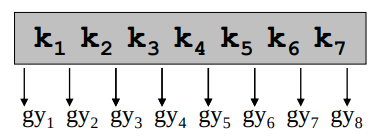
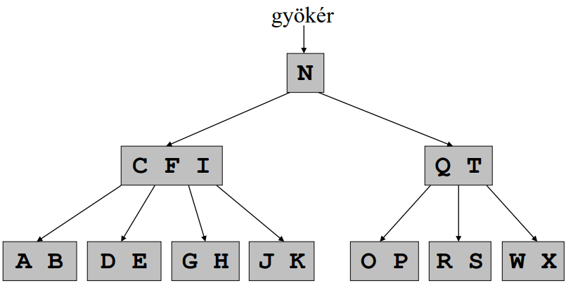
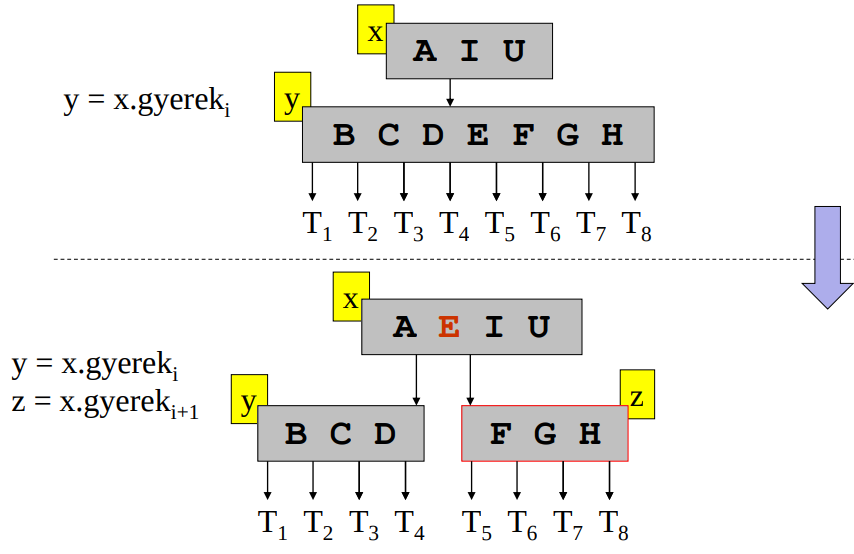
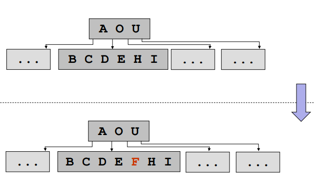
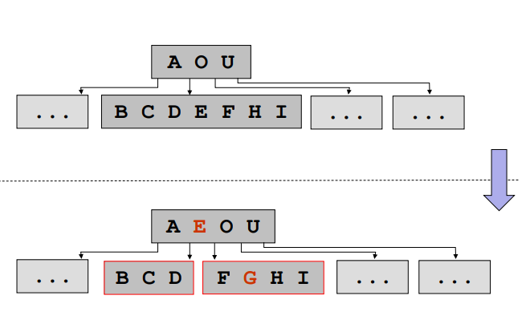
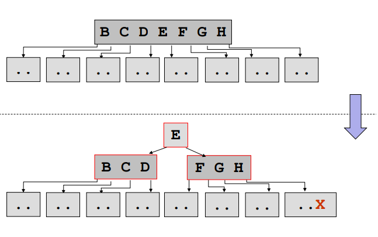

# SZTF2: 12.B fa

### B-fa

* B-fa: Olyan kiegyensúlyozott keresőfa amelyben olyan módon tároljuk az adatokat ami a hdd-nek kedvezőbb
* futási időt két összetevőre bontjuk fel
  * lemezhozzáférések száma
  * központi egység műveleteinek száma
* háttértárolók általában nagyságrendekkel nagyobb sebességet tudnak elérni blokkok írása/olvasása során, mintha elemi adatként írnák/olvasnák

### B-fa egy csúcsának felépítése

* n – egész szám : a csúcsban tárolt kulcsok darabszáma
* levél - logikai érték : levélről vagy belső csúcsról van szó!!!!!!!!!!!!!!
* kulcs 1 <= kulcs 2 <= ... <= kulcs n – K -
  * összehasonlítható típus : a csúcsban tárolt egyedi kulcsok listája(minden elemnek van egy kulcsa)
* tartalom1, tartalom2, … , tartalomn
  * T típus : a tartalom, a példákban mindig feltételezzük, hogy a kulcsokkal együtt mozog
* gyerek1, gyerek2, ... ,gyerekn+1 – M típus
  * hivatkozások a csúcs gyerekeire (részfáira)
*  
* B-fa további jellemzői
  * Ha ki egy kulcs a gyereki gyökerű részfában, akkor:
    * k1 <= kulcs1 <= k2 <= kulcs2 <= ... kn <= kulcsn <= kn+1???????????????????????????,
  * talán jelentése: a csúcs nagyobb mint a gyerekei
  * A csúcsokban található kulcsok darabszáma alulról és felülről is korlátos, ezt egy rögzített t számmal lehet kifejezni (B-fa minimális fokszáma):
    * Minden nemgyökér csúcsnak legalább t-1 kulcsa van, tehát minden belső csúcsnak legalább t gyereke
    * Minden csúcsnak legfeljebb 2t-1 kulcsa lehet, tehát minden belső csúcsnak legfeljebb 2t gyereke
  * A B-fa mindig kiegyensúlyozott: minden levél mélysége azonos

### B-fa példa

*  
* A példában t = 3, tehát a gyökércsúcs kivételével a csúcsokban található kulcsok száma
  * minimum 2
  * maximum 5

### B-fa csúcsának szétvágása - példa

* B-fa csúcsának szétvágása (t = 4)
*  

### B-fa csúcsának szétvágása

* A szétvágás lépései
  * Új z csúcs létrehozása
  * Az y utolsó t-1 db kulcsának (és ha van, gyerek mutatójának) átmásolása z-be
  * Az y így maradt legnagyobb kulcsának felvitele x-be
  * A z csúcs legyen x gyereke a 3. pontban felvitt kulcs után
* Megjegyzés: y telített, x nem telített
* A vágáshoz szükség van egy hivatkozásra az elem szülőjére. Ezt vagy minden elemben eltároljuk, vagy az algoritmusnak kell nyilvántartania
* Speciális eset: gyökér szétvágása
  * A lépések hasonlóak a fentihez
  * Ezt követően a gyökér elem az újonnan létrehozott elem lesz

## Beszúrás művelete

### B-fába új elem beszúrása

* Mindig levélbe szúrjuk be az új kulcsot, azonban ez csak akkor lehetséges, ha a megfelelő levél még nem telített
* Ezt már a keresés fázisban biztosítjuk, telített elemre nem lépünk tovább, hanem szétvágásokkal garantáljuk a megfelelő elemszámot
* Rekurzív megoldás: x gyökerű B-fába akarunk egy K kulcsot beszúrni
  * Ha x egy levélelem
    * Az x csúcs K-nál nagyobb kulcsainak (és tartalmak) hátraléptetése
    * Új K kulcs (és ha van tartalom) felvétele az x kulcsai közé
    * Az x csúcs n mezőjének növelése
  * Ha x nem levélelem
    * x kulcsai alapján megkeressük, hogy a K kulcs helye melyik y részfában van
    * Ha ennek gyökere telített, akkor ezt szétvágjuk, és újra elvégezzük az y részfa keresést (a két új részfa közül melyikbe kell továbblépni)
    * Folytatjuk a rekurzív beszúrást: y gyökerű részfába K kulcs beszúrása
  * Speciális esetek:
    * Első elem beszúrása – új gyökérelem létrehozása és K elhelyezése
    * x a gyökérelem és telített – szétvágás és új gyökérelem létrehozása a régi gyökér középső elemével

### Levélbe kulcs beszúrása

* Példa: F beszúrása
   

### Telített csúcsra lépés előtti szétvágás

* Példa: G beszúrása
   

### Telített gyökérelem esetén új gyökér

* Példa: X beszúrása
   

### Fa magassága a beszúrások során

* Az első elem beszúrásakor a fa magassága 1 lesz egyetlen csúcsponttal, tehát ilyenkor kiegyensúlyozott
* Az egyes levelekbe való beszúráskor nem változik a fa csúcsainak szerkezete, tehát a kiegyensúlyozottságot ez nem befolyásolja
* A gyökércsúcs kettévágása az egyetlen művelet, amely a B-fa magasságát növeli. Ez azonban minden levélhez vezető út hosszát ugyanúgy egyel növeli, így a kiegyensúlyozottság ebben az esetben is megmarad
* A bináris keresőfával ellentétben tehát a B-fa a gyökerénél nő, és nem a fa alján
* Ennek köszönhetően a B-fa mindig kiegyensúlyozott

### B-fából elem törlése

* Cél: K kulcsot tartalmazó csúcs megkeresése, majd innen a K törlése
* Rekurzív megoldás: x gyökerű B-fából akarunk egy K kulcsot törölni
  * Ha K nincs az x-ben, akkor az x kulcsai alapján megkeressük, hogy melyik részfában kell lennie, és rekurzívan ott folytatjuk a törlést (még pontosítjuk!)
  * Ha K az x-ben van és x egy levélelem
    * Ha K az x-ben van és x egy levélelem
    * Az x csúcs K-nál nagyobb kulcsainak (és tartalmak) előre léptetése
    * Az x csúcs n mezőjének csökkentése
  * Ha K az x-ben van és x belső csúcs
    * i) eset: ha van x-nek olyan y gyökerű részfája, amely tartalmaz egy K-t közvetlenül megelőző K’ kulcsot, és y-nak legalább t kulcsa van: az x-beli K kulcs felülírása K’-vel (tartalom is), és a törlés rekurzív folytatása: az K’ kulcsot töröljük az y gyökerű részfából
    * ii) eset: hasonló mint i) csak a K-t közvetlenül követő kulcsot keressük meg
    * • iii) eset: ha az i) és ii)-ben vizsgált mindkét szomszédos gyereknek csak t-1 kulcsa van, akkor töröljük a K kulcsot (és a tartalmat) x-ből és egyesítjük a két gyereket és a törölt K-t egy közös y csúcsban (ami továbbra is az x gyereke), majd rekurzívan folytatjuk: K kulcsot töröljük az y gyökerű fából

### Feltétel biztosítása

* Vegyük észre, hogy az előző levélből törlés és a iii) eset csak akkor működik, ha az x-ben lévő kulcsok száma legalább t
* Mivel ez alapból nem biztos hogy fennáll, ezért ezt már a keresés során garantálnunk kell az alábbiak szerint:
  * az újabb rekurzív hívás előtt ha azt látjuk, hogy a következő vizsgálandó y csúcsnak csak t-1 kulcsa van, de valamelyik testvérének t, akkor a testvérből vigyünk fel egy kulcsot a szülőbe (ez most az x), onnan pedig egyet le az y-ba.
  * ha a következő csúcsnak és egyik testvérének is t-1 kulcsa van, akkor egyesítsük ezeket, és vigyünk le az így feleslegessé vált kulcsot a szülőből
* Speciális esetek
  * Nincs törlendő kulcs a fában – hibát jelzünk
  * Ha az x a gyökér és mindkét gyerekének t kulcsa van – a fenti műveletek elvégzése, és az így kapott új csúcs lesz az új gyökér
  * B-fa egyetlen elemének törlése – gyökér -ra állítása
* Megjegyzés: csak a gyökér utolsó kulcsa és annak gyerekei összevonásakor változik a fa magassága, ezzel meg tudja őrizni a kiegyensúlyozottságot

### B-fa további műveletei

* Bejárás
  * Alapelve hasonló a bináris fáknál megismerttel
  * Kibővítve azzal, hogy egy csúcsnak több tartalma és gyereke lehet, így csúcsokon belül is egy ciklust kell indítani
* Keresés
  * Alapelve hasonló a bináris fáknál megismerttel
  * Kibővítve azzal, hogy egy csúcsnak több tartalma és gyereke lehet, így csúcsokon belül is egy ciklust kell indítani
  * A kulcsok rendezettek, ezért csúcson belüli kereséskor használható a logaritmikus keresés
* Keresés hatékony, mivel
  * A fa mindig kiegyensúlyozott, így biztosítható az ideális keresési lépésszám
  * Mivel egy csúcs több kulcsot tartalmaz, így kevesebb csúcsbetöltést igényel, ezzel kevesebb háttértár műveletet

